## lecture1

→ A device efficiently converting current to voltage
→The very front-end in the RX of optical serial links(接收信号的最前端，光串联链路)
→ Provide reasonable gain（增益不会太大）introducing minimal noise and bridging signal to the subsequent blocks.(引入最小的噪声，桥接信号和后面的模块)

Optical RX

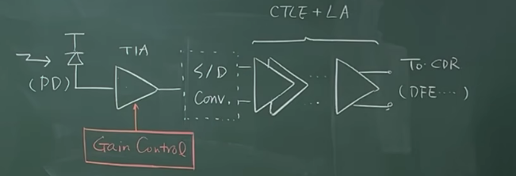

光电二极管→TIA→(可能用到单端转双端，或者后面再做单端转双端)→再做CTLE+LA、或者equallazer(均衡器)这些

TIA：不能饱和(需要调控TIA的gain)，需要gain contral 越自动越好(最好是自己可以判断调整gain，在模拟世界解决)

阻抗要求：大多数情况是没什么阻抗的要求的，但是还是输入阻抗越小越好(保证感应的电流大多数都进入TIA)

介绍PD：Photo diode

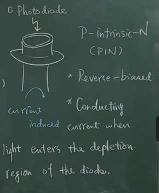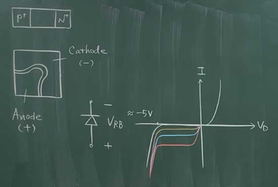

另一个名称：P-intrinsic-N(PIN)
特点：  
	1. 反偏
	2.光照进二极管耗尽区时产生电流

光照产生反向的反流，如右图，不同光照强度产生不同的电流。

判断PD的好坏参数：Responsivity如下图：

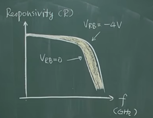

Responsivity(R)响应度：会和偏压有关系
定义如下:（其中Input light Power 是光的功率可以量的出来）

$$
R \triangleq \frac{Induced \, I}{ Input \, light \, Power} (A/W)
$$

举例：
	1. R = 0.5 (A/W)    for    850nm lacer(激光)
	2. R = 0.9 (A/W)    for    1.55μm lacer

ER (Extinction Ratio)(消光比)：逻辑1时候的power和逻辑0时候的power（关断和开启）

$$
ER \triangleq \frac{P_{1}}{P_{0}} = \frac{Logical \, 1 \, Power}{Logical \, 0 \, Power} \, (A/W)
$$

## lecture2

Input-REF Noise

High-speed (broadband) devices →
Need to consider whole spectrum(of interest)

输出等效噪声除增益 $R_{T}^2$   ；在带宽内积分，积分的结果才是所有的Noise

增益 $R_{T}^2$  也可能是和频率相关的。直接用  $R_{T,DC}$  来除就好了
输入噪声定义：

$$
\overline{I_{n,in}^2} \triangleq \frac{\int_{0}^{\infty} \overline{V_{n,out}^2} \,dx}{R_{T,DC}^2}
$$

RMS Noise current：

$$
I_{n,rms} = \sqrt{\overline{I_{n,in}^2}}
$$

==TIA must contribute as little noise as possible to ensure sensitivity== ：贡献尽可能少的噪声确保灵敏度，如下图：噪声大了信号就被淹没了，检测不到了

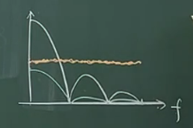

Photo diode Noise(shot noise)：这个是器件的选型相关的

$$
\overline{I_{n}^2} \triangleq 2  \cdot q \cdot I
$$

举例：Ex Consider an optical front-end , determine: 如下图
(a) Overall gain(总增益需要多少)   (b) max(最大的噪声多少可以接受)

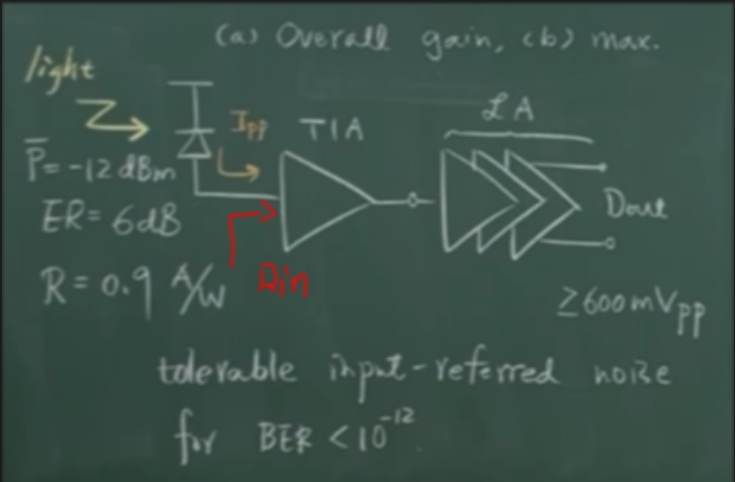

平均光的功率 $\overline{P}$ 、消光比 $ER$、 响应度 $R$ 

$$
\begin{cases}
\overline{P} = -12 \text{dBm} \\
ER = 6 \text{dB}  \\
R = 0.9 \text{A/W} \\
D_{out} \geq 600 \text{mV}_{pp}
\end{cases}
$$

tolerable input-referred noise for $BER < 10^{-12}$  

==(a) Overall gain(总增益需要多少)：==

$$
\begin{gather}
ER = 6 dB = 10 \log_{10}\frac{P_{1}}{P_{0}}   \\
P_{1} = 4 P_{0}
\end{gather}
$$

平均功率:

$$
\begin{gather}
\frac{1}{2} (P_{1} + P_{0}) = -12 \text{dBm} = 63 \mu \text{W}  \\
P_{1} = 100.8 \mu \text{W} , P_{0} = 25.2 \mu \text{W}
\end{gather}
$$

又  $R = 0.9 A/W$  得到：

$$
\begin{gather}
I_{1} = R \times P_{1} = 90.7 \mu \text{A} \\
I_{2} = R \times P_{2} = 22.7 \mu \text{A}  \\
I_{pp} = I_{1} - I_{2} = 68 \mu \text{A}
\end{gather}
$$

所以，从输入到 $D_{out}$  需要的增益：

$$
Total \, gain = \frac{600 \text{mV}}{68 \mu \text{A}} = 8.8 \text{k} \Omega = 79\text{dB} \Omega 
$$

For example, wo choose $TIA \,gain = 46 \text{dB} \Omega$   $LA \, gain = 40 \text{dB}$  留有余量。

==(b) max(最大的噪声多少可以接受)：==  SNR越大越好，但是要达到什么程度可以达到我们的要求呢？ $BER < 10^{-12}$  
需要 $V_{pp} / noise_{value} \geq 14$     ==注：在宽频放大器那里有讲==

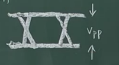

首先有：

$$
\begin{cases}
\frac{I_{pp}}{I_{n,RMS}} \geq 14  \\
I_{pp} = 68 \mu \text{A}  \\
I_{n,rms} = \sqrt{\overline{I_{n,in}^2}}
\end{cases}
$$

得到：

$$
I_{n,RMS} \leq 4.8 \mu \text{A,rms}
$$
这个值是， Photo diode + TIA noise + LA noise 总噪声等效到TIA输入的值小于 $4.8 \mu \text{Arms}$ 

==Caculate PD noise in a 10GHz system:==
PD 噪声：

$$
\begin{gather}
\overline{I_{n,\text{PD1}}^2} = \int_{0}^{\infty} \overline{I_{n}^2} \,df = 2 \cdot q \cdot I_{1} \cdot BW  \\
q = 1.6 \times 10^{-19} \text{K} \\
I_{1} = 90.7 \mu \text{A}
\end{gather}
$$

$$
\begin{gather}
\overline{I_{n,\text{PD0}}^2} = \int_{0}^{\infty} \overline{I_{n}^2} \,df = 2 \cdot q \cdot I_{0} \cdot BW  \\
I_{0} = 22.7 \mu \text{A}
\end{gather}
$$

解得：

$$
\begin{gather}
I_{n,PD1,rms} = 0.54 \mu \text{A,rms} \\
I_{n,PD0,rms} = 0.27 \mu \text{A,rms}
\end{gather}
$$

*Why a TIA? Why not a simple resistor?
1. Lower Input-resistance

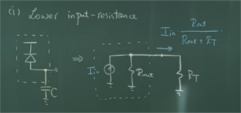

如上图：当频率高的时候会产生电容的分流，以及 $R_{T}$  的分流。导致到达下一级的信号变得很微弱。
$R_{in} \ll R_{T}$  ，保证所有的电流都流过TIA。

An active TIA with proper design provide much lower input resistance → guaranteeing most PD current flowing in to TIA.

2. Gain Contral
A TIAwith automatic gain contral can increase its dynamic range, preventing itself from 'saturation' and ensuring sufficient amplification.

3. Low Output-resistance

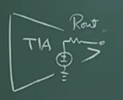

Low Output-resistance to properly drive  the subsequent blocks.

4. More bandwidth（后面讲）

5. Noise

==Feedback TIA(shunt-shunt)==

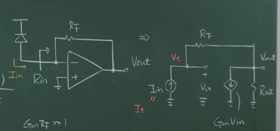

（a）Low freq：
其中  $G_{m}R_{F} \gg 1$  ;  $G_{m}R_{out} \gg 1$  

$$
\begin{gather}
I_{in} = G_{m} V_{in} + \frac{V_{out}}{R_{out}} = \frac{V_{in} - V_{out}}{R_{F}} \\
R_{T} = \frac{V_{out}}{I_{in}} = \frac{R_{out} (1 - G_{m} R_{F})}{1 + G_{m} R_{out}} \approx - R_{F}
\end{gather}
$$

（b）input-impedance
输入端  $I_{in} \to I_{t}$  $V_{in} \to V_{t}$  ,

$$
\frac{V_{out}}{R_{out}} + G_{m}V_{t} = I_{t} = \frac{(V_{t} - V_{out})}{R_{F}}
$$

$$
R_{in} = \frac{R_{F}(1 + \frac{R_{F}}{R_{out}})}{(\frac{R_{F}}{R_{out}} + G_{m} R_{F})} \approx \frac{1}{G_{m}}
$$

（c）output-impedance

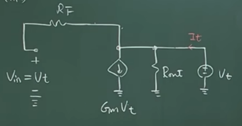

$$
R_{out} = \frac{V_{t}}{I_{t}} = \frac{1}{G_{m}} \parallel R_{out} \approx \frac{1}{G_{m}}
$$

将TIA的放大器想成一个一阶的放大器：如下图

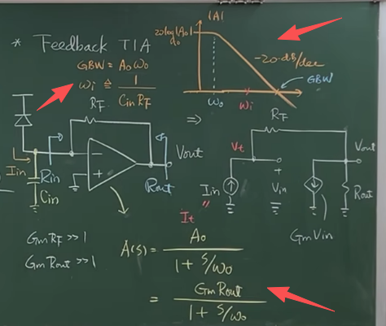

输入等效电容和电阻 $R_{F}$  组成的 $\omega_{i}$  

Opamp → 1st order approx: 条件 $\omega_{0} \ll \omega_{i} < GBW$  

$$
\begin{gather}
R_{T} = \frac{-R_{F} A_{0} \omega_{0} \omega_{i}}{S^2 + S (\omega_{0} + \omega_{i}) +(A_{0} + 1)\omega_{0} \omega_{i}} = \frac{K_{1}}{s^2 + (\frac{\omega_{n}}{Q})S + \omega_{n}^2} \\[4pt]
K_{1} = -R_{F} A_{0} \omega_{0} \omega_{i}  \\[4pt]
\omega_{n}^2 = (A_{0} + 1)\omega_{0} \omega_{i} \approx GBW \cdot \omega_{i} \\[4pt]
Q = \frac{\sqrt{(A_{0} + 1)\omega_{0} \omega_{i}}}{\omega_{0} + \omega_{i}} \approx \sqrt{\frac{A_{0} \omega_{0}}{\omega_{i}}} = \sqrt{\frac{GBW}{\omega_{i}}}
\end{gather}
$$

这里的传递函数的计算过程：[[笔算过程.md#^47cc20]]

>[!note] 补充说明
>由上式化简结果  $Q = \sqrt{\frac{GBW}{\omega_{i}}}$  可知Q值描述的是第二极点和GBW的关系，也就是相位裕度，香味于都不够就会产生peaking，当相位裕度为45°的时候，也就是第二极点位与GBW的2倍的位置，Q值就是0.707，没有peaking的时候。

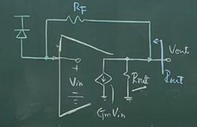

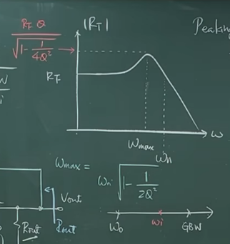

peaking appears for $Q > \frac{1}{2}$  

探索：  $peaking = 20 \log_{10}(Q)$ 
1. For $GBW = 10 \omega_{i} , Q = 3.16$
	 $peaking = 10dB , \omega_{n} = 3.16 \omega_{i}$ 
2.  For $GBW = 100 \omega_{i} , Q = 10$
	 $peaking = 20dB , \omega_{n} = 10 \omega_{i}$ 

这样的peaking是不能接受的，做的时候需要Q很小，

==所以采用shunt-shunt结构的问题：==
Bandwidth entend in a cost of peaking.

Modified FB TIA改进：

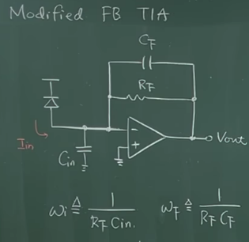

可以自己计算下： $\omega_{n} , Q , R_{T}$ 

$$
\begin{gather}
\omega_{i} \triangleq \frac{1}{R_{F} C_{in}} \\
\omega_{F} \triangleq \frac{1}{R_{F} C_{F}}
\end{gather}
$$

Peaking significantly reduced by $C_{F}$ 

举例： For the case $GBW = 100 \omega_{i}, \omega_{F} = 10 \omega_{i}$ 
 we have $Q = 0.95 , \omega_{n} = \omega_{F} = 10 \omega_{i} , Peaking = 0.97dB$  

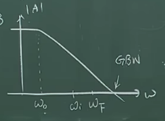

>[!note] 要求
>(shunt-shunt)还是达不到要求则需要：
>High-speed TIA  要求：
>1.Remove Opamp
>2. Simplify your Circuit as much as possible

举例： Ex：

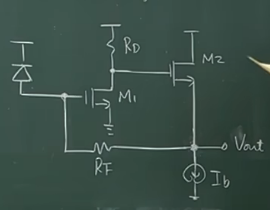

FB TIA with follower.
三个问题：==stable? Noise? Gain?==

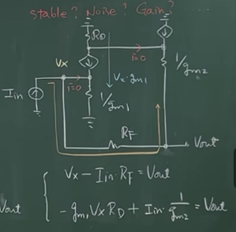

$$
\begin{cases}
V_{x} - I_{in} R_{F} = V_{out}  \\
- g_{m1} V_{x} R{D} + I_{in} \cdot \frac{1}{g_{m2}} = V_{out}
\end{cases}
$$

if  $g_{m1} R_{D} \gg 1$  

$$
R_{T} = \frac{V_{out}}{I_{in}} = - \frac{(g_{m1} R_{D} R_{F}) - \frac{1}{g_{m2}}}{1+ g_{m1} R_{D}} \approx -R_{F}
$$

输入阻抗：

$$
R_{in} = \frac{V_{x}}{I_{in}} = \frac{R_{F} + \frac{1}{g_{m2}}}{1 + g_{m1} R_{D}} \approx \frac{R_{F}}{1 + g_{m1} R_{D}}
$$

输出阻抗：

$$
R_{out} = \frac{R_{F} \parallel \frac{1}{g_{m2}}}{1 + g_{m1} R_{D}} \approx \frac{ \frac{1}{g_{m2}}}{1 + g_{m1} R_{D}}
$$

>[!drawbacks] Drawbacks（缺点）:
>1.  $I_{b}$   parasitics cap
>2. Source follower
>3. May need large supply (  $\gg 1.8V$ )

Direct FB  TIA: 直接反馈TIA[[笔算过程.md#^ab4eaf]]

![[Lecture-1786533821414.webp]]

No poles locate at relatively high freq.笔算过程中有完成的计算结果。

DC Analysis:
if  $g_{m1}R_{F} \gg 1$  $g_{m1}R_{D} \gg 1$  

$$
R_{T} = -R_{D} \cdot \frac{g_{m1}R_{F} - 1}{1 + g_{m1} R_{D}} \approx -R_{F}
$$

输入电阻： $R_{in}$

$$
R_{in} =  \frac{R_{F} + R_{D}}{1 + g_{m1}R_{D}}
$$

输出电阻： $R_{out}$ 

$$
R_{out} = R_{D} \parallel (\frac{1}{g_{m1}})
$$

Noise Analy:[[笔算过程.md#^a1ce89]]

![[Lecture-1786540688438.webp]]

同时计算：

$$
\begin{cases}
I_{n,R_{D}} - \frac{V_{n,out}}{R_{D}} = v_{x} g_{m1} + I_{n,m_{1}} \\[4pt]
V_{x} = I_{n,R_{F}} R_{F} + V_{n,out}
\end{cases}
$$

得到：

$$
I_{n,R_{D}} - I_{n,m_{1}} - g_{m1}R_{F} I_{n,R_{F}} = (g_{m1} + \frac{1}{R_{D}})V_{n,out}
$$

化简得：

$$
\overline{V_{n,out}^{2}} = \frac{1}{(g_{m1} + \frac{1}{R_{D}})^2}[\overline{I_{n,R_{D}}^{2}} + \overline{I_{n,M_{1}}^{2}} + g_{m1}^{2}R_{F}^{2} \overline{I_{n,R_{F}}^2}]
$$

如果： $g_{m1}R_{D} \gg 1$ 

则简化为：

$$
\overline{V_{n,out}^{2}} = \frac{1}{g_{m1}^2}[\underbrace{ \overline{I_{n,R_{D}}^{2}}}_{ \frac{4kT}{R_{D}}} + \underbrace{ \overline{I_{n,M_{1}}^{2}}}_{4kT \gamma g_{m1}} + \underbrace{g_{m1}^{2}R_{F}^{2} \overline{I_{n,R_{F}}^2}}_{\frac{g_{m1}^2R_{F}^2 4kT}{R_{F}}}]
$$
比较哪一项贡献的噪声最大：

$$
\frac{1}{R_{D}} \ll g_{m_1} < g_{m_1} R_{F}
$$

噪声的频率响应可以算一下，就可以得到大概的曲线：

![[Lecture-1786600764893.webp]]

>[!note] example: Inverter-based TIA

![[Lecture-1786601146770.webp]]

>[!note] 练习：可以自己算一下
>* high-freq. ?
>* Noise?
>* $R_{T}$ ?
> * Drawback?

**Common-Gate TIA：**
	1. No feedback
	2. Simple
	3. Low Noise
	4. Easy to implement

![[Lecture-1786603042892.webp]]

a：Low freq.
	1.  $R_{T} = R_{D}$
	2.  $R_{in} = \frac{1}{g_{m}}$
	3. $R_{out} = R_{D}$

b: General case
	 
	 $$
	 \begin{gather}
	 R_{T} = \frac{R_{D}}{(1 + \frac{s}{\omega _{in}})((1 + \frac{s}{\omega _{out}})}\\[4pt]
	 \omega_{in} = \frac{g_{m}}{C_{in}} \, \, \, \omega_{out} = \frac{1}{R_{D} C_{L}}
	 \end{gather}
	 $$
Two real pole : $\omega_{in} > \omega_{out}$  (Most likely)

Noise Consideration: 
小信号模型：分开算每部分的噪声

![[Lecture-1786603518435.webp]]

  $R_{D}$  贡献噪声
	  
	  $$
	  \overline{V_{n,out,R_{D}}^2} = \overline{I_{n,R_{D}}^2} \cdot  \left|R_{D} \parallel \frac{1}{s C_{L}} \right|^2 = \overline{I_{n,R_{D}}^2} \cdot \frac{R_{D}^2}{\left| 1 + \frac{s}{\omega_{out}} \right|^2}
	  $$

M1 贡献噪声
	 $$
	 \begin{gather}
	 -\frac{V_{n,out,M_{1}}}{(R_{D} \parallel \frac{1}{sC_{L}})} = I_{n,M_{1}} - V_{x} g_{m_{1}} = V_{x} \cdot s C_{in} \\[4pt]
	 \overline{V_{n,out,M_{1}}^2} = \overline{I_{n,out,M_{1}}^2} \cdot \frac{R_{D}^2}{\left| 1 + \frac{s}{\omega_{out}} \right|^2} \cdot \frac{|s|^2}{\left| s + \omega_{in} \right|^2}
	 \end{gather}
	 $$

M2 贡献噪声
	 $$
	 \overline{V_{n,out,M_{2}}^2} = \overline{I_{n,out,M_{2}}^2} \cdot \frac{1}{\left| 1 + \frac{s}{\omega_{in}} \right|^2} \cdot \frac{R_{D}^2}{\left| 1 + \frac{s}{\omega_{out}} \right|^2}
	 $$

![[Lecture-1786605872548.webp]]

**Regulated-Cascode TIA**:
	In some cases TIA with lower input impendance is required(to ensure most input current from PD could be injected into TIA even at high freq.)
如图：就是随着频率的升高， $C_{in}$  的等效阻抗在下降，所以输入阻抗要很小才可以分到更多的电流，至少是一个数量级以上。

![[Lecture-1786606216269.webp]]

电路以及小信号模型：

![[Lecture-1786609885271.webp]]

Transimpedance Gain：
*  DC  $R_{T} = R_{D2}$ 
* operation freq.  3-caps → 3 poles

极点分析：（每个电容单独分析）

1. 输入电容：

![[Lecture-1786610100305.webp]]

1. For $C_{in}$  :  这个 $R_{eq}$  也是等效的输入电阻
	$$
	\begin{gather}
	-\frac{(V_{t} I_t \cdot \frac{1}{g_{m2}})}{R_{D1}} \cdot \frac{1}{g_{m1}} = V_t \\[4pt]
	R_{eq} \triangleq \frac{V_t}{I_t} = \frac{\frac{1}{g_{m2}}}{1+g_{m1}R_{D1}} \\[4pt]
	\omega_{in} = \frac{1}{C_{in}(\frac{\frac{1}{g_{m2}}}{1+g_{m1}R_{D1}})}
	\end{gather}
	$$

2. For $C_L$  : 也就是等效输出电阻
	
	$$
	\omega_{out} = \frac{1}{R_{D2}C_L}
	$$

2. For $C_p$  :
	
	$$
	\omega_p = \frac{1}{C_{p}(\frac{R_{D1}}{1+g_{m1}R_{D1}})} = \frac{1+g_{m1}R_{D1}}{C_p R_{D1}}
	$$

>[!note] 带宽
>这个结构的主极点和共栅的主极点位置相同，所以基本上不会影响放大器的带宽。

**Other TIA Technique：** 

* Gain Boosting  → Prvide more bias current to increase gm(save Voltage headroom)

![[Lecture-1786611332789.webp]]

>[!question]
> 	1.输出节点引入更大的寄生电容，会压缩带宽。
> 	2.也会引入噪声

* Cap Coupling (Save Voltage headroom)
