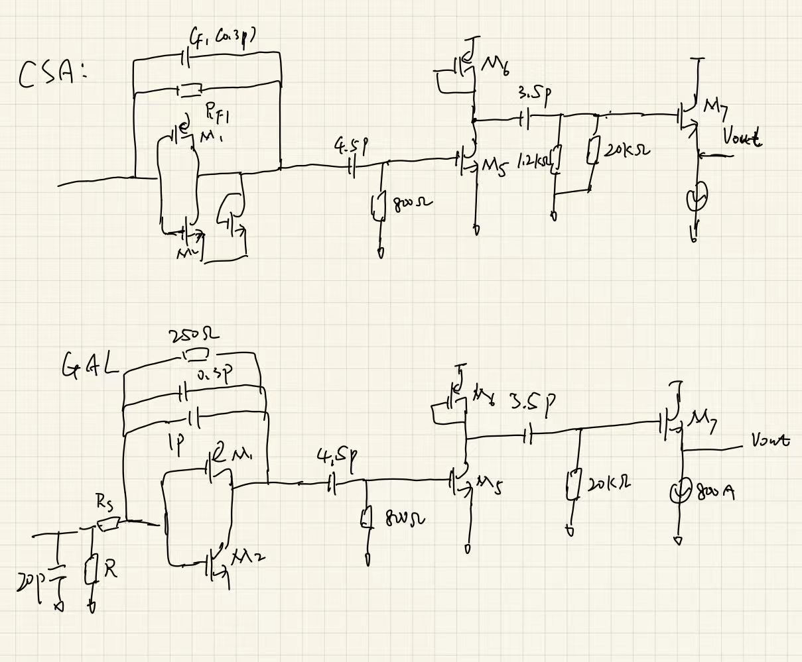

# 论文阅读 2022 — Kaiyou Li

> ⚠️ 本文件由 Claude 依据 PDF **文字层 + 逐页渲染图（160 dpi）+ 关键局部 300 / 600 / 900 dpi 放大**填写。Table I / II / III 和 Fig. 1–21 全部看到了，没有「图未提取」的格子；剩下的空缺都是**论文本身没说**，标为「未说明」。
> 所有带「【我算的】」的数字是我自己推的（公式和中间值都写了），带「【读图】」的是从曲线上读的，**都要你自己复核**。
> 🚩 **本篇最要紧的一条在 Q19 复现 A**：标题里的 **37 nA_rms 用错了示波器统计量**——882 μV 是「pk-pk 读数的标准差」，不是波形 RMS；按高斯统计反推真实输出噪声 ≈ 2.0–2.2 mV → **~87 nA_rms**。请你亲自看一眼 Fig. 18(a) 框出来的 sdev 在哪一列。
> 模板这次新增了 Q24b / Q25b / A19 / A20 和 B 组两条陷阱说明（本文件已按新模板填）。

**论文**：Li, Guo, Zhao, *A CMOS AFE With 37-nA_rms Input-Referred Noise and Marked 96-dB Timing DR for Pulsed LiDAR*
**级别**（精读 / 提取 / 扫）：提取级（前放 + 噪声口径精读）
**开始时间**：2026-09-16　　　**结束时间**：2026-09-16

---

## 一、定位（20 min · 正文一个字都不读）

**Q1. 题目、出处、年份是什么？**

答：
- 题目：A CMOS AFE With 37-nA_rms Input-Referred Noise and Marked 96-dB Timing DR for Pulsed LiDAR
- 出处：IEEE Trans. Circuits and Systems—I: Regular Papers (TCAS-I), Vol. 69, No. 9, pp. 3565–3578, Sep. 2022，DOI 10.1109/TCSI.2022.3181133
- 单位：中山大学（第一作者 Kaiyou Li 博士生、Yubin Zhao：微电子科学与技术学院，珠海；通讯作者 Jianping Guo：电子与信息工程学院，广州）。[30] 是作者 2018 年 SOCC 的前作，[10] Zheng–Li–Guo 2021 是同组的相移 LiDAR AFE。
- 谱系：对比表里的 [4] Zheng TIM'18、[7] Wang TCAS-I'20 是西电朱樟明组。**你库里的「论文阅读2021」（具有强度信息补偿的低行走误差模拟前端）数字跟 [7] 完全对得上（86 dBΩ / 281 MHz / 1.2 pF / 1:5000），「论文阅读2018」郑浩学位论文应该就是 [2]  [4]  [5] 那条线**——本篇等于在跟你已经读过的两篇正面比。

---

**Q2. 摘要最后一句宣称的指标是什么？（原样抄下来，带单位）**

答：
> "The measured input-referred RMS noise current of the proposed AFE is 37 nA. With dual-mode control, a linear output DR of 80 dB and a wide timing DR of 96 dB with walk error no more than ±160 ps have been achieved. For single-shot measurement application, only CSA mode was enabled and the pulse widths of saturated output signals have been measured to compensate the walk errors, which realized a timing DR of 78 dB with accuracy of ±150 ps. The averaged power consumption is 66 mW and the  total silicon area is 0.79 × 0.42 mm2 in 0.18-μm CMOS process."

摘要主指标（合起来看）：
- 双模前放 CSA / GALA-TIA + 内置脉冲成形，过零点标为定时点，采样式（ADC）和事件式（TDC）接收机都能用
- 输入折合 RMS 噪声电流 **37 nA**  这个是CSA模式的。
- 双模控制：线性输出 DR **80 dB**，定时 DR **96 dB**，walk error **≤ ±160 ps**
- 单发（只开 CSA + 测饱和脉宽补偿）：定时 DR **78 dB**，精度 **±150 ps**
- 平均功耗 **66 mW**；面积 **0.79 × 0.42 mm²**；0.18 μm CMOS

---

**Q3. 末页对比表里，它加粗或点名的是哪一列？它跟谁比？**

答：

![[Li2022-table3_comparison.png]]

- **This work 整列加粗**，没单独点名某一行；正文点名的是："The most notable feature of the proposed AFE is that it has **relatively low noise** while achieving comparative performances on power consumption, linear output DR, timing discrimination DR and walk error."
- 逐行排名（跟 8 家比，NA 的不计）：

| 行           | 本文              | 名次         | 赢它的                                                                         |
| ----------- | --------------- | ---------- | --------------------------------------------------------------------------- |
| C_PD        | 1.2 pF          | 中游         | [11] 2.5–5、[31] 2、[25] 1.7、[24] 1.5 更大                                      |
| f₋₃dB       | 98 / 230 MHz    | CSA 档倒数第 2 | 只比 [25] 15 MHz 宽(但是没有25的)                                                   |
| 跨阻          | 87 dBΩ          | 8 家第 6     | [25] 127、[28] 121、[4] 106、[24] 100、[8] 99                                   |
| 功耗          | 66 mW           | 第 3        | [8] 41、[25] 60                                                              |
| **噪声**      | **37 nA**       | **第 3**    | [25] ~3、[11] 17 ← 标题卖点                                                      |
| MDS         | 0.6 μA (SNR=16) | 并列第 4      | [25] 0.019、[11] 0.053、[4] 0.28；与 [28] 0.6 并列（但 [28] 是 SNR=9）  ==(SNR是最好的)== |
| **线性输出 DR** | **1:10,000**    | **第 1**    | 其余最好 [4] 1:2,000 ← 唯一明确第一                                                   |
| 定时 DR       | 1:66,667        | 第 2        | [24] 1:100,000                                                              |
| walk error  | ±160 ps         | 7 家第 5     | [24] ±25、[7] ±30、[25] ±75、[28] ±100                                         |
| 最差 jitter   | 560 ps @600 nA  | 5 家第 4     | 只比 [25] 1.7 ns 好                                                            |

- 🚩 【我算的】==**jitter × 幅度**（噪声限定时 jitter ∝ 1/幅度，乘起来才能横比）==：[25] 1.7 ns × 38 nA = **65**；[28] 0.103 × 840n = **87**；[7] 0.062 × 2000 = **124**；[24] 0.17 × 1300 = **221**；**本文 0.560 × 600 = 336 ns·nA，最差**。噪声排第 3 而定时抖动归一值排最后——**这两个数很难同时成立**，这是 Q19 复现 A 的第一个线索。
- 比的对象和话术：
	[25] 噪声极好但 BW 只有 15 MHz、接受的回波 FWHM 25 ns；
	[11] 17 nA 但 CSA-only，DR 1:12,000、walk ±1.4 ns；
	[8] 高 PSRR 但没标定时点、线性 DR 窄不能测强度；
	[28] 1:50,000 不用增益控制、精度 ±100 ps，但「传统电阻反馈 TIA + LC 谐振成形」噪声差、非线性反馈不能测强度；
	[7]  [24]  [25] 在全 DR 做 LUT 补偿、数据量大。
- **它的组合牌**：「低噪声 + 宽定时 DR + 宽线性 DR（能测强度）+ 事件式只需 1 路 TDC」。
- 🚩 **表里没列的**：面积（0.33 mm²，其实不差却没放）、**GALA 档噪声 1.8 μA**、**切模要打几发**、**定时 DR 的输出负载条件**、功耗是两模平均。

---

**Q3b. 它自定义的 FoM 是什么？分子分母里有哪些量、故意漏了哪些量？**

答：**没有 FoM。** Table III 没有 FoM 行，全文也没定义。

---

**Q4. 系统架构是什么？用一句话描述从光电二极管到输出的完整链路。**

答：

![[Li2022-fig03_block_diagram.png]]

> 片外线性模式 APD(~200 V 偏压)→ 键合线(4 nH)+ ESD → **双模前置放大器**：S=0 时 TG1 旁路  $R_S$ ，走 **CSA**（ $C_F1(0.3 pF) ∥ R_F1 (43 k\Omega)$ ）→ **两级 CR 微分器**（ $R_{h1}C_{h1}$  → ~1 V/V 缓冲 M5/M6 → ( $R_{h2}∥R_b)C_{h2}$ ）；S=1 时走  $R_S$  + GAL 分流 → **GALA-TIA**（R_F2 250 Ω ∥ C_F2 1 pF，与 CSA 共用核心反相器）→ **一级 CR 微分器** → 单极性脉冲变双极性、过零点即定时点 → 源随器 M7 → AC 耦合 → **后级 PA**（两级电阻负载差分放大，中间插源随器，恒 gm 偏置，共 20 V/V）→ **输出缓冲**（源随 3.5 mA × 2）→ OUTP/OUTN → 片外定时鉴别（过零比较 → TDC）+ 强度采集（PDH + 低速 ADC），或直接高速 ADC → 系统控制 & DSP，由 DSP 根据**上一发**的输出决定 S。

说的就是：线性的APD → 双模前置放大器：S = 0 时，CSA 两级的微分器，电流的范围是从600nA到60μA，S = 1, 的时候，一级微分器，是将单极信号转化为双极的信号，更好的找出crossing-zero点的位置。然后交给TDC或者是峰值检测，峰值检测在交给ADC就可以读出信号的强度了。

电源：前放 1.8 V（1.8 V 管省面积，且把 PSRR 差的反相器单独供电），其余 3.3 V（拿大线性摆幅）。

---

**Q5. 创新在框图的哪个框里？**

答：**在「Pre-amplifier」那个橙色虚线框里**，具体三处（按分量排）：

1. **GALA-TIA（主创新）**：大电流档不是简单把 R_F 调到 ~10 Ω——作者列了这么做的四个问题：
	① 反馈通路延迟比放大器小，输入端的电压脉冲直接穿过 R_F 到输出；
	② R_F 小把输入主极点推到高频、跟输出极点撞，要 >150 pF 补偿；
	③ 输出级要接近 50 mA 的偏置；
	④ 增益切换开关要极大。它的办法是在输入口并一个**门控有源负载 GAL**（M11/M12 经 TG5 接成二极管的反相器，~30 Ω），核心放大器前串 **R_S**：电流按 $\beta=R_{AL}/(R_S+R_{AL})\approx1/30$ 分流，TIA 只吃 1/30，R_F2 可以留在 250 Ω（稳定），等效跨阻 $\beta R_{F2}\approx8$–10 Ω，线性到 60 mA（Fig. 7，传统 TIA 只到 7 mA），输入电阻 ~30 Ω 基本不随电流变（Fig. 8）。M8 做开关 + M9/M10 复制反相器定直流 → **4 mA 主电流路径上没有大开关**。
2. **双模共用一个核心放大器**：单级自偏置反相器 M1/M2（11 mA）+ M3 二极管负载；TG1/TG3/TG4/TG5 切换。CSA 反馈是电容，**没有 R_F 热噪声**，负责弱信号。
3. **片上成形**：CSA 后两个一阶 CR 微分器（中间插低输出阻抗缓冲，让 C_h2 滤掉 R_h2∥R_b 的热噪声，作者说这比一个二阶微分器噪声好），TIA 后一个 → 单极性变双极性。**过零时刻对幅度不敏感，输出削顶了过零点还在** → 定时 DR 不再受线性范围限制。

（附）PA：AC 耦合定输入偏置 + 恒 gm 偏置（K = 4），开环增益蒙特卡洛 3σ 从 4.2 → 1.56 V/V（Fig. 10），作者称稳健性提升 70%。

![[Li2022-fig04_preamp_schematic.png]]

> 一句话：**弱信号用「电荷桶」保噪声( $R_F$ 选的很大，可以降低等小的输入电流噪声)，强信号用「电流分压器」保线性，两种模式都靠片上微分器把定时点钉在过零处。**

---

**Q6. 它拿什么测试结果证明自己？（哪几张图、哪个数）**

答：

| 图 / 表        | 证明什么                   | 关键数                                                                                                                                                                                         |
| ------------ | ---------------------- | ------------------------------------------------------------------------------------------------------------------------------------------------------------------------------------------- |
| Fig. 12 / 13 | 频响（电学，VNA）             | CSA 带通 **11–98 MHz**，−3 dB 角点处单端 80.8 dBΩ（11 kΩ）；GALA **28–230 MHz**，38.5 dBΩ（84 Ω）。【读图】峰值 CSA ≈ 84 dBΩ @30–40 MHz、GALA ≈ 41.5 dBΩ @~80 MHz；CSA 在 ~200 MHz 有台阶（~76 dB），GALA 在 ~800 MHz 有深凹口 |
| Fig. 16      | 激光脉冲                   | 上升 1.47 ns、FWHM 3.35 ns（参考 TIA：OPA855，5 kΩ / 360 MHz）                                                                                                                                       |
| 正文（光学）       | 跨阻增益                   | CSA **24 kΩ**、GALA **235 Ω**（输出 pp ÷ 输入峰值，参考 TIA 标定 10 μA）                                                                                                                                  |
| Fig. 17      | 线性 DR                  | 0.6 μA–6 mA = **80 dB**，误差 ≤10%（CSA）/ 8%（GALA），正幅度 ≥10 mV；CSA 段 0.6–60 μA、GALA 段 60 μA–6 mA 各 40 dB                                                                                         |
| Fig. 18      | 输出噪声                   | "882 μV / 24 kΩ ≈ **37 nA**" 🚩（882 μV 实为 pk-pk 的 sdev，Q19）                                                                                                                                 |
| 正文           | GALA 噪声 / APD 影响       | GALA **1.8 μA**；接真 APD（200 V）噪声 **+1.2 nA**                                                                                                                                                 |
| Fig. 19      | 输出波形                   | 两模过零点固定偏差 **2.47 ns**；CSA 光学小信号负半周偏小                                                                                                                                                        |
| **Fig. 20**  | **定时 DR（核心卖点）**        | 0.6 μA–40 mA walk ≤ ±160 ps → **96 dB**；jitter @600 nA **560 ps**；60–200 μA 被 GALA 噪声抬到 ≤250 ps                                                                                             |
| Table II     | 负载敏感(电容负载增加导致定时DR范围变小) | C_load,TOT 2.5 / 4 / 6.1 / 8.1 pF → 定时 DR 1:66,667 / 50,000 / 30,000 / 16,667                                                                                                               |
| Fig. 21      | 单发                     | CSA-only：0.6–80 μA 过零 ±150 ps；80 μA–5 mA 用「200 mV 前沿 → 过零」脉宽补偿 → **78 dB**                                                                                                                  |
| Table I      | 噪声仿真                   | 前放输出 36.4 μV（10–96 MHz）÷ 1.1 kΩ ≈ 33 nA；前五：M2 闪烁 12.4%、M4 闪烁 9%、M5 闪烁 8.2%、R_h2∥R_b 8.2%、R_h1 4.7%                                                                                          |
| Fig. 7 / 8   | GALA 机制（仿真）            | I_RF ≈ I_in/30，线性到 60 mA；R_in ≈ 30 Ω 稳定；walk < ±100 ps                                                                                                                                      |
| Fig. 10      | PA 增益稳健（仿真）            | MC：20.8 V/V (3σ 4.2) → 20.77 V/V (3σ 1.56)                                                                                                                                                  |
| 正文           | 功耗 / 面积                | 1.8 V：CSA 12.5 mA / GALA 16.9 mA；3.3 V：12 mA → 平均 66 mW；0.79 × 0.42 mm²                                                                                                                     |

![[Li2022-fig12-13_VNA_setup_freq_resp.png]]

![[Li2022-fig17_linear_DR.png]]

![[Li2022-fig19_waveforms.png]]

![[Li2022-fig20_walk_jitter.png]]

![[Li2022-table2_Cload.png]]

![[Li2022-fig21_single_shot.png]]

---

**Q7. Intro 最后两段里，它==批评前人什么？**==

答：四条，外加第二节补的一刀：

1. **电子增益控制 + CFD [15] / DVS [4] / CDD [11]**：DR 上不去，"no more than 1:12,000 (82 dB) [11] even with 4-level gain control [2]"。→ 它用过零点让定时 DR 不受线性范围限制。
2. **对数 / 压缩 TIA [20]  [21]**：DR > 110 dB，但压缩输出不利于高精度定时。
3. **时域补偿（测脉宽 [18]  [22]、斜率 [23]、两者都测 [12]  [24]  [25]）**：DR 能到 1:10,000–>1:100,000，但要复杂 LUT，激光脉冲形状和 PVT 一变 LUT 就不准；用脉宽补偿强度 [7] 同样受脉冲形状影响；而且只能用于事件式接收机（要多通道 TDC）。→ 它双模时不补偿，单发时只补大信号。
4. **脉冲成形过零 [26]–[28]**：定时 DR 很宽、不用补偿，但 "the pulse shaper always introduces additional noise" → **这就是它的切入点**：CSA 做低噪前放 + 仔细设计微分器。
5. 第二节：TIA 的反馈电阻热噪声让它灵敏度不如电容反馈结构 [11]；用 BJT [26] 贵、不适合 SoC。

> 注意它把 **[28]（最像它的方案：成形过零、1:50,000、±100 ps、不用增益控制）** 留到 Table III 讨论才说「噪声差、非线性反馈不能测强度」——而 [28] 的 walk（±100 ps）和 jitter（103 ps @840 nA）其实都比它好。

---

## 二、三问（10 min · 通过标准）

**Q8. 它想赢哪一列？（只能有一个）**

答：**输入折合噪声（37 nA_rms）。**

标题第一个数、结论段的 "most notable feature"。表里它真正第一的是线性输出 DR（1:10,000），但它的叙事是「低噪声的前提下仍然有宽 DR」。

🚩 而 Q19 表明 37 nA 很可能要乘 ~2.4：修正到 ~87 nA 后它在噪声行掉到 **9 家第 7**（只比 [24] 100、[31] 119 好）。**它想赢的那一列恰恰是最站不住的一列。**

---

**Q9. 为了赢那一列，它牺牲了什么？（一定有）**

答：六样，按代价大小排：

1. **单发能力 / 点频**：双模切换 "requires multiple shots (at least two) of the laser pulses for the external control unit to find out the suitable mode"，**本文还是手动设 S**（"emulated by setting S manually, according to the captured output"）。扫描式 LiDAR 每个点至少两发 → 点频减半；而且判据看的是「上一发」，反射率一跳变就错档。单发替代方案（CSA-only）线性 DR 只剩 **40 dB**，>80 μA 还要第二路 TDC 测脉宽做补偿。
2. **波形保真 / 多回波**：带通成形（CSA 11–98 MHz）把回波改成双极性，采样式接收机拿到的不是原始回波形状；==大信号后的负半周又深又长——Fig. 19(b) 10 mA 时 −0.95 V，~30 ns 才开始回升，40 ns 回基线【读图】；Fig. 19(a) CSA 6 mA 在 25 ns 以后基线正偏 ~+70 mV【读图】。**紧跟在强回波后几米内的第二个回波会被淹掉。**== 
3. **GALA 档噪声**：1.8 μA = CSA 的 **49 倍**【我算的】（同口径修正后 ~4 μA）；60–200 μA 区间 jitter 从 ~20 ps 跳回 250 ps（Fig. 20）。==电流分流等于把 R_F2 的噪声放大 1/β = 30 倍（Q13）。==
4. **功耗**：平均 66 mW（CSA 模式 62.1 / GALA 模式 70.0 mW【我算的】），其中**输出缓冲 2 × 3.5 mA × 3.3 V = 23.1 mW，占 CSA 模式的 37%**【我算的】，只为驱动 8 pF 负载；核心反相器 11 mA × 1.8 V = 19.8 mW。单通道。做阵列扛不住。
5. **标定与环境敏感**：两模传播延迟差 2.47 ns（= 37 cm【我算的】）要标定，PVT 漂移没测；输出负载从 2.5 pF 到 8.1 pF 定时 DR 掉 **12 dB**（Table II）；CSA + 成形的增益依赖激光脉冲形状，作者自己承认电学模拟脉冲测的增益 "could be inaccurate"，只能拿光学参考 TIA 标定。
6. **双电源**（1.8 V + 3.3 V）；**DC 耦合输入对背景光直流没有任何处理**（Q22-2）。

---

**Q10. 它的机制是什么？一句话，不带公式，讲给不懂的人听。**

答：
> 激光回波有弱有强，能差上万倍。回波弱的时候，芯片用一只「电荷桶」（电容反馈放大器）把光电流攒成电压——电容自己不产生热噪声，所以最安静；接着用两道「求变化率(微分器)」的电路把单峰脉冲改造成「先正后负」的 S 形波，**把过零那一刻当作回波到达时刻**：S 形波不管高矮，过零时刻几乎不动，就算顶部被削平了，过零点也还在原地。回波强的时候（上一发发现桶溢出了），拨一个开关：在入口并上一个很低阻的「泄洪口」(就是在电流大的时候在输入引入一个小的电阻来放电)，放大器前面再串一个电阻，于是 30 份电流里只有 1 份进放大器，放大器不会被冲垮，输出仍按比例变化，过零点照样能用。所以测距时刻能覆盖 96 dB 的强度变化，强度本身在 80 dB 内保持线性。

> ✅ 通过。附加一句给电路的人：**CSA + 两级 CR 微分就是核电子学里的 CR-RC² 型成形，定时靠过零；GALA 是「串联 R_S + 低阻有源负载」构成的电流分压器，$Z_T=\beta R_{F2}$，但折合到输入的 R_F2 噪声也被放大了 $1/\beta$。**

---

## 三、反推（30 min）

> Fig. 4 给了**全部器件尺寸和支路电流**（比 Zheng 2024 好得多），所以「我猜」能算到数。平方律参数取 0.18 μm 1.8 V 管的典型值：$\mu_nC_{ox}$ = 270 μA/V²、$\mu_pC_{ox}$ = 60 μA/V²、$V_{th}$ ≈ 0.45 V、$C_{ox}$ = 8.6 fF/μm²、栅交叠 0.3 fF/μm——**都不是 PDK 值**，数字全部标【我算的】。

![[Li2022-fig05_CSA_model.png]]

![[Li2022-fig06_GALA_model.png]]

**Q11. 输入阻抗 $R_{in}$ 大概是多少？主极点被推到哪？**

我猜：
- **核心放大器**：M2（NMOS 96/0.18）+ M1（PMOS 288/0.18）自偏置反相器，11 mA。【我算的】$V_{ov,n}=\sqrt{2I/(\mu_nC_{ox}W/L)}=0.39$ V，$V_{ov,p}=0.48$ V，$V_{GS,n}+V_{SG,p}=0.9+0.39+0.48=1.77$ V ≈ 1.8 V ✓——**11 mA 正好是这对管子在 1.8 V 下的自偏置电流**。$g_{m2}\approx56$ mS、$g_{m1}\approx46$ mS，平方律 $G_M\approx100$ mS，计速度饱和取 **70–100 mS**。
- **M3（2/0.18）栅漏都接输出 = 二极管负载**：输出直流 ≈ 输入 ≈ 0.84 V 时，平方律算出的电流 **229 μA**，图上标 **230 μA** ✓；$1/g_{m3}\approx850\ \Omega$。作者说 $A_0\approx20$ ⇒ $R_o\approx200$–290 Ω ⇒ $r_{o1}\|r_{o2}$ ≈ 270–440 Ω。
- **CSA 模式**：输入不是电阻，是 **Miller 电容 $C_F(A_0+1)$**。$C_F=C_{F1}+C_{gd1}+C_{gd2}\approx0.3+0.12=0.42$ pF（C_gd 按交叠算）→ **≈ 8.8 pF**（只算 C_F1 是 6.3 pF），50 MHz 处阻抗 ≈ 360 Ω。输入节点 $C_T$ = 1.2 + 1.5 + 0.5 = 3.2 pF，加 $C_{in}$（M1+M2 栅 ⅔WLC_ox = 396 fF + 交叠 115 fF ≈ **0.51 pF**）= 3.7 pF → **约 3.7/(3.7+8.8) ≈ 30% 的电荷留在 C_T 上，没进 C_F**。
- **主极点**：$\tau_{eq}=\tau_{T1}/(A_0+1)+\tau_{F1}=43\text{k}\times3.7\text{p}/21+43\text{k}\times0.3\text{p}=7.6+12.9=20.5$ ns → **7.8 MHz**。CSA 本来就该慢（积分器），真正的带通由微分器定：把式 (1) 数值扫频 → 峰值 **3.9 kΩ @43.5 MHz**、−3 dB **19–104 MHz**。
- **GALA 模式**：$R_{in}\approx R_S\|R_{AL}$。Fig. 7 给 β ≈ 1/30 ⇒ $R_{AL}=R_S/29$ ⇒ R_S = 1.2 kΩ 时 R_in = **40 Ω**、R_S = 600 Ω 时 **20 Ω**。输入节点还经 TG2 挂着 **C1 = 20 pF** ⇒ $C_{T2}$ = 23.2 pF ⇒ 输入极点 $1/(2\pi R_{in}C_{T2})$ = **172 MHz（40 Ω）/ 343 MHz（20 Ω）**——**GALA 模式的主极点就在输入端，而且是 C1 故意放的。**

作者：
- CSA：式 (1) 单极点 $1/(\tau_{T1}/(A_0+1)+\tau_{F1})$；"the CSA can be with low BW"；仿真带通 10–96 MHz；C_APD 在 0.5–2 pF 变化引起增益变化 $\Delta C_T/((A_0+1)C_F)\approx12\%$。
- GALA：式 (3) 给 $Z_{in,X}$；式 (6) 两个实极点 $1/(\beta R_SC_{T2})$ 与 $1/(R_{F2}C_{FTOT})$；式 (8) 解 −3 dB，"a −3-dB BW of ∼230 MHz"；Fig. 8 R_in ≈ 30 Ω 在 0–60 mA 基本平（传统 TIA 从 ~15 Ω 涨到 ~125 Ω）。

差在：
- 方向全对上。三笔小账：
  1. **「12%」其实是 ±12%**【我算的】：$\Delta C_T$ = 1.5 pF、$A_0$ = 20、$C_F$ = 0.3 pF → 1.5/6.3 = **23.8%**；±0.75 pF 才是 11.9%。作者省了「±」。
  2. **式 (8) 代作者自己的数算不出 230 MHz**【我算的】：R_in = 40 Ω、C_T2 = 23.2 pF、C_FT = 0.3 + 1 + 0.12 = 1.42 pF、A_0 = 20 → 两极点 172 / 252 MHz → **f₋₃dB = 130 MHz**；A_0 → ∞ 也只有 153 MHz；要 R_in = 20 Ω 且 A_0 很大才到 249 MHz。实测 230 MHz 是整链（含 PA、成形）的上角点。
  3. 🚩 **R_S 图文两个值**：Fig. 4 标 **R_S (600 Ω)**，正文写 **R_S = 1.2 kΩ**。用 Fig. 7（β = 1/30）+ Fig. 8（R_in ≈ 31 Ω【读图】）反推 $R_S\approx30R_{in}$ ≈ **930 Ω**，夹在中间，判断不了哪个对。同类问题：Fig. 12 标 **R_s2 (1.8 kΩ)**、正文写 **1 kΩ**（实测等效 3 kΩ）；前放 CSA 等效增益正文一处 **1.2 kΩ**、一处 **1.1 kΩ**。
- **「CSA 输入是 Miller 电容、A_0 只有 20、30% 电荷被 C_T 抢走」作者没明说**——这正是增益对 C_APD 敏感的原因。

---

**Q12. 直流跨阻 $Z_T$ 由哪个器件决定？**

我猜：
- **CSA 模式带内不是 R_F1 决定的**。式 (1) 在 $f\gg1/(2\pi\tau_{eq})$ 时 $Z\approx R_{F1}/(s\tau_{eq})=1/(sC_{F,eff})$，$C_{F,eff}=C_F+C_{T1}/(A_0+1)\approx0.48$ pF【我算的】。脉冲等效增益 ≈ 电荷 / $C_{F,eff}$ × 成形峰值系数：3 ns FWHM 高斯脉冲电荷 ≈ 3.2 ns × I_peak → $Q/C_{F,eff}$ ≈ **6.7 kΩ**（A_0 = 20）/ **3.9 kΩ**（A_0 = 8），再乘微分器的峰值系数（< 1）。**R_F1 只管放电时间常数和泄放 APD 暗电流**，"直流跨阻 = R_F1" 在这里没有意义（直流被微分器挡掉了）。
- **GALA 模式**：$Z_T\approx\beta R_{F2}$ = 250/30 = **8.3 Ω**，再乘一个微分器。
- **整链**：× PA 20 V/V × 各级缓冲。

作者：
- CSA 本体 "~1.8 kΩ"，加成形后 "~1.2 kΩ"（噪声段又写 1.1 kΩ）；整链设计 20 kΩ / GALA 200 Ω，所以 PA 要 20 V/V（Fig. 9 标第一级 12 dB、第二级 8 dB，MC 均值 20.8 V/V）。
- 实测：光学脉冲 **24 kΩ / 235 Ω**（pp ÷ 峰值）；VNA 单端 −3 dB 角点处 80.8 dBΩ（11 kΩ）/ 38.5 dBΩ（84 Ω）；Table III 写 **87 dBΩ**。

差在：
- 【我算的】24 kΩ = **87.6 dBΩ**；VNA 单端 80.8 dBΩ + 6 dB（差分）= **86.8 dBΩ**——**「87」两种来源都说得通，表里没说是哪个**。
- VNA 峰值【读图】≈ 84 dBΩ 单端 = 15.8 kΩ，差分 ≈ 31.7 kΩ，比脉冲 pp 增益 24 kΩ **高 32%**；GALA 峰值【读图】41.5 dBΩ 单端 → 差分 237 Ω，跟脉冲 235 Ω 几乎一样。**CSA 的「增益」强依赖脉冲形状（3.35 ns 脉冲的能量不全落在 11–98 MHz 带通里），GALA 是宽带 TIA 不依赖**——作者坚持用光学参考 TIA 标定是对的。
- 两模增益比 24 kΩ / 235 Ω = 102 = **40.2 dB**【我算的】，设计 20k/200 = 100 ✓。
- 我估的 $Q/C_{F,eff}$ 3.9–6.7 kΩ vs 作者 CSA 本体 1.8 kΩ，差 2–4 倍，可能差在 A_0 的实际值（输出端挂着 R_h1 = 800 Ω 会拉低高频 A_0）和「等效增益」怎么定义；进疑问池。
- 🚩 **正峰值增益只有 pp 增益的 ~62%**：Fig. 17 60 μA → ~920 mV、0.6 μA → 11.5 mV【读图】→ 正幅度增益 ≈ **15.3 kΩ**；24 kΩ 是正峰 + 负峰。**噪声除的是 pp 增益，所以 MDS 的 SNR 是按 pp 算的**（Q26）。

---

**Q13. 噪声主贡献是哪个器件？为什么是它？**

我猜（CSA 模式，按式 (11) 的结构 + 我补的项，全部【我算的】）：

| 源 | 折到输入的量级 | 说明 |
|---|---|---|
| 核心管 M1/M2 沟道热噪声 | $v_n=\sqrt{4kT\gamma/G_M}$ = 0.41–0.60 nV/√Hz（G_M 70–100 mS、γ 1–1.5）× $\omega C_{TOT}$（~4.5 pF）→ 50 MHz 处 ~0.7 pA/√Hz | ∝ f，带边最大 |
| **TG1 导通电阻** | NMOS 30/0.18 ∥ PMOS 60/0.18：48 ∥ 147 ≈ **36 Ω** → 0.78 nV/√Hz，串在 C_T 和放大器输入之间，× ωC_T(3.7 pF) → 50 MHz 处 ~0.9 pA/√Hz | **跟核心管同量级甚至更大**，式 (11) 里没有 |
| R_F1 43 kΩ | 0.62 pA/√Hz，白 | 小 |
| R_h1 800 Ω | 3.64 nV/√Hz 在前放输出端（44 MHz 低通），÷ 前放增益（峰值 ~3.9 kΩ）→ ~0.9 pA/√Hz | 不小 |
| PA 输入噪声、M4/M5 偏置管 | ÷ 前放增益 | 不小 |
| 闪烁噪声 | 最小沟长、小面积（M2 的 WL 只有 17 μm²） | 我猜 10–96 MHz 内不重要——**猜错了** |

白噪声项合成 ≈ 1.6 pA/√Hz × √133 MHz（式 (1) 形状的等效噪声带宽）≈ **18 nA**，加上闪烁和缓冲到几十 nA，跟仿真 33 nA 同量级。**判断：没有单一主导源，输入管、TG1、微分电阻、R_F1 四者量级相当。**

GALA 模式另算：R_F2 = 250 Ω 热噪声 8.14 pA/√Hz 在 TIA 输入端，折到芯片输入再 ÷β → **244 pA/√Hz**；R_S 1.2 kΩ：3.72 × 30 = 111 pA/√Hz；GAL 自身 $\sqrt{4kT\gamma g_m}$（33 mS）= 23 pA/√Hz 直接进。**主贡献是 R_F2 被 1/β 放大**；R_h1 和 PA 的噪声再 ÷ 只有 ~10 Ω 的前放增益，只会更大。

作者：
- 式 (10) R_F1 热噪声；式 (11) 核心管 $\left(\frac{4k\gamma T}{G_M}+\frac{K_f}{C_{ox}WLf}\right)\cdot\left[\frac{1}{R_{F1}^2}+\omega^2C_{TOT}^2\right]$；式 (12) 两级微分器电阻；式 (13)(14) M5–M7。
- Table I（前放输出、10–96 MHz 积分 36.4 μV）：**M2 闪烁 12.4% / M4 闪烁 9% / M5 闪烁 8.2% / R_h2∥R_b 8.2% / R_h1 4.7% / Others 57.5%** → 36.4 μV / 1.1 kΩ ≈ 33 nA。
- 结论："the noise of the feedback resistor has not been the bottleneck"；微分器及其偏置的闪烁噪声占 ~21%；建议输入管「大 G_M 但 WL 小」以减 C_T。
- GALA 模式：只有一句 "the noise current of GAL would be enlarged"，**没有噪声模型**。

![[Li2022-table1_noise_contributors.png]]

差在：
1. 「没有单一主导源」对上了：前五加起来只有 42.5%，Others 57.5% 而且每项都 < 4.7% ⇒ 后面至少还有 13 个贡献者。
2. 🚩 **闪烁噪声在 10–96 MHz 带内排前三**，跟作者自己「保持 WL 小以减 C_T」的建议打架：闪烁 ∝ 1/(WL)，M2（WL = 17 μm²）闪烁排第一。**说明它在「减输入电容」这个方向上走过头了**；M4（R_h1 的偏置管）、M5（缓冲）也是闪烁。对 dToF 前端的启发：**脉冲带宽只有几十 MHz 时，最小沟长小管子的 1/f 角可能就在十几 MHz**（取决于 PDK 的 K_f，我验证不了）。
3. 🚩 **式 (11) 里没有 TG1 导通电阻的串联噪声**。我估 0.78 nV/√Hz，比 G_M 那项还大；但 Table I 前五里没有 TG1 ⇒ 要么 R_on 比我估的小（TG1 的 PMOS 只有 ~0.84 V 的 V_SG，我觉得小不了多少），要么它藏在 Others 里。**CSA 模式为了旁路 R_S 加了 TG1（Q15），TG1 自己又是噪声源**——双模共用输入的隐性代价。
4. 仿真只算到前放输出、10–96 MHz 砖墙积分，**PA、输出缓冲、DSC、电源噪声、带外尾巴都不在 33 nA 里**；式 (1) 形状的等效噪声带宽是 133 MHz【我算的】，是 86 MHz 积分窗的 1.55 倍。
5. GALA：作者没模型。我估 R_F2/β 一项 × √(80–250 MHz) = **2.2–3.9 μA**【我算的】，**只这一项就 ≥ 它宣称的整链 1.8 μA**（Q19 复现 B）。
6. 都没算：APD 暗电流 / 背景光散粒噪声（APD 增益 M ≈ 50，还要乘过剩噪声因子 F）；噪声测试时输入是 1.2 pF 电容、**没有直流光电流**（Q26b）。

---

**Q14. peaking / Q 值靠什么压下去？代价是什么？**

我猜：
- **CSA**：单级放大器 + 电容反馈，环路里只有输出端一个主极点，天然稳定。【我算的】反馈系数 $C_F/(C_F+C_{TOT})$ ≈ 0.42/4.9 = 0.086，$G_M/(2\pi C_{h1})$ ≈ 80 mS/(2π × 4.5 pF) ≈ 2.8 GHz ⇒ 环路穿越 ≈ **240 MHz**；次极点在输入端（TG1 36 Ω × 4 pF ≈ 1.1 GHz）和键合线谐振（4 nH × 3.2 pF ≈ 1.4 GHz）→ 相位裕度应该够。**Fig. 13 CSA 曲线在 ~200 MHz 的台阶【读图】可能就是环路穿越附近的轻微 peaking。**
- **GALA**：作者列的第二个问题——R_F 小 → 输入主极点推高 → 跟输出极点撞 → 要 >150 pF 补偿。GALA 的解法：**R_F 不变小（仍 250 Ω）+ 输入口放 C1 = 20 pF**，主极点由 $R_{in}C_{T2}$ 人为定在 170–340 MHz，TIA 自己的反馈极点 $R_{F2}C_{FTOT}$ ~250 MHz，两个都是实极点。代价：C1 面积、带宽被 C1 限死、GALA 档输入电容很大。
- Fig. 13 GALA 曲线在 ~800 MHz 的深凹口【读图】：【我算的】4 nH 与 ~10 pF 谐振 = 796 MHz——**可能是键合线与 C1 那一侧的串联谐振把输入短路了**（纯猜，作者没讨论）。

作者：
- CSA 模式："the parasitic inductance of the input bonding wire is neglected as it has little influence on the stability of the single-stage CSA"。
- GALA：式 (6) 两个实极点、式 (8) 求 −3 dB，"with proper design of R_S, C_1, R_F2, C_F2, and the respective sizes of TG5, M11 and M12"。
- **没给相位裕度、没给环路增益图、没给 Q 值**；成形电路也没讨论过冲 / 下冲。

差在：
- 方向一致，作者把稳定性当成「单级放大器 = 天然稳定」处理，可以接受。
- 🚩 **成形部分没说的代价**：双极性波形的负半周在大信号下又深又长（Q9-2）。这不是 peaking，但它是脉冲成形版的「振铃代价」：**基线恢复时间决定多回波分辨能力**，论文一个字没提。

---

**Q15. 哪个器件去掉会坏事？作者为什么加它？**

答：**TG1——跨在 R_S 两端的旁路开关（30/0.18）。**

作者的理由（隐含）：S = 0 时 "TG1 and TG4 are closed"，CSA 模式下 R_S 被短路；"R_TG1 is ignored as R_TG1 ≪ R_F1"。

去掉的后果【我算的】：R_S 就串在 CSA 的输入路径上，它的热噪声电压 $\sqrt{4kTR_S}$ = **4.46 nV/√Hz**（1.2 kΩ）/ 3.15（600 Ω），是核心管 0.4–0.6 nV/√Hz 的 **7–10 倍**；× ωC_T（3.2 pF、50 MHz）= 4.5 pA/√Hz，× √87 MHz ≈ **42 nA**——一个电阻就吃掉比整个前放仿真噪声（33 nA）还多的预算。**TG1 是「两种模式共用一个输入口」能成立的前提**；而它自己 ~36 Ω 的导通电阻又是 Q13 差在-3 那个噪声源——开关尺寸的 trade-off（TG1 大 → R_on 小，但结电容挂在输入上）。

其他「去掉就坏事」的候选（次要）：
- **R_S / GAL（M11/M12 + TG5）**：去掉任何一个 β 分流就没了。只去 R_S：GAL（~30–40 Ω）跟 TIA 输入（$R_{F2}/(A_0+1)$ ≈ 12 Ω）直接并联，TIA 分走 ~75% → 回到「7 mA 就饱和」。
- **C1（20 pF）**：去掉则 GALA 输入极点消失、主极点回到高频 → 作者列的第二个问题（稳定性）回来【推测】。
- **M5/M6 低阻缓冲**：去掉则 C_h2 不能再滤 R_h2∥R_b 的热噪声（原话 "to allow C_h2 filter out the thermal noise of R_h2 and R_b"），两个一阶微分器级联的噪声优势没了。
- **M8–M10**：让 4 mA 主电流路径上没有大开关（开关放在 400 μA 的复制支路）；去掉就要在主路径串大开关，GAL 跨导掉、β 变大。

![[Li2022-fig07_IRF_vs_Iin.png]]

![[Li2022-fig08_Rin_walk.png]]

---

**Q16. 手抄核心电路图（不要截图），在图上标三处**

⚠️ **这一步我做不了，也不该替你做。** 把该标的三处内容准备好，你抄 Fig. 4（前放）+ Fig. 6（GALA 小信号模型）的时候往上填：

① **输入节点 G / E**：C_T = C_APD 1.2 + C_PCB 1.5 + C_PAD 0.5 = 3.2 pF，L_bond 4 nH，两颗 ESD；C_in(M1+M2) ≈ 0.51 pF【我算的】；CSA 模式看进去是 Miller 电容 $C_F(A_0+1)$ ≈ 6.3–8.8 pF【我算的】，~30% 电荷留在 C_T；**TG1（30/0.18，R_on ≈ 36 Ω、0.78 nV/√Hz【我算的】）旁路 R_S**；GALA 模式 R_in ≈ 30 Ω（Fig. 8），经 TG2（180/0.18）挂 C1 = 20 pF ← **两种模式的输入口是完全不同的两种阻抗**

② **核心放大器 + 反馈**：M1 PMOS 288/0.18 + M2 NMOS 96/0.18 自偏置反相器 11 mA（G_M ≈ 70–100 mS【我算的】），M3 2/0.18 二极管负载 230 μA（1/g_m3 ≈ 850 Ω【我算的】），A_0 ≈ 20（作者）；CSA：C_F1 0.3 pF ∥ R_F1 43 kΩ（τ_F1 = 12.9 ns）；GALA：TG3 接入 C_F2 1 pF ∥ R_F2 250 Ω

③ **GAL + 成形**：M8（48/0.18，开关，400 μA）+ M9/M10（6/0.18、19/0.18）复制反相器定直流；M11/M12（18/0.18、144/0.18，4 mA）经 TG5（90/0.18）接成二极管 → R_T2 ≈ 1/(g_m11+g_m12) ≈ 30 Ω；R_S 1.2 kΩ（正文）/ 600 Ω（图）→ β ≈ 1/30 → βR_F2 ≈ 8.3 Ω；微分器 R_h1 800 Ω · C_h1 4.5 pF = 3.6 ns，(R_h2 1.2 kΩ ∥ R_b 20 kΩ) · C_h2 3.5 pF = 3.96 ns（TG4 切掉 R_h2）；M5/M6 ~1 V/V 缓冲（1 mA），M7 源随 800 μA

后级（Fig. 9）：两级电阻负载差分对 48/0.35（R 1.2 kΩ、尾流 1.2 mA，"12 dB"）→ 源随 300 μA × 2 → 5 pF / 40 kΩ AC 耦合 → 48/0.35（900 Ω、1.2 mA，"8 dB"）→ 源随 3.5 mA × 2；恒 gm 偏置 K = 4，Miller 补偿 C_c = 8 pF。

![[Li2022-fig09_PA_buffer.png]]

---

## 四、复现一个数字（10 min）

**Q17. 我复现的是哪个数？**

答：复现了**五个**，A 是本篇最重要的，B、C 是 A 的旁证：

- **主复现 A（Q25b 噪声口径）**：Fig. 18 那个 **882 μV** 到底是什么统计量，真实 RMS 是多少。
- **复现 B（GALA 噪声下限）**：1.8 μA 跟 R_F2/β 一项的下限对不对得上。
- **复现 C（定时自洽）**：用 Fig. 19 过零斜率 × Fig. 20 jitter 反推输出噪声 σ_v。
- **复现 D（B5 灵敏度）**：MDS 0.6 μA 的「SNR = 16」怎么来的。
- **复现 E（加法与时间常数）**：66 mW、80 / 96 / 78 dB、±24 mm、τ_h、33 nA、式 (1) 带通。

---

**Q18. 用了它给的哪些参数？**

答：
- **Fig. 18(a) 截图**：P1:pkpk(C2) —— value 18.6 mV / mean 18.0945 mV / min 15.6 mV / max 22.6 mV / **sdev 881.8 μV（作者框出的那一格）** / num 11.514e+3；P3:hsdev(F1) = 882 μV；5 mV/div、5 μs/div（记录 50 μs）；示波器 20 GSa/s，带宽设 4 GHz。
- **Fig. 18(b)**：直方图 F1 横轴 13.52–23.52 mV，**中心 18.52 mV**，1 mV/div。
- 跨阻 24 kΩ（CSA，光学 pp）/ 235 Ω（GALA）；GALA 噪声 1.8 μA；β ≈ 1/30（Fig. 7）；R_F2 = 250 Ω；R_S = 1.2 kΩ。
- Fig. 19(a)、Fig. 20、Fig. 17 读数（【读图】，见下）。
- 电流：1.8 V 12.5 / 16.9 mA，3.3 V 12 mA；Fig. 4 / Fig. 9 各支路电流。
- DR 端点：0.6 μA、60 μA、5 mA、6 mA、40 mA；Table I 36.4 μV、1.1 kΩ；R_h1、C_h1、R_h2、R_b、C_h2、R_F1、C_F1。
- 外部假设只有一条：复现 A 的蒙特卡洛假设噪声近似高斯、单次记录 10⁶ 点。

---

**Q19. 我算出来多少？它宣称多少？**

### 复现 A —— 882 μV 不是 RMS 噪声，是 pk-pk 读数的标准差

![[Li2022-fig18_noise_scope.png]]

它称："The output peak-to-peak amplitude of the AFE was captured by the oscilloscope ... and the histogram function of the oscilloscope was enabled to observe the noise distribution. The measured RMS output noise ... the equivalent input-referred RMS noise current is calculated as 882 μV / 24 kΩ ≈ 37 nA."

算术本身对：882 μV / 24 kΩ = **36.75 nA** ✓。问题在 882 μV 是什么。

**第一层：截图本身（事实，看图即可确认）**
1. 作者框出来的 "**sdev 881.8 μV**" 在 **P1:pkpk(C2)** 那一列——是「11,514 次采集、每次一个 pk-pk 值」这组数的标准差。截图里**没有任何一个参数是波形本身的 RMS / sdev**（P2 freq(C1) 是空的）。
2. P3 = hsdev(F1) = 882 μV，跟 P1 的 sdev 同一个数 ⇒ **F1 就是 P1 读数的直方图**。旁证：F1 横轴中心 **18.52 mV**、跨 13.52–23.52 mV，正好覆盖 pk-pk 的 min 15.6 / mean 18.09 / max 22.6；而 C2 波形以 0 mV 为中心（Fig. 18(a) 左侧 C2 标记在 0 μV），**波形采样点的直方图不可能以 18.5 mV 为中心**。直方图每格最高 ~280 次【读图】，总计数 ~10⁴ 量级，跟 P1 的 num = 11,514 对得上；如果是波形采样点，一次 50 μs 记录就有 10⁵–10⁶ 个点。直方图右尾偏长，也是极值（pk-pk）分布的特征。

**第二层：由 pk-pk 统计反推真实 σ**【我算的】

蒙特卡洛：高斯噪声，20 GSa/s × 50 μs = 10⁶ 点，试了 5 种频谱（带通 11–98 MHz、0–150 MHz、11–250 MHz，另加 2% / 10% 示波器白噪声），每种 400 次采集：

| 统计量 | MC 结果 | 论文 |
|---|---|---|
| mean(pk-pk) / σ | 8.29–9.08 | — |
| std(pk-pk) / σ | 0.400–0.447 | — |
| **mean(pk-pk) / std(pk-pk)** | **18.6–21.7** | **18.09 / 0.882 = 20.5** ✓ |

论文的 pk-pk 统计完全就是「高斯噪声 pk-pk 读数」该有的样子。反过来，**若 σ 真是 0.882 mV，pk-pk 均值 18.09 mV = 20.5σ**，高斯噪声要 ~e⁵² 个独立点才可能出现——不可能。

- 由 pk-pk 均值：σ = 18.09 / (8.29–9.08) = **1.99–2.18 mV**
- 由 pk-pk 标准差：σ = 0.882 / (0.400–0.447) = **1.97–2.20 mV**
- 两条路一致。目测也吻合：Fig. 18(a) 5 mV/div，波形密集带约 ±4–5 mV【读图】≈ ±2σ（σ ≈ 2 mV）；若 σ = 0.88 mV，±3σ 才 ±2.6 mV，密集带应该只有半格。

我算：**输出 RMS 噪声 σ ≈ 2.0–2.2 mV → 输入折合 2.0–2.2 mV / 24 kΩ ≈ 83–92 nA_rms，取 ~87 nA**（未扣示波器本底和 DSC 噪声，这两项我估占不到 10%）
它称：**37 nA_rms**
→ **差 ~2.4 倍。**

### 复现 B —— GALA 1.8 μA vs R_F2/β 一项的下限

$$i_{n,in}\ \ge\ \frac{1}{\beta}\sqrt{\frac{4kT}{R_{F2}}}=30\times8.14\ \text{pA}/\sqrt{\text{Hz}}=244\ \text{pA}/\sqrt{\text{Hz}}$$

× √B_n：80 MHz → **2.18 μA**；100 MHz → 2.44；200 MHz → 3.45；250 MHz → **3.86 μA**（β = 1/25 时 1.82–3.22 μA）【我算的】。

它称：GALA **1.8 μA**（"With similar setup"，同一方法）。

→ **只算 R_F2 一项就 ≥ 1.8 μA**（GALA 带通 28–230 MHz，等效噪声带宽不会小于 ~150 MHz），还没算 R_S（×30 → 111 pA/√Hz）、GAL、R_h1、PA。按复现 A 的 ×2.4 修正 → **~4.3 μA**，跟下限相容。**旁证，不是铁证**（β、带宽各有 ±30% 不确定）。

### 复现 C —— 定时自洽：用 jitter 反推输出噪声（旁证）

过零 jitter $\sigma_t=\sigma_v/\text{slope}$，slope ∝ 输入幅度。

- **Fig. 20 jitter × 幅度**（600 dpi 放大【读图】）：0.61 μA × 558 = 340；0.70 × 449 = 314；0.80 × 437 = 350；0.89 × 357 = 318；1.0 × 307 = **307**；2 × 227 = 454；4 × 166 = 664；10 × 61 = 610 ps·μA。
  → **0.6–1 μA 段 310–350 ps·μA；2–10 μA 升到 450–660**（jitter 随幅度下降得比 1/I 慢，说明光学测试里还有跟幅度有关的额外抖动源，例如激光脉冲形状起伏——Fig. 16 上升时间 sdev 97 ps）。
- **Fig. 19(a) 过零斜率**（900 dpi 放大【读图】）：10 μA 曲线 22.0 ns 处 0.067 V、22.8 ns 处 0.013 V → **~65 mV/ns**；4 μA 曲线 **~23 mV/ns** → 每 μA **5.7–6.6 mV/ns**（两条曲线「斜率 / 正幅度」都 ≈ 0.33 /ns，形状一致）。
- $\sigma_v$ ≥（5.7–6.6 mV/ns/μA）×（0.31–0.35 ns·μA）= **1.8–2.3 mV**【我算的】；用 2–10 μA 段的点会更大（2.6–4.4 mV）。
- 反过来，若 σ_v = 0.882 mV，600 nA 处 jitter 应为 0.882/(6.2 × 0.6) ≈ **240 ps**，实测 **560 ps**。

→ **最低幅度段（最接近纯噪声限定）给出的 σ_v 跟复现 A 的 2.0–2.2 mV 一致**。但光学测试确实有额外抖动源，所以这一条只能算「跟 2 mV 相容、需要 0.88 mV 就得有 2.3 倍解释不了的额外抖动」，**不是独立铁证**。

### 复现 D —— MDS 0.6 μA 的「SNR = 16」

$$\frac{600\ \text{nA}}{36.75\ \text{nA}}=16.3$$ ✓ —— SNR = 16 就是这么除出来的。

- 这是 **V_pp,out / σ**（因为 24 kΩ 是 pp 增益）。按正峰值：Fig. 17 在 600 nA 处 11.5 mV【读图】，11.5 / 0.882 = 13。
- 按修正噪声：pp 口径 **600/87 ≈ 6.9**；正峰值口径 11.5 / 2.07 ≈ **5.6**。
- 作者自己在 Intro 写 "high signal-to-noise ratio (SNR) (usually SNR ≥ 10) is always required to get acceptable precision"——**修正后它的 MDS 点低于它自己的门槛**。按 SNR = 10、修正噪声，MDS 应为 **0.87 μA**【我算的】。

### 复现 E —— 加法与时间常数

| 项 | 我算 | 它称 |
|---|---|---|
| 功耗 | 1.8×12.5 = 22.5；1.8×16.9 = 30.42；3.3×12 = 39.6 → CSA 模式 **62.1**、GALA 模式 **70.0**，平均 **66.06 mW** ✓。GAL：0.4 + 4 = 4.4 mA = 16.9 − 12.5 ✓（精确）。前放支路 11 + 0.23 + 0.1 + 1 + 0.8 = 13.1 mA vs 12.5（差 5%）。3.3 V：PA 1.2 + 1.2 + 源随 0.6 + 输出缓冲 7 = 10 mA，剩 2 mA 给偏置。**输出缓冲 23.1 mW = CSA 模式总功耗的 37%** | 66 mW（"averaged by CSA mode and GALA-TIA mode"） |
| 线性 DR | 6 mA / 0.6 μA = 10⁴ = **80.0 dB** ✓；CSA / GALA 各 100 = 40 dB | 80 dB |
| 定时 DR | 40 mA / 0.6 μA = 66,667 = **96.5 dB** ✓；单发 5 mA → 8,333 = **78.4 dB** ✓；Table II 负载 4 / 6.1 / 8.1 pF → 94.0 / 89.5 / 84.4 dB | 96 / 78 dB |
| 距离 | ±160 ps × c/2 = **±24 mm** ✓；±150 ps = **±22.5 mm** ✓；两模偏差 2.47 ns = **370 mm**；600 nA 处单发 σ = 560 ps = **84 mm** | ±24 / ±22.5 mm |
| 时间常数 | 800 × 4.5 p = **3.6 ns** ✓；(1.2 k ∥ 20 k) × 3.5 p = 1.13 k × 3.5 p = **3.96 ns** ✓；43 k × 0.3 p = **12.9 ns** ✓ | 3.6 / 4 / ≈13 ns |
| 带通 | 理想 CR-RC 型 $\lvert H\rvert\propto\omega\tau/(1+\omega^2\tau^2)$ 的 −3 dB 点在 $\omega\tau=\sqrt2\mp1$ → τ = 3.8 ns 时 **17–101 MHz**；式 (1) 全式数值扫 **19–104 MHz** | 仿真 10–96、实测 11–98 MHz（上角点对上，下角点它更低） |
| 仿真噪声 | 36.4 μV / 1.1 kΩ = **33.1 nA** ✓（÷1.2 kΩ 则 30.3 nA） | 33 nA |
| 两模增益比 | 24 k / 235 = 102 = **40.2 dB** | 设计 100 |

---

**Q20. 结论是哪一种？下一步做什么？**

- [ ] **对上** → 我理解了它的模型
- [ ] **对不上，我错**
- [x] **对不上，它错** → 单独记一页：**标题数字 37 nA_rms 是把「pk-pk 读数的标准差」当成了「RMS 噪声」，真实值 ~87 nA_rms（×2.4）；同口径的 GALA 1.8 μA 也应在 ~4 μA。**

说明：
- **除噪声以外的数字内部自洽**：功耗、DR、walk → mm、时间常数、仿真噪声除法全部精确对上（复现 E）。作者填表认真，**错在测量方法（示波器统计量）这一处**，偏偏是标题里的数、Table III 的卖点。
- 证据强度分层：**「882 μV 是 pk-pk 的 sdev」是截图事实**（第一层），**「真实 σ ≈ 2.0–2.2 mV」是高斯假设下的统计推断**（第二层，两条路一致），jitter（复现 C）和 GALA 下限（复现 B）是相容的旁证。**我对这个结论把握比较大，但它是在指出一篇已发表论文的测量错误，请你务必亲自看一眼 Fig. 18(a)。**
- 修正后的影响：噪声行从第 3 掉到第 7（Q8）；MDS 的 SNR 从 16 变成 ~7；**你 2021 那篇（[7]，81 nA @ 281 MHz）跟本篇（~87 nA @ 98 MHz）噪声基本一样，而 [7] 带宽是它的 2.9 倍**；Table III 的 jitter × 幅度本篇最差（336 ps·μA）也就说得通了。
- **下一步（建议做第 1 个）：**
  1. 把 Table III 里其他家的 nA_rms 也查一次测量方法（先查 [28] 70 nA、[4] 56 nA、[8] 71 nA 这几个跟它最接近的），看是不是也用示波器 pk-pk / 直方图读的。每篇 10 分钟，只看测试段。
  2. 以后读 dToF 前端，**默认做一次「jitter × 幅度 ÷ 过零斜率 ≈ σ_v」的定时自洽**（已写进模板 B 组陷阱说明），这是验证噪声数最便宜的办法。

---

## 五、归档（20 min）

**Q21. 一句话贡献是什么？**

答：**单通道 0.18 μm 脉冲 dToF 前端：前放在 CSA（电容反馈、无 R_F 噪声）和 GALA-TIA（串联 R_S + 门控低阻有源负载做 1/30 电流分流，R_F 保持 250 Ω 以保稳定，线性到 60 mA）之间切换，共用一个反相器核心；片上 CR 微分器把回波成形为双极性、以过零点作定时点——过零点对饱和不敏感，于是定时 DR 做到 96 dB（walk ±160 ps）、线性输出 DR 80 dB、单发 CSA-only 定时 78 dB；宣称噪声 37 nA_rms（我复核为 ~87 nA_rms），平均功耗 66 mW，0.33 mm²。**

---

**Q22. 它没解决什么？（1–2 条）**

答：
1. **单发内的自动切模。** 模式由「外部控制单元根据上一发的输出」决定，本文还是手动设 S；需要 ≥2 发；切换阈值正文前后写了 100 μA（Sec. II）和 60 μA（Sec. IV）两个数。**真正的难点——在一个 3 ns 脉冲之内判断强弱并切换，或者两条通路并行各出一个定时点——没碰。** 它给的单发方案（CSA-only + 测大信号脉宽补偿）又回到了它在 Intro 里批评的「脉宽测量 + LUT」路线，只是只补大信号。
2. **真实工况下的噪声和背景光。** 噪声是在输入挂 1.2 pF 电容、无光电流下测的；接真 APD 也只是实验室里 200 V 偏压（+1.2 nA，而且是同一个 pk-pk sdev 口径）。**户外背景光在 APD（M ≈ 50）上产生的直流及其散粒噪声 × M²F**，以及 CSA 模式 DC 耦合时背景直流全部流过 R_F1 = 43 kΩ、推移输出工作点（10 μA 就是 0.43 V【我算的】，1.8 V 电源下反相器核心扛不住）——**都没测、没讨论**。对 dToF 而言这恰恰是最大的噪声项之一。
3. （附）**多回波 / 基线恢复**没表征（Q14）；**两模 2.47 ns 偏差的 PVT 漂移**没测；**输出负载敏感**（8 pF 掉 12 dB 定时 DR），而后面实际接的比较器 / ADC 负载没说；**只有单通道**。

---

**Q23. 我不懂的是什么？（列出来，先攒不查）**

答：**先攒着不查。**

*电路一侧*

1. ❓ **电流分流型衰减的噪声代价能不能拿回来？** GALA 折到输入的噪声 ≈ $(1/\beta)\sqrt{4kT/R_{F2}}$，相当于一个 $\beta^2R_{F2}$ = 0.28 Ω 的反馈电阻【我算的】，而跨阻是 $\beta R_{F2}$ = 8.3 Ω——**比「直接用 8.3 Ω 电阻、且能稳定」的理想 TIA 噪声大 $\sqrt{1/\beta}$ ≈ 5.5 倍**。这是所有电流分流型衰减的普遍代价，还是可以让「被分流走的那 29/30」也做成跨阻、两路相加拿回来？← **这条最值钱，直接关系到你做宽 DR 前端时选「电流分流」还是「可变 R_F」。**
2. ❓ **R_S 到底是 600 Ω 还是 1.2 kΩ？** 图文不一致，Fig. 7/8 反推 ~930 Ω。同类：R_s2 1.8 kΩ vs 1 kΩ、前放增益 1.1 vs 1.2 kΩ。
3. ❓ **式 (8) 代作者自己的数只有 130 MHz**（Q11），~230 MHz 从哪来？C1 = 20 pF 挂在输入口，真实用意是限带宽补偿，还是给 M11/M12 栅极做交流地、顺带限带宽？
4. ❓ **闪烁噪声在 10–96 MHz 排第一**——是这个 PDK 最小沟长管的 K_f 特别大，还是仿真模型 artifact？如果是真的，dToF 前端输入管该不该放弃最小沟长？
5. ❓ **TG1 ~36 Ω 导通电阻的噪声为什么不在前五？**（Q13 差在-3）
6. ❓ CSA 本体「~1.8 kΩ 等效增益」跟我按 $Q/C_{F,eff}$ 估的 3.9–6.7 kΩ 差 2–4 倍，差在 A_0（R_h1 负载）还是「等效增益」的定义？

*噪声口径一侧*

7. ❓ **Table III 里其他家的 nA_rms 是怎么测的？**（复现 A 的延伸）如果 [28] 70 nA、[4] 56 nA 是正确 RMS，修正后本篇是这张表里噪声偏差的一家；如果它们也是 pk-pk 类统计，这张表的噪声行整体要重做。
8. ❓ 噪声除的是 pp 增益（24 kΩ），正峰值增益只有 ~15 kΩ。**脉冲前端的「输入折合噪声」到底该除哪个增益？** 对过零定时，真正相关的是「过零斜率 / σ_v」，不是任何一个增益。
9. ❓ 示波器 4 GHz 带宽的本底（5 mV/div）和 DSC（LMH6552）噪声没扣，它们在 ~2 mV 里占多少？（我猜 < 10%，没数据）
10. ❓ Fig. 20 的 jitter × 幅度从 0.6 μA 的 ~320 升到 10 μA 的 ~610 ps·μA——**光学测试里跟幅度有关的额外抖动是什么**？激光脉冲形状起伏（上升时间 sdev 97 ps）？NDF 衰减标定误差？

*系统一侧*

11. ❓ 双模需要 ≥2 发——**扫描式 LiDAR 每个像素的点频代价是多少？** 用相邻像素的强度预判模式，边缘处错档概率多大？
12. ❓ 定时 DR 96 dB 里 6–40 mA 这段 GALA 输出已经削顶（线性 DR 只到 6 mA），**强度信息没了但定时还在**——对要强度的 4-D LiDAR，有效 DR 该按 80 dB 还是 96 dB？
13. ❓ walk error 是 ≥1000 次的**均值**；单发精度要看 jitter：600 nA 处 σ = 560 ps = **84 mm**【我算的】。Table III 并列写 "±160 ps (±24 mm)" 和 "560 ps"，**单发测距精度到底该报哪个？**

---

## 六、口径核对（不确定就写「未说明」）

**Q24. $Z_T$ 是 TIA 单级还是含后级的整链？**

答：**整链**（前放 + 微分成形 + PA + 输出缓冲，差分输出经 0 dB 的 DSC 转单端到示波器）。三条证据：
1. Table III 87 dBΩ ≈ 光学实测 24 kΩ（87.6 dBΩ）或 VNA 单端 80.8 dBΩ + 6 dB；两者都在 AFE 输出端测。
2. 前放单级只有 ~1.1–1.2 kΩ（CSA）/ ~10 Ω（GALA）（仿真），PA 设计 20 V/V。
3. 原文 "a total trans-impedance gain of 20 kΩ is designed for the AFE working in CSA mode"。

- 🚩 **抄进总表时 A5 打星号「整链」**。跟 2021 那篇（[7]，整链 86 dBΩ）、Zheng 2024（整链 107 dBΩ）同属整链，但还要看 Q24b。

---

**Q24b. $Z_T$ 是小信号频域增益还是脉冲等效增益？单端还是差分？**

答：**一篇里同时出现了三种口径：**
- Table III **87 dBΩ**：未说明，最可能是**脉冲等效 pp 增益**（输出 pp ÷ 输入峰值，3.35 ns FWHM 激光，差分）= 24 kΩ。
- Fig. 13 **80.8 dBΩ（11 kΩ）/ 38.5 dBΩ（84 Ω）**：VNA **单端**，而且是带通响应**在 −3 dB 角点处的值**（原文 "The measured −3-dB single-ended trans-impedance gain"），峰值还要 +3 dB【读图 ≈ 84 / 41.5 dBΩ】。
- 线性度图（Fig. 17）用的是**正峰值**口径：~15.3 kΩ【读图算】。
- CSA 的脉冲增益 24 kΩ 比 VNA 差分峰值 ~31.7 kΩ 低 32%，GALA 237 vs 235 几乎相同 → **CSA 的增益依赖脉冲形状，换激光就要重标**。
- 🚩 横比时这篇的 Z_T 不能跟纯小信号 TIA 放一列。

---

**Q25. 噪声给的是密度（pA/√Hz）还是积分值（nA_rms）？积分带宽是多少？带内平不平坦？**

答：**只给积分值**（37 nA_rms CSA / 1.8 μA GALA），**没给密度**，所以不存在 Zheng 2024 那种「密度由积分值除 √f₋₃dB 换算」的循环。
- **积分带宽**：示波器带宽 4 GHz 内 AFE 自己滚降后的等效带宽，**未说明**。
- **带内平坦度**：不平坦。CSA 模式是 11–98 MHz 带通，作者自己说 "the frequency responses are not flat in signal band"；折合到输入的电流噪声在高频按 $\omega C_{TOT}$ 上升。
- 【我算的】换成密度只作参考：37 nA / √87 MHz = **3.94**、/ √133 MHz（式 (1) 形状的等效噪声带宽）= **3.21 pA/√Hz**；按修正 87 nA → **9.33 / 7.60 pA/√Hz**。
- 仿真 33 nA 是前放输出、10–96 MHz 砖墙积分，不含后级。

---

**Q25b. 积分噪声是怎么读出来的？示波器截图里 sdev 属于哪个测量参数？**

答：🚩🚩 **读错了统计量。** 示波器测的是 pk-pk 参数 P1，882 μV 是 P1 的 sdev（也是 P1 直方图 F1 的 hsdev），不是波形 RMS。mean(pk-pk)/sdev(pk-pk) = 20.5，正是高斯噪声 pk-pk 统计的指纹（MC 18.6–21.7）。真实 σ ≈ 2.0–2.2 mV → **~87 nA_rms**（Q19 复现 A）。
- 除的增益：24 kΩ **pp 增益**（Q24b）。
- 示波器本底：**没扣**（偏保守，量级小）。
- GALA 1.8 μA "with similar setup"——同样的问题。

---

**Q26. MDS 的判据是什么？（SNR=? / BER=? / $P_D$=? @ $P_{FA}$=?）**

答：**SNR = 16，SNR 定义 = 输入峰值电流 ÷ 输入折合噪声 = V_pp,out ÷「σ」**（600 nA / 37 nA = 16.3）。
- 0.6 μA 同时也是线性 DR 下端（正幅度 ≥ 10 mV）和定时 DR 下端（walk ≤ ±160 ps）——**MDS 是按「walk error 和线性度还守得住的最低点」定的，SNR = 16 是事后除出来的**，不是 $P_D$@$P_{FA}$。
- 🚩 修正噪声后 SNR ≈ **6.9（pp）/ 5.6（正峰值）**；jitter 560 ps。
- Table III 各家 SNR 判据不同：[7][24] SNR = 10，[28] 9，[11] 3.3，本文 16——**MDS 行不能直接比**。

---

**Q26b. 噪声是在什么直流 / 背景条件下测的？**

答：jumper S3 接 C_APD 1.2 pF 模拟电容，S1 / S2 / S4 断开 → **输入无信号、无直流**。另测接真 APD（AD500-9-TO52-S1，200 V 偏压，实验室环境、推测无强背景光）噪声 "+1.2 nA"（同一个 pk-pk sdev 口径）。**背景光直流、APD 暗电流 × M 的散粒噪声：未测**（Q22-2）。本篇没有直流消除环，CSA 模式 DC 耦合，直流全部经 R_F1 = 43 kΩ 流走。

---

**Q26c. 带宽和噪声是电学测的还是光学测的？$C_d$ 是板上贴的电容还是真 PD（含键合线）？光学测试只做了单频点还是扫了频？**

答：**这是笔记库里光学测试做得最完整的一篇。**
- **频响**：电学。VNA + 串联电阻模拟电流源（R_s1 100 kΩ 给 CSA；R_s2 正文 1 kΩ / 图 1.8 kΩ / 实测等效 3 kΩ 给 GALA），**C_APD = 板上 1.2 pF 电容**，单端输出。
- **跨阻增益**：**光学**。905 nm LD（峰值 ~1 W，1.47 ns 上升、3.35 ns FWHM）→ NDF → APD（~50 A/W）→ 片外参考 TIA（OPA855，5 kΩ）标定 10 μA → 同一光电流切到 AFE。
- **线性 DR**：电学（AWG + 固定电阻模拟电流脉冲，以光学 1 μA 的输出幅度校准）。
- **噪声**：电学（1.2 pF 电容）+ 一次真 APD 对照。
- **定时 DR / walk / jitter**：**光学、真 APD**，NDF 扫 > 100 dB，每个幅度 ≥ 1000 次，示波器兼作时间测量（20 ps 时基分辨率、≤ 10 ps 精度）。**不是单频点，是全幅度扫描。**
- 封装：COB（die 键合到小 PCB 再焊主板），L_bond = 4 nH 进了模型。
- 负载：DSC（LMH6552，120 Ω 输入电阻）+ 可变 C_load，Table II 扫了 2.5–8.1 pF。

![[Li2022-fig14_transient_setup.png]]

---

**Q27. 时间盒到点了吗？没读完的是哪部分，为什么停？**

答：图表全部看到了，**没有「没读到」的部分**。论文没写 / 我没法验证的：
1. R_S、R_s2、前放增益的图文不一致，哪个是真值（Q23-2）。
2. A_0、γ、K_f、TG1 R_on 的实际 PDK 值——Q11 / Q13 的数全是平方律估算。
3. 背景光下的噪声和工作点；两模偏差的 PVT 漂移；切模的实际控制逻辑。
4. 其他 8 家的噪声测量方法（Q23-7）。

**→ 请你补的三件事（按价值排序）：**
- **① 打开 Fig. 18(a)，确认框出来的 "sdev 881.8 μV" 在 P1:pkpk(C2) 那一列，再看 Fig. 18(b) 直方图中心是不是 18.52 mV。** 这一眼决定复现 A 和 A7 那一格。
- **② 对着 Fig. 19(a) 自己读一次 10 μA 曲线的过零斜率**（我读 ~65 mV/ns），和 Fig. 20 的 600 nA / 1 μA jitter（我读 558 / 307 ps）。这是复现 C 的全部输入。
- **③ Q16 手抄 Fig. 4。** 输入口那一小块（TG1 跨 R_S、TG2 通 GAL、C1）画一遍，你就明白两种模式的输入阻抗为什么完全不同。

---

## 七、总表行

### A 组 —— 从论文抄

| 列 | 字段 | 值 | 注意 |
|---|---|---|---|
| A1 | 年份 / 出处 | **2022 · IEEE TCAS-I Vol.69 No.9 pp.3565–3578** | 中山大学 Jianping Guo 组；对比表 [4][7] 是西电朱樟明组（库里 2018 / 2021 那条线） |
| A2 | 工艺 / 电源 | **0.18 μm CMOS / 前放 1.8 V + 其余 3.3 V** | 双电源 |
| A3 | 应用场景 | **脉冲 dToF LiDAR**（线性模式 APD，905 nm，~3 ns 脉冲）；采样式（ADC）或事件式（TDC），带强度（4-D） | 单通道 |
| A4 | TIA 拓扑 | **双模前放：CSA（C_F1 0.3 pF ∥ R_F1 43 kΩ）/ GALA-TIA（R_F2 250 Ω ∥ C_F2 1 pF + 串联 R_S + 门控有源负载分流 β ≈ 1/30）**，共用单级自偏置反相器（11 mA）+ 二极管负载；CR 微分成形（CSA 两级、TIA 一级）→ 双极性过零 | 后级：两级电阻负载差分 PA（AC 耦合、恒 gm）+ 源随缓冲 |
| A5 | 跨阻增益 $Z_T$ | **87 dBΩ（Table III）= CSA 24 kΩ / GALA 235 Ω**（光学，pp ÷ 峰值）；VNA 单端 −3 dB 角点处 80.8 / 38.5 dBΩ（峰值【读图】≈ 84 / 41.5） | 🚩 **整链 + 脉冲等效 pp 增益 + 差分（Q24 / Q24b）**；前放单级 ~1.1–1.2 kΩ / ~10 Ω（仿真） |
| A6 | 带宽 BW (−3dB) | **CSA 11–98 MHz / GALA 28–230 MHz（带通）** | 电学 VNA、板上 1.2 pF、单端；Table III 的 "98/230" 是两模上角点 |
| A7 | 输入参考噪声 | 宣称 **37 nA_rms（CSA）/ 1.8 μA（GALA）**；**我复核 ~87 nA_rms（83–92）/ ~4 μA** | 🚩🚩 **882 μV 是 pk-pk 读数的 sdev，不是 RMS（Q19 复现 A）**；只给积分值；÷ pp 增益；未扣示波器本底；无直流 / 背景光 |
| A8 | $C_{PD}$ / $C_{in}$ | **C_APD 1.2 pF（板上电容，模拟 AD500-9）**；作者输入模型 C_T = 1.2 + 1.5(PCB) + 0.5(PAD) = 3.2 pF；C_in(M1+M2) ≈ 0.51 pF【我算的】 | GALA 模式输入另挂 C1 = 20 pF；L_bond 4 nH；定时测试用真 APD |
| A9 | 动态范围 | **线性 80 dB**（0.6 μA–6 mA，±10%，两档，外部切换）；单档各 **40 dB**；**定时 96 dB**（0.6 μA–40 mA，±160 ps）；单发 CSA-only 定时 78 dB / 线性 40 dB | 线性 DR 是两档拼的；定时 DR 靠过零对饱和不敏感；负载 8.1 pF 时定时 DR 掉到 84 dB |
| A10 | 功耗（单通道） | **66 mW = 两模平均**；CSA 模式 **62.1** / GALA 模式 **70.0 mW**【我算的】：1.8 V 前放 22.5 / 30.4，3.3 V 其余 39.6 | 输出缓冲 23.1 mW（37%）；核心反相器 19.8 mW；GAL 7.9 mW |
| A11 | 面积（单通道） | **0.79 × 0.42 = 0.332 mm²**，含 pad 和去耦电容 | Table III 没列 |
| A12 | 通道数 | **1** | — |
| A13 | MDS 判据 | **0.6 μA，"SNR = 16"** = 峰值电流 ÷ 37 nA（pp / σ）；实际由 walk / 线性度下端定 | 🚩 修正噪声后 SNR ≈ 6.9（pp）/ 5.6（正峰），低于作者自己的 "SNR ≥ 10" |
| A14 | 一句话创新 | 弱信号 CSA（无 R_F 噪声）+ 强信号 GALA-TIA（R_S + 有源负载 1/30 分流，R_F 保持 250 Ω），共用核心；片上 CR 成形把定时点钉在过零处 ← Q10 | |
| A15 | 代价 | ≥ 2 发 + 外部切模；GALA 噪声 × 49；带通成形丢波形、大信号下冲长；两模 2.47 ns 偏差要标定；负载敏感；输出缓冲 23 mW ← Q9 | |
| A16 | 低频截止 / 直流处理 | **高通 11 MHz（CSA）/ 28 MHz（GALA）**，由片上 CR 微分器决定；输入 **DC 耦合**（为了避开 APD 偏置电阻噪声），暗电流经 R_F1 43 kΩ 泄放；**无直流伺服、无背景光消除** | 截止点是无源 RC，不随直流变；🚩 背景直流 10 μA 就把 CSA 输出推 0.43 V【我算的】，未测 |
| A17 | 线性度 / 输出摆幅 | 线性误差 ≤ 10%（CSA）/ 8%（GALA）；输出正幅度上限 ~0.9 V（经 0 dB DSC 后，差分转单端）；**无 HD / SFDR** | 正半周幅度 > 负半周，正幅度限制线性 DR |
| A18 | 测试条件 | 频响 / 线性 DR / 噪声：**电学**（串联电阻 + 板上 1.2 pF）；增益：**光学**（参考 TIA 标定）；定时：**光学真 APD**（905 nm、NDF、每幅度 ≥ 1000 次）；噪声测试时**无直流输入** | COB 封装；DSC 120 Ω 负载 |
| A19 | 定时性能 | **过零（CR 成形）**；walk ±160 ps（**均值**，0.6 μA–40 mA，C_load,TOT 2.5 pF）；jitter 560 ps @0.6 μA、大信号地板 ~20–30 ps；**jitter × 幅度 310–350 ps·μA（0.6–1 μA）【我算的】**；两模固定偏差 2.47 ns | 🚩 Table III 里 jitter × 幅度最差（[25] 65、[28] 87、[7] 124、[24] 221） |
| A20 | 增益切换 / 模式控制 | **外部控制单元（本文手动设 S）**；阈值 60 μA（Sec. II 写 100 μA）；**需 ≥ 2 发**；单发替代：CSA-only + 大信号测脉宽补偿（需 2 路 TDC） | 非片上自动，非单发内 |

**补充（本文特有）**

| 项 | 值 |
|---|---|
| GAL 分流比 β | ≈ 1/30（Fig. 7 仿真：60 mA 时 I_RF ≈ 2 mA） |
| GAL 偏置 / 输入电阻 | 4.4 mA（M8 400 μA + M11/M12 4 mA）；R_in ≈ 30 Ω（Fig. 8） |
| 成形时间常数 | τ_h1 3.6 ns、τ_h2 4 ns、τ_F1 13 ns |
| PA | 20 V/V（MC 3σ 1.56 V/V），两级 12 + 8 dB |
| 激光 / APD | 905D1S3J09UA，峰值 ~1 W，1.47 ns / 3.35 ns；AD500-9-TO52-S1 @~200 V，~50 A/W |
| 单发模式 | CSA-only 过零 0.6–80 μA ±150 ps + 脉宽补偿 80 μA–5 mA → 78 dB |
| 负载敏感（Table II） | C_load,TOT 2.5 / 4 / 6.1 / 8.1 pF → 定时 DR 96.5 / 94.0 / 89.5 / 84.4 dB【我算的】 |

### B 组 —— 自己算

> 【全部为我算的，未经你复核】

| 列 | 派生量 | 算法 | 值 | 它告诉你什么 |
|---|---|---|---|---|
| B1 | 跨阻带宽积 | $Z_T\times BW$ | **CSA：24 kΩ × 98 MHz = 2.35×10¹² Ω·Hz**；GALA：235 Ω × 230 MHz = 5.4×10¹⁰ | 🚩 **整链 + 脉冲等效 pp 增益 + 带通上角点，三重口径**。比 2021 那篇（[7]，整链 86 dBΩ × 281 MHz = 5.6×10¹²）低 2.4 倍，比 Zheng 2024（3.69×10¹³）低 16 倍——**这是 CSA + 成形故意收窄带宽的结果，B1 对这篇没有判断力** |
| B2 | 带容量归一 | $Z_T\times BW\times C_{in}$ | **× 1.2 pF = 2.8**；× C_T 3.2 pF = 7.5；× 3.7 pF（+ C_in）= 8.7 | Zheng 2024 是 73.9（2 pF）；1.2 pF 模拟的是一颗 "moderate-cost APD"，不算用小 PD 作弊 |
| B3 | 功率效率 | $Z_T\times BW/P$ | **2.35×10¹² / 62.1 mW = 3.8×10¹⁰ Ω·Hz/mW**（CSA 模式实耗）；÷ 66 mW = 3.6×10¹⁰ | 输出缓冲占 37%；Zheng 2024 7.2×10¹¹。同样对这类架构没有判断力 |
| B4 | 噪声自洽 | $I_{n,rms}$ vs $i_{n,in}\sqrt{B_n}$ | **只给积分值，不存在密度换算循环**；🚩 **但积分值本身读错统计量**：σ_v ≈ 2.0–2.2 mV → ~87 nA（× 2.4） | 参考密度：宣称 3.2–3.9 pA/√Hz，修正 7.6–9.3 pA/√Hz |
| B5 | 灵敏度反推 | 由 A7 + A13 反推 MDS | **宣称 0.6 μA / 37 nA = 16.3（pp/σ）→ 修正 6.9（pp）/ 5.6（正峰）**；SNR = 10 时 MDS = 0.37 μA（宣称噪声）/ **0.87 μA**（修正） | Zheng 2024 是 6.8σ（线性度起点）；2021（[7]）MDS 2 μA @SNR = 10。三篇的 SNR 定义都不一样 |

**B4 展开——噪声的四路自洽**（本篇特有）

| 检验 | 计算 | 结果 |
|---|---|---|
| pk-pk 均值 → σ | 18.09 mV ÷ (8.29–9.08) | **1.99–2.18 mV** |
| pk-pk sdev → σ | 0.882 mV ÷ (0.400–0.447) | **1.97–2.20 mV** |
| pk-pk 均值 / sdev | 18.09 / 0.882 | **20.5**（MC 高斯 18.6–21.7）✓ |
| jitter × 斜率（0.6–1 μA） | (5.7–6.6 mV/ns/μA) × (0.31–0.35 ns·μA) | **1.8–2.3 mV**（相容；更高幅度给出更大值） |
| 若 σ = 0.882 mV 预测的 jitter | 0.882 / (6.2 × 0.6) | 240 ps vs 实测 560 ps ✗ |
| R_F2/β 下限（GALA） | 244 pA/√Hz × √(80–250 MHz) | 2.2–3.9 μA ≥ 宣称 1.8 μA ✗ |
| 仿真 vs 修正实测 | 33 nA（前放、10–96 MHz 砖墙）vs 87 nA | 2.6 倍；差额可由 PA / 缓冲噪声、带外尾巴（等效带宽 133 vs 86 MHz）、电源噪声解释 |

> **结论：σ_v ≈ 2 mV 在四条路上相容；σ_v = 0.882 mV 在三条路上矛盾。「882 μV 是 pk-pk 的 sdev」这一点本身是截图事实。**

---

## 八、给你的三条即时结论

1. **这篇对你的 TIA / dToF 主线真正有用的一件事：脉冲 dToF 前端的噪声数，要用定时数据倒过来验。** 过零 jitter $\sigma_t=\sigma_v/\text{slope}$，所以「jitter × 幅度」（ps·μA）是能跨论文比、又能反推 σ_v 的量——本篇宣称噪声排第 3，jitter × 幅度却排最后（336 ps·μA），**这两个数不可能同时成立**，顺着这条线就挖出了 882 μV 的统计量错误（Q19）。电路上值得带走的是 **GALA 的「串联 R_S + 低阻有源负载」电流分压器**：R_F 不用做小就能拿到 ~10 Ω 跨阻、线性到 60 mA，代价是 R_F 噪声被放大 1/β（Q13 / Q23-1）。

2. **以下数字不要直接抄进对比表：**
   - **37 nA_rms** → ~87 nA_rms（🚩🚩 统计量用错）；GALA **1.8 μA** → ~4 μA
   - **87 dBΩ** → 整链 + 脉冲等效 pp 增益 + 差分，三个星号（Q24 / Q24b）
   - **98 / 230 MHz** → 两个模式各自带通的上角点，不是一个 TIA 的 −3 dB
   - **66 mW** → 两模平均；CSA 模式实耗 62.1 mW
   - **MDS 0.6 μA (SNR=16)** → SNR 是 pp/σ 且 σ 错了，实际 ~7
   - **96 dB / ±160 ps** → 需 ≥2 发、walk 是 1000 次均值、负载 2.5 pF；单发 σ 在 MDS 处是 84 mm

3. **可以变成选题种子的洞：「单发内完成强弱判断」的宽 DR 前端。** 本篇的 96 dB 定时 DR 建立在「外部看上一发、手动拨 S、至少打两发」上，单发方案又退回到它自己批评的「测脉宽 + LUT」。**在一个 ~3 ns 脉冲内同时保住弱信号噪声和强信号过零**——比如 CSA 与 GALA 两条通路并行、各出一个过零点、由幅度自动选，或者让分流通路本身也输出定时信息——论文完全没碰，而这正是扫描式 LiDAR 点频和宽 DR 能不能兼得的关键。配套要解决的就是 Q23-1：**电流分流带来的 $\sqrt{1/\beta}$ 噪声代价能不能拿回来。**

---

> **⚠️ 最后提醒**：这份是 AI 填的。**Q16（手抄电路图）我故意留空**。Q27 列的三件事请你亲自做，**第 ① 件（Fig. 18(a) 的 sdev 在哪一列）最要紧**——它决定本篇标题数字能不能用。

随工作模式不变 → 这里恰恰有个坑：CSA 和 GALA-TIA 两条通路的传播延迟差 2.47 ns（= 37 cm），切档就跳一下。作者的做法是“它是常数，减掉就行”，但 PVT 下这 2.47 ns 会漂多少，论文没给——这正是笔记 Q22-3 和 Q23-13 记的那条。

文中的jitter太大了，导致jitter×幅度的值很大，虽然行走误差小，但是幅值×jitter最大了

图19显示，大的信号的时候波形的伪影太长了，影响了探测的频率，所以是不是可以采用后一级的比较器翻转后对前面的放大器进行复位的操作。

在GLA模式的时候虽然DR被扩大了，但是呢RF的等效噪声也被放大了β倍