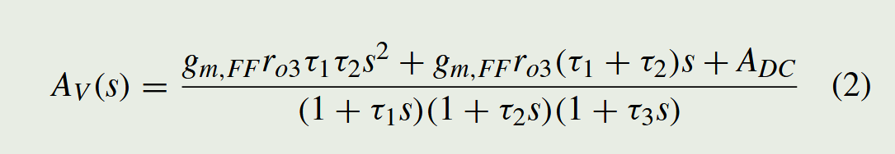

# 论文阅读 2023 — Xiayu Wang

> ⚠️ 本文件由 Claude 依据 PDF **文字层 + 逐页渲染图**填写，经过我的验证分析和完整阅读。这是一篇 5 页的 TCAS-II Brief，**Fig. 1–10 和 Table I 全部看到了**，没有「图未提取」的格子；剩下的空缺都是**论文本身没说**，标为「未说明」。
> 所有带「【我算的】」的数字是我自己推的，不是论文原话，务必自己验一遍；带「【读图】」的是从曲线上量的。
> **第三节（反推）已改成纯结构推导**：从节点方程写出 $Z_T(s)$ 和 $A_V(s)$，重新推出论文的式 (2)、式 (3) 和两条设计式，再代数解零极点。**不使用任何器件尺寸估算和工艺常数**，输入只有「连接关系 + Fig. 2 标的无源件/支路电流 + Fig. 4 的三档带宽」。
> **3.0b 是补的一节**：第一版把末级当成了理想压控电压源（输出阻抗 = 0），漏了开环输出电阻 $r_{o3}$。补上之后 94 dBΩ 档的结论全部成立（修正 < 8%），但**中低两档要重算，Q15 里「42 dBΩ 档需要 160 GHz」那个数是错的**（含 $r_o$ 后只要 ~1 GHz）。受影响的条目在 3.0b 末尾逐条列出。
> 用的是新版模板（Q3b / Q24b / Q25b / Q26b / Q26c / A16–A20 / B4 陷阱）。本篇读完之后又给模板加了 **Q24c / B6 / B4 陷阱 3**，见文末第七节。

**论文**：Xiayu Wang, Rui Ma, Dong Li, Jin Hu, Zhangming Zhu, *A Wide Dynamic Range Analog Front-End With Reconfigurable Transimpedance Amplifier for Direct ToF LiDAR*
**级别**（精读 / 提取 / 扫）：提取级（TIA + 噪声口径一侧精读）
**开始时间**：2026-09-28　　　**结束时间**：2026-09-22

---

## 一、定位（20 min · 正文一个字都不读）

**Q1. 题目、出处、年份是什么？**

答：
- 题目：A Wide Dynamic Range Analog Front-End With Reconfigurable Transimpedance Amplifier for Direct ToF LiDAR
- 出处：**IEEE TCAS-II: Express Briefs, Vol. 70, No. 3, pp. 944–948, March 2023**，DOI 10.1109/TCSII.2022.3220888
- 单位：**西安电子科技大学 微电子学院**（通讯作者 Rui Ma / Zhangming Zhu）
- 关键背景：**Table I 里的 [3]（Zheng, Sensors J. 2018）和参考 [5]（Wang, TCAS-I 2020，低 walk error）都是同一个组的自家前作。**本篇是冲着自家 [3] 去的——同样 50 kΩ 的 $R_F$，但用**一个**拓扑代替 [3] 的**两个**拓扑。
- 审稿极快：2022-10-17 投、11-04 返修、11-07 接收。是 Brief 不是 Full paper，内容密度要按 5 页去读。

---

**Q2. 摘要最后一句宣称的指标是什么？（原样抄下来，带单位）**

答：
> "The proposed AFE is fabricated in 0.18 μm CMOS technology, which achieves the −3-dB bandwidth, maximum transimpedance gain, linear dynamic range, and input-referred noise current of **260 MHz, 100 dB, 79.3 dB, and 3.3 pA/√Hz**, respectively."

补齐的主指标：
- 0.18 μm CMOS / 3.3 V，单通道
- TIA 三档 **94 / 68 / 42 dBΩ**（= $R_F$ 50 kΩ / 2.5 kΩ / 125 Ω），整链 AFE 三档 **100 / 74 / 48 dBΩ**
- 三档实测带宽 **260 / 280 / 530 MHz**
- 最大输入电流 **5 mA**，线性度误差 **0.7%**；MDS **540 nA**（SNR = 10）
- 功耗 **153 mW**（其中 TIA 29.4 mW），die 918 × 968 μm，TIA 本体 **110 × 110 μm**

---

**Q3. 末页对比表里，它加粗或点名的是哪一列？它跟谁比？**

答：

![[Wang2023-table1_comparison.png]]

**它一列都没加粗，也一列都没赢**  逐列过：

| 列 | 本文 | 谁更好 | 排名 |
|---|---|---|---|
| 跨阻增益 | 100 dBΩ | [3] 106 | 第 2 / 5 |
| 带宽 | 260 MHz | [10] 720、[2] 640、[12] 340 | **第 4 / 5** |
| 输入折合噪声 | 3.3 pA/√Hz | [3] 0.89 | 第 2 / 5 |
| 线性动态范围 | 79.3 dB | [10] 81.4、[3] 80 | **第 3 / 5** |
| PSRR | >61（**仿真**） | [12] >87 | 第 2 / 2 |
| 功耗 | **153 mW** | [3] 16.5、[10] 29.8、[12] 41、[2] 114 | **倒数第一，差 9.3 倍** |
| $C_{PD}$ | 1.5 pF | （[2] 2 pF 更大） | 第 2 |
| FoM₁ | 28.3 | [3] 78.7 | 第 2 / 5 |
| FoM₂ | 3.1 | [3] 7.9 | 第 2 / 5 |

- 比的对象：[2] Ngo TCAS-I'13（宽带 LADAR 接收机，增益档）、**[3] Zheng Sensors'18（自家前作，双拓扑）**、[10] Hong Sensors'18（多通道 TIA 阵列）、[12] Khoeini TCAS-I'21（高 PSRR、全差分）。
- **它真正的卖点根本不在表里**：正文才说 —— 「[3] 用 shunt-feedback + current-mode 两套拓扑拿宽 DR，TIA 面积 150 × 312 μm；本文只用 shunt-feedback 一套，TIA 110 × 110 μm」。**面积比 [3] 小 3.87 倍【我算的】，而 Table I 里根本没有面积这一行。**
- 所以它的组合牌是「**只用一种拓扑 + 三档可重构 + 前馈补偿** → 面积小、带宽宽（260 vs [3] 的 153 MHz），DR 还基本持平（79.3 vs 80）」。==这是个**省面积**的故事，不是**打指标**的故事。==

---

**Q3b. 它自定义的 FoM 是什么？分子分母里有哪些量、故意漏了哪些量？**

答：

$$\text{FoM}_1=\frac{R_T\cdot DR\cdot BW^2\cdot C_{PD}}{i_{in}/\sqrt{\Delta f}}\qquad \text{FoM}_2=\text{FoM}_1/DR$$

- 【我算的】五列全部验算通过（**DR 要代线性比值不是 dB**）：

| | [2] | [3] | [10] | [12] | This |
|---|---|---|---|---|---|
| 我算 FoM₁ (×10²⁴) | 2.19 | 78.72 | 3.16 | 0.05 | **28.35** |
| 表里 | 2.2 | 78.7 | 3.2 | 0.05 | 28.3 |
| 我算 FoM₂ (×10²¹) | 1.38 | 7.87 | 0.27 | 2.81 | **3.07** |
| 表里 | 1.4 | 7.9 | 0.3 | 2.8 | 3.1 |

- **分母里没有功耗。**这是全文最关键的一处遗漏：它自己 153 mW，是表里最高的、比 [3] 高 9.3 倍，而 FoM 对此完全无感。
- 分子里也**没有面积**——而面积恰恰是它正文里唯一敢说自己赢的东西。**它最想卖的和它最想藏的，都不在 FoM 里。**
- 分子里也没有 **dToF 真正要的定时指标**（walk error / jitter）。FoM₂ 的存在理由是「[4] 那类用定时技术扩 DR 的片子不该被 DR 项惩罚」——它意识到了定时这条轴，然后选择不进入。
- $BW^2$ 是平方项，权重最大；$C_{PD}$ 在分子（大 PD 电容有利，它 1.5 pF 跟 [3] 并列第二大）。
- 🚩 **【我算的】整张 FoM 表的名次挂在 [3] 的一个数上**：Table I 给 [3] 的噪声是 0.89 pA/√Hz @ 153 MHz，换成积分值是 **11.0 nA_rms**；但**本文自己的 Introduction 里白纸黑字写 [3] 是「109 nA_rms input-referred noise current」**——差整整 10 倍。若按 109 nA_rms 反算，[3] 的密度是 **8.8 pA/√Hz**，FoM₁ 从 78.7 掉到 **≈ 8.0**、FoM₂ 从 7.9 掉到 **≈ 0.80**，**本文就成了两个 FoM 的第一名**。大概率是 [3] 有两条通道（高灵敏 / 宽 DR），Table I 把不同通道的数拼在了一列里。见 Q23-9。

---

**Q4. 系统架构是什么？用一句话描述从光电二极管到输出的完整链路。**

答：

![[Wang2023-fig01_block_diagram.png]]

> 线性模式 APD（阴极接 +HV，$C_P$ 并联）→ 光电流**灌进**输入节点 → **可重构 shunt-feedback TIA**（三级核心放大器 + 前馈级 $M_{FF}$，反馈支路三选一：$R_{F1}$ 50 kΩ / $R_{F2}$ 2.5 kΩ∥$C_1$ / $R_{F3}$ 125 Ω∥$C_2$）→ **片上 AC 耦合电容 + 偏置到 $V_{CM}$** → **后置放大器**（单端转差分，输入级 $M_1/M_2$ 带 $R_1/R_2$ 局部 CMFB，$M_{11}/M_{12}$ 有源反馈，输出级 $M_6/M_7$ 带 $R_3$ 源简并、片上 50 Ω 负载）→ $V_{OP}/V_{ON}$ 差分输出。

**链路上只有两个模块，没有 ADC、没有比较器、没有 TDC、没有片上增益控制逻辑。**「gain control scheme」这个词全文出现了 4 次，但**控制信号从哪来、阈值多少、几发之内能切完，一个字没说**（见 A20）。

---

**Q5. 创新在框图的哪个框里？**

答：**全在 TIA 那个框里**，具体三处（按分量排）： 

![[Wang2023-fig02_reconfig_TIA.png]]

1. ==**$M_{FF}$ 前馈级（主创新）**：==从输入节点直接跨过第一、二级，喂到核心放大器的第三级（和 $M_8$ 组成推挽输出）。作用有二 ——（a）给 $A_{DC}$ 加一项 $g_{m,FF}r_{o3}$；（b）**在传递函数里引入左半平面零点**（式 2 分子是 $g_{m,FF}r_{o3}\tau_1\tau_2 s^2+g_{m,FF}r_{o3}(\tau_1+\tau_2)s+A_{DC}$），把三级放大器的相位裕度救回来，于是核心放大器的带宽要求从式 (3) 的 $2.89A_1^3/(2\pi R_FC_P)$ 放松到 $2A_0/(2\pi R_FC_P)$。**代价见 Q13：它同时是噪声主源。**
2. **可重构拓扑（而不是并联两套 TIA）**：三档不是换三个放大器，而是**在同一个核心放大器里开关几个器件**——$M_4$（串 $R_1$ 400 Ω 进第二级，把节点 A/B 的阻抗压到 $1/g_{m2}$，换带宽）和 $M_6$（第三级并一个 35/0.35 的 NMOS 抽电流）。所以三档共用一套版图，TIA 只有 110 × 110 μm。**这才是它对 [3] 的真正胜点。**
3. **$M_6$ 电流导引（enabler，不是亮点）**：最小增益档输入 5 mA，而核心放大器末级静态只有 0.3 mA，没有 $M_6$ 输出直接饱和 / 反向 peaking。**80 dB DR 的上端靠它。**

![[Wang2023-fig03_moderate_mode.png]]

> 一句话：创新点是**用一条前馈支路买回三级放大器的相位裕度，于是同样的功耗下 $R_F$ 可以留在 50 kΩ 而带宽从 190 MHz 推到 283 MHz；再靠几个开关让同一套放大器兼做三档，用面积换 DR 而不是用第二个 TIA 换 DR。**

---

**Q6. 它拿什么测试结果证明自己？（哪几张图、哪个数）**

答：

| 图           | 证明什么                 | 关键数                                                                                                         |
| ----------- | -------------------- | ----------------------------------------------------------------------------------------------------------- |
| **Fig. 4**  | **前馈的全部证据（后仿，不是实测）** | 同功耗下 94 dBΩ 档：本文 **283 MHz** vs 传统三级 inverter TIA **190 MHz**，**×1.49**【我算的】；68 dBΩ→304 MHz；42 dBΩ→700 MHz  |
| Fig. 8(a)   | 输出噪声                 | 示波器直方图 **Std Dev(Hs) = 2.703 mV**，μ = 2.6615 mV；正文写「扣掉示波器本底后 2.7 mV」                                        |
| Fig. 8(b)   | 电流导引能力               | 5 mA 输入、42 dBΩ 档，**单端**输出 ΔV = **620 mV**；可见脉冲后有明显下冲                                                        |
| **Fig. 9**  | 实测频响（整链）             | **100 dBΩ / 260 MHz**、74 dBΩ / 280 MHz、48 dBΩ / 530 MHz；🚩 100 dBΩ 档在 700 MHz 以上有一个 **79 dBΩ 的平台**（见 Q23-4） |
| **Fig. 10** | 线性度 + DR（核心卖点）       | 差分输出幅度 vs 输入电流，三档覆盖 0.5 μA → 5 mA；**线性度误差 0.7% @ 5 mA**                                                     |
| Table I     | 对比 + FoM             | FoM₁ 28.3 / FoM₂ 3.1，都第二                                                                                    |
| Fig. 6      | 芯片照片                 | die 918 × 968 μm；**Post Amplifier 那块明显比 TIA 大**；外围一圈是 141 pF 片上去耦 MOS 电容                                    |

![[Wang2023-fig04_sim_freq_resp.png]]

![[Wang2023-fig09_meas_freq_resp.png]]

![[Wang2023-fig10_linearity_DR.png]]

![[Wang2023-fig08a_output_noise.png]]

![[Wang2023-fig08b_transient_5mA.png]]

芯片照片（注意两件事：**Post Amplifier 那块明显比 TIA 大**；核心电路外面一圈全是 141 pF 的片上去耦 MOS 电容和保护环，所以 die 有 918 × 968 μm 而 TIA 只有 110 × 110 μm）：

![[Wang2023-fig06_chip_photo.png]]

> ⚠️ **注意证据的分布**：前馈技术（题目里的第一个创新）**只有后仿证据（Fig. 4），没有任何实测对照**——没有流片一个不带 $M_{FF}$ 的版本，也没办法从实测里把它剥出来。实测那几张图只能证明「这颗片子能跑到 260 MHz / 80 dB DR」，证明不了「是前馈让它跑到 260 MHz」。

---

**Q7. Intro 最后两段里，它批评前人什么？**

答：三条，一一对应它自己的三个动作：

1. **[2] Ngo TCAS-I'13**：「用增益档把 DR 扩到 64 dB，但**最大跨阻不够大，做不了远距离**」（[2] 只有 78 dBΩ）。→ 它自己上 100 dBΩ / 50 kΩ。
2. **[3] Zheng Sensors'18（自家前作）**：「109 nA_rms 的高灵敏度前端，**用双拓扑**拿到 80 dB DR，**代价是面积和带宽不够**」（153 MHz）。→ 它自己只用一种拓扑、260 MHz、TIA 面积小 3.87 倍。**这是全文真正的靶子。**
3. **[4] Baharmast TCAS-I'20**：「非线性反馈 TIA + 输入脉冲成形，94 dB DR，**但幅度信息保不住**，而幅度对目标识别和背景抑制很关键」。→ 它自己强调 linear DR、0.7% 线性度误差。

> 注意它**没批评** [12] Khoeini'21 的 PSRR（那是它自己最弱的一列，>61 dB 还是仿真值），也**没在 Intro 里提 [10]**。

---

## 二、三问（10 min · 通过标准）

**Q8. 它想赢哪一列？（只能有一个）**

答：==**「用一种拓扑（而不是两种）拿到 ~80 dB 线性 DR」——本质上是 TIA 面积（110 × 110 μm）**==。

Table I 里它一列都没排第一，唯一排第一的量（TIA 面积比 [3] 小 3.87 倍）根本没进表，只在正文讨论 FoM 时补了一句。这是典型的「Brief 体量的增量工作」：把自家前作的两条通道合成一条。

---

**Q9. 为了赢那一列，它牺牲了什么？（一定有）**

答：牺牲了**四样**，按代价大小排：

1. **功耗，而且是毁灭性的**(==TIA只有29.4mW==)：153 mW，表里最高，比自家 [3] 高 9.3 倍。【我算的】**其中 123.6 mW（80.8%）在后置放大器**，因为输出级挂了两个**片上 50 Ω 负载**：要撑 700 mV 单端摆幅就得每边 14 mA，两边 × 3.3 V = **92.4 mW** 只在这两个电阻上。**这是测试的账，不是结构的账**——但 Table I 里它就这么跟别人的 16.5 / 29.8 mW 并排放（见 A10、Q22-4）。
2. **噪声，比自家 [3] 差 3.7 倍**（3.3 vs 0.89 pA/√Hz）（可能是由前馈的管子增加了等效输入噪声），而**两篇的 $R_F$ 都是 50 kΩ、$C_{PD}$ 都是 1.5 pF**。【我算的】其中只有 **1.7 倍**能用带宽解释（电容主导前端换算密度 $\propto f_{-3dB}$，260/153 = 1.70），**剩下的 2.2 倍是核心放大器自己的电压噪声，也就是 $M_{FF}$**（见 Q13、B6）。**前馈补偿不是免费的，它的价码就是这 2.2 倍。论文一个字没提。**
3. **带宽第 4 名**：260 MHz。对 3–5 ns 的 dToF 回波够用（5 ns 脉冲需 ~175 MHz、3 ns 需 ~292 MHz【我算的】），但在 Table I 里被 [10] 720 / [2] 640 碾压。
4. **单档 DR 只有 28–37 dB，80 dB 是拼的**【读图】：100 dBΩ 档 0.5–12 μA（27.6 dB）、74 dBΩ 档 4–280 μA（36.9 dB）、48 dBΩ 档 80 μA–5 mA（35.9 dB）。**没有自动 AGC，谁来切、切得多快，全文未说明。**

---

**Q10. 它的机制是什么？一句话，不带公式，讲给不懂的人听。**

答：
> 高增益的跨阻放大器要稳定，后面那个放大器就得又快又有劲，这两件事平时得用电流去换。这里给放大器加了一条「抄近路」的旁路支路，让信号绕开前面两级直接冲到最后一级，相位就不会拖那么久，于是同样的电流下放大器能容忍更大的反馈电阻，增益和带宽一起留住了。再在这同一个放大器里放几个开关，想要大增益就接大电阻、想收强信号就接小电阻并且临时加一个专门抽电流的管子，于是一套电路顶三套，从 0.5 微安一直量到 5 毫安。

> ✅ 通过。附加一句给电路的人：**前馈级在开环传函的分子上产生一对 LHP 复零点 $s_z=(-1\pm j\sqrt{K-1})/\tau_a$（$K=A_{DC}/g_{m,FF}r_{o3}$），论文据此把三级放大器的带宽要求从 $2.89A_1^3/(2\pi R_FC_P)$ 放松到 $2A_0/(2\pi R_FC_P)$。**
> 🚩 **但第三节 14.3–14.6 的推导表明：这对零点落在 $\sqrt K\,\omega_a$ = 1.8–7.5 GHz，比环路单位增益频率 $f_u$ = 200 MHz 高一到两个数量级，在 $f_u$ 处只还回 1–4° 的相位；即便全盘接受论文的「2.89 → 2」，同功耗下带宽收益的解析上限也只有 $(2.891/2)^{1/4}=+9.6\%$，不是 Fig. 4 宣称的 +49%。**

---

## 三、反推（从电路结构推传递函数，再解零极点）

> **方法声明**：这一节**不从器件尺寸估 $g_m$/$C_{gs}$ 再去算别的**。只用三样输入：
> ① **连接关系**——谁的栅接在哪个节点、哪个节点是二极管负载（低阻）哪个是高阻、反馈从哪里取；
> ② **Fig. 2 标注的无源件和支路电流**——$R_{F1..F3}$、$C_1$、$C_2$、5.14 / 2.03 / 0.93 mA；
> ③ **论文自己给的带宽**——Fig. 4 的 283 / 304 / 700 MHz、Fig. 9 的 260 / 280 / 530 MHz。
> 符号参数（$A_0$、$BW_0$、$\tau$、$K$）全部由 ①②③ **反解**。这样得出的结论只依赖论文自己的数据和电路拓扑，不依赖我对工艺常数的任何假设。凡是【我算的】都写出公式和中间值，可以自己重算。

---

### 3.0 先把闭环写出来 —— 论文那几条设计式是从哪来的

**节点方程**。输入节点 X，反馈网络 $R_F\|C_F$，输入总电容 $C_T$（APD + pad + 输入管栅），核心放大器 $v_{out}=-A(s)\,v_x$：

$$i_{in}=v_x\,sC_T+(v_x-v_{out})\left(\frac1{R_F}+sC_F\right)$$

代入 $v_x=-v_{out}/A(s)$ 消元：

$$\boxed{\;Z_T(s)=\frac{v_{out}}{i_{in}}=\frac{-A(s)\,R_F}{\,1+A(s)+sR_F\big[\,C_T+(1+A(s))\,C_F\,\big]\,}\;}\tag{★}$$

> ⚠️ **(★) 假设了放大器输出阻抗为零**（理想压控电压源）。这在 94 dBΩ 档（$r_{o3}/R_F\le0.03$）够用，**但在中低两档会算出荒谬的结果**。正确的两节点式见 **3.0b**，那里也逐条核对了哪些结论受影响。

三个立刻能读出来的结论：

1. **直流**：$Z_T(0)=-R_F\cdot A_0/(1+A_0)\approx-R_F$ —— 这就是三档 94/68/42 dBΩ 精确等于 $R_F$ 的结构原因（Q12）。
2. **输入阻抗**：$R_{in}=v_x/i_{in}\big|_{DC}=R_F/(1+A_0)$。
3. ==**$C_F$ 是被米勒放大的**：它以 $(1+A(s))\,C_F$ 的形式并到 $C_T$ 上。$(1+A_0)$ 有一百多倍，所以几十 fF 的 $C_F$ 就等效于几 pF 的输入电容。== 这是全文最大的一个隐藏约束，论文一个字没提（Q12、Q14）。

**取 $C_F=0$（94 dBΩ 档的真实情况）、核心放大器用单极点 $A(s)=A_0/(1+s/\omega_0)$**，代进 (★) 整理成标准二阶式：

$$Z_T(s)=\frac{-R_F\,A_0/(1+A_0)}{\dfrac{s^2}{\omega_n^2}+\dfrac{2\zeta}{\omega_n}s+1},\qquad
\omega_n=\sqrt{\frac{(1+A_0)\,\omega_0}{R_FC_T}}\approx\sqrt{\frac{A_0\omega_0}{R_FC_T}},\qquad
\zeta=\frac{\omega_n\!\left(R_FC_T+1/\omega_0\right)}{2(1+A_0)}\approx\frac12\sqrt{\frac{\omega_0R_FC_T}{A_0}}$$

（$R_FC_T=100$ ns $\gg1/\omega_0\approx0.4$ ns，所以 $1/\omega_0$ 可以扔掉。）

于是**论文那两条设计式一行就出来了**：

$$\zeta\ge\tfrac1{\sqrt2}\ \Longrightarrow\ \boxed{\omega_0\ge\frac{2A_0}{R_FC_T}}\quad\Leftrightarrow\quad BW_0\ge\frac{2A_0}{2\pi R_FC_P}\ \text{（论文 ✓）}$$

$$\text{取等号代回}\ \Longrightarrow\ \boxed{\omega_n=\frac{\sqrt2\,A_0}{R_FC_T}}\quad\Leftrightarrow\quad BW\approx\frac{\sqrt2A_0}{2\pi R_FC_P}\ \text{（论文 ✓）}$$

**两个论文没写、但设计时更好用的等价读法**：

- 两式相除：$\boxed{BW=BW_0/\sqrt2}$。==**TIA 带宽就是核心放大器带宽除以 $\sqrt2$，跟 $A_0$、$R_F$、$C_T$ 全无关。**== 先定核心放大器的带宽，TIA 带宽当场就知道。校验：Fig. 4 的 283 MHz ⟹ $BW_0$ = 400 MHz。
- 跨阻带宽积：$\boxed{Z_T\cdot BW=R_F\cdot\dfrac{\sqrt2A_0}{2\pi R_FC_T}=\dfrac{\sqrt2\,A_0}{2\pi C_T}}$ —— ==**跟 $R_F$ 无关**==。这就是 Säckinger 的跨阻极限（论文引了 [6] 却从没用过）。**要提高跨阻带宽积只有两条路：加 $A_0$（必须按比例加 $\omega_0$，即加电流），或减 $C_T$。换 $R_F$ 是零和游戏**（Q12 末尾有数值验证）。

**用上面的式子反解工作点**（输入只有 $R_{F1}$ = 50 kΩ、$C_T$、Fig. 4 的 283 MHz 三个数）：

| $C_T$ | $A_0$ | $BW_0=\sqrt2\,BW$ | $R_{in}=\frac{R_F}{1+A_0}$ | $f_u=\frac{A_0}{2\pi R_FC_T}$ | 三级等极点 $f_p$ | $A_1=A_0^{1/3}$ | 每级 GBW | $Z_T\!\cdot\!BW$ |
|---|---|---|---|---|---|---|---|---|
| 1.8 pF | 113（41.1 dB） | 400 MHz | 438 Ω | 200 MHz | 785 MHz | 4.84 | 3.80 GHz | 1.42×10¹³ |
| **2.0 pF** | **126（42.0 dB）** | **400 MHz** | **395 Ω** | **200 MHz** | **785 MHz** | **5.01** | **3.93 GHz** | **1.42×10¹³** |
| 2.2 pF | 138（42.8 dB） | 400 MHz | 359 Ω | 200 MHz | 785 MHz | 5.17 | 4.06 GHz | 1.42×10¹³ |

下面统一取 $C_T$ = **2.0 pF**（= 1.5 pF APD + 0.3 pF pad，两个都是论文给的数；再加 ~0.2 pF 的 $C_{IN}$，论文只给了符号没给值）。
**注意 $BW_0$、$f_u$、$f_p$、$Z_T\!\cdot\!BW$ 对 $C_T$ 的假设完全不敏感**——因为 $A_0\propto C_T$，而这些量里都是 $A_0/C_T$ 的组合。受影响的只有 $A_0$ 和 $R_{in}$，也只有 ±10%。

---

### 3.0b 把开环输出电阻 $r_o$ 放回去 ★

> ⚠️ **上面 3.0 的推导把放大器当成了理想压控电压源（$v_{out}=-A(s)v_x$，输出阻抗 = 0）。这是错的**，而且论文自己就提示了：它写的主极点是 $\omega_{pd}\approx1/[(r_{o3}+R_{F1})C_P]$ —— **$r_{o3}$ 是跟 $R_F$ 串在一起的**。末级是一个 CS 级，输出阻抗是 $r_{o3}\|1/(sC_o)$，不是零。下面把它放回去。

**正确的模型是两节点**。把末级写成跨导 $G_m(s)$（这是从 $v_x$ 到灌进节点 C 的电流，主通路 + 前馈都算在里面），输出节点导纳 $Y_o=1/r_o+sC_o$，反馈网络导纳 $Y_F=1/R_F+sC_F$：

$$\text{节点 X:}\quad i_{in}=v_x\,sC_T+(v_x-v_o)Y_F$$
$$\text{节点 Y:}\quad (v_x-v_o)Y_F-G_m(s)v_x-v_oY_o=0\ \Longrightarrow\ \frac{v_o}{v_x}=\frac{Y_F-G_m}{Y_F+Y_o}$$

注意第二式：==**放大器的「带载增益」是 $\frac{Y_F-G_m}{Y_F+Y_o}$，不是开环增益 $-A(s)$。**== 反馈网络既取样又**加载**输出节点，而且 $Y_F$ 还提供一条从 X 直通 Y 的**前馈路径**（就是 $Y_F-G_m$ 里的那个 $Y_F$）。消元得：

$$\boxed{\;Z_T(s)=\frac{Y_F-G_m(s)}{\,sC_T(Y_F+Y_o)+Y_F\big(Y_o+G_m(s)\big)\,}\;}\tag{★★}$$

**开环（空载）增益仍然是 $A(s)=G_m(s)/Y_o(s)=\dfrac{G_m(s)\,r_o}{1+s\,r_oC_o}$** —— 这正是式 (2) 描述的东西（$r_o$ 本来就在 $A_{ff}=g_{m,FF}r_{o3}$ 里），==**所以 Q14 里式 (2) 和零点的推导不受影响。受影响的是闭环。**==

#### 变了什么、没变什么

把 $C_F=0$、$G_m$ 取常数、极点全放在输出节点（$\omega_0=1/r_oC_o$）代进 (★★)，分母是

$$s^2C_TC_o+s\left[C_T\Big(\tfrac1{R_F}+\tfrac1{r_o}\Big)+\tfrac{C_o}{R_F}\right]+\frac{1+A_0}{R_Fr_o}$$

| 量 | 3.0（$r_o=0$） | 3.0b（含 $r_o$） | 差别 |
|---|---|---|---|
| $\omega_n$ | $\sqrt{\dfrac{(1+A_0)\omega_0}{R_FC_T}}$ | **一模一样** | ✅ 无 |
| $\zeta$ | $\dfrac12\sqrt{\dfrac{\omega_0R_FC_T}{1+A_0}}$ | $\dfrac12\sqrt{\dfrac{\omega_0R_FC_T}{1+A_0}}\left(1+\dfrac{r_o}{R_F}\right)$ | ==**多一个 $(1+r_o/R_F)$**== |
| 稳定条件 | $\omega_0\ge\dfrac{2A_0}{R_FC_T}$ | $\boxed{\omega_0\ge\dfrac{2A_0R_F}{C_T(R_F+r_o)^2}}$ | ==**松了 $(1+r_o/R_F)^2$ 倍**== |
| 直流增益 | $-R_F\dfrac{A_0}{1+A_0}$ | $\boxed{Z_T(0)=\dfrac{r_o-A_0R_F}{1+A_0}}$ | ==**$|Z_T|$ 永远 $<R_F$，少的那项 $\propto r_o$**== |

==**关键结论：$r_o$ 是帮忙的，不是捣乱的。**== 它给闭环加阻尼、让稳定条件变松，而且 **$R_F$ 越小帮得越多**：

| 档 | $R_F$ | $(1+r_o/R_F)^2$（$r_o$=1.5 kΩ） | $BW_0$ 需求（忽略 $r_o$） | $BW_0$ 需求（含 $r_o$=1.5 kΩ） |
|---|---|---|---|---|
| 94 dBΩ | 50 kΩ | 1.06 | 400 MHz | **377 MHz** ← 几乎不变 |
| 68 dBΩ | 2.5 kΩ | 2.6 | 8.0 GHz | **3.1 GHz** |
| 42 dBΩ | 125 Ω | **169** | 160 GHz（荒谬） | **0.95 GHz** ← 完全做得到 |

#### 第二个机制：反馈网络反过来把输出节点拉低阻

高频时节点 X 经 $C_T$ 接地，于是节点 Y 看到的电阻是 $r_o\|R_F$：

| 档 | $r_o\|R_F$（$r_o$=1.5 kΩ） | 输出极点 $1/(2\pi(r_o\|R_F)C_o)$ |
|---|---|---|
| 94 dBΩ | 1456 Ω | 412 MHz |
| 68 dBΩ | 938 Ω | 640 MHz |
| 42 dBΩ | **115 Ω** | **5.2 GHz** |

==**所以「降 $R_F$ 需要更宽的核心放大器」这件事，有一大半是自动发生的**== —— 反馈电阻自己把放大器的输出节点拉低阻、把极点推出去。论文那句「the bandwidth of the core amplifier needs to be widened with the decrease of the feedback resistance」只说了需求变严，没说供给也同时变松。

#### 对前面结论的影响（逐条核对）

| 结论 | 是否受影响 |
|---|---|
| 式 (2) 的推导、零点公式（Q14.1–14.2） | ✅ **不受影响**（那是开环空载增益，$r_o$ 本就在里面） |
| 式 (3) 的推导（Q14.5） | ✅ 不受影响（环路相位，$r_o$ 只改主极点位置 3%） |
| **94 dBΩ 档的全部数字**（$A_0$、$BW_0$、$R_{in}$、$f_u$、$Z_T\!\cdot\!BW$） | ✅ **修正 < 8%**：$r_o/R_F\le0.03$。含 $r_o$ 后为落回 283 MHz，$A_0$ 从 126 略降到 **~110–120**，$Z_T(0)$ 比 $R_F$ 低 **0.07 dB**。结论全部成立 |
| 前馈补偿的收益评估（Q14.3–14.7） | ✅ 不受影响（全部是 94 dBΩ 档的事） |
| **Q12 的三档带宽对账** | ⚠️ **要改**：中低档对 $r_o$ 极敏感，见 Q12 修正 |
| **Q15「42 dBΩ 档若无 $C_F$ 需要 160 GHz」** | ❌ **错了**：含 $r_o$ 后只要 ~0.95 GHz。见 Q15 修正 |
| Q13 的噪声分析 | ✅ 不受影响（式 5/6 是输入折合，跟 $r_o$ 无关） |

**Q11. 输入阻抗 $R_{in}$ 大概是多少？主极点被推到哪？**

我猜（由 3.0 的结构式直接给出，不是估的）：

- **输入阻抗**：$R_{in}=R_{F1}/(1+A_0)=50\ \text{k}\Omega/127=\mathbf{395\ \Omega}$【我算的】（$C_T$ 取 1.8 pF 则 438 Ω）。

- **环路的主极点在输入节点，而且可以推出来**。把环路在放大器输入端断开：注入 $v_x$ → 放大器输出 $-A(s)v_x$ → 经 $R_F$ 驱动挂着 $C_T$ 的节点 X → 返回的电压

  $$T(s)=\frac{-A(s)}{1+sR_FC_T}\qquad\Longrightarrow\qquad \omega_{pd}=\frac1{R_FC_T}$$

  把放大器的输出电阻 $r_{o3}$ 串进去（信号要从放大器输出经 $r_{o3}$ 和 $R_F$ 才到节点 X）就是 $\omega_{pd}=1/[(r_{o3}+R_F)C_T]$ —— ==**这就是论文那句 $\omega_{pd}\approx1/(r_{o3}+R_{F1})C_P$ 的完整来源。**==
  【我算的】$f_{pd}=1/(2\pi\cdot50\text{k}\cdot2\text{p})=\mathbf{1.59\ MHz}$（94 dBΩ 档 $r_{o3}/R_F\le0.03$，可忽略；**但中低两档 $r_{o3}$ 会主导这个电阻，见 3.0b**）。

- **环路单位增益频率**：$f_u=A_0\cdot f_{pd}=126\times1.59\ \text{MHz}=\mathbf{200\ MHz}$【我算的】。**这个数在 Q14 判定前馈有没有用时是关键 —— 补偿零点必须落在 $f_u$ 附近才起作用。**

- **闭环 −3 dB（283 MHz）比 $f_u$（200 MHz）还高**，不是矛盾：$\zeta=0.707$ 的二阶系统在 $\omega_n$ 处才掉 3 dB，而 $\omega_n=f_u/0.644$。这 40% 是「最大平坦」买来的。

作者：**$R_{in}$、$A_0$、$\omega_0$、相位裕度一个数都没给**，只给了 $\omega_{pd}$、$BW_0\ge2A_0/(2\pi R_FC_P)$、$BW\approx\sqrt2A_0/(2\pi R_FC_P)$ 三条关系式 —— 而这三条我在 3.0 里已经全部从节点方程推出来了。

差在：
- **推导完全对得上，一个符号都不差**，说明作者用的就是这套标准二阶 shunt-feedback 模型（Razavi [7] / Säckinger [8]）。论文没做的是**代数**：把 $R_F$、$C_T$、$BW$ 代回去，$A_0$ 和 $BW_0$ 是唯一确定的。
- 🚩 反解出来的 $A_0\approx126$、$BW_0\approx400$ MHz ==**恰好让稳定条件取等号**==：$2A_0/(2\pi R_FC_T)=2\times126/(2\pi\times100\ \text{ns})=401$ MHz。**这颗片子就设计在 Butterworth 边界上 —— Fig. 4 的平坦是「刚好压到」不是「留了裕度」。$\omega_0$ 只要少 28%（$\zeta$ 掉到 0.6）就开始 peaking，而论文没有任何 PVT / 蒙卡数据。**
- 「等效 GBW」$A_0\cdot BW_0=50$ GHz 看着吓人，但**多级放大器的 $A_0\times BW_0$ 本来就不受单级 $f_T$ 约束**：$A_1=A_0^{1/3}=5.0$、每级极点 785 MHz、**每级只要 3.9 GHz 的 GBW**【我算的】——0.18 μm 厚栅器件轻松做到。设计点是合理的。
- 🚩 **节点 A/B 的阻抗论文自相矛盾**，而这一条直接决定 $\tau_1$、$\tau_2$（Q14 的零点位置就靠它们）：Fig. 2 里 $M_{N1}$ 是 **0.4/0.35** 的二极管接法 NMOS，正文讲中增益档时却说「the equivalent resistance at nodes A and B is equal to $1/g_{m2}$」。**二极管负载 = 低阻节点 = 快极点**这个定性判断是确定的（也正是为什么第一、二级能做到 GHz 级），但具体值论文两处说法不一致。见 Q23-3。

---

**Q12. 直流跨阻 $Z_T$ 由哪个器件决定？**

我猜：TIA 单级 $Z_T\approx R_F$；整链 $Z_T=R_F\times A_{post}$。

作者：**这篇难得地把两个口径都给了，而且能对上。**【我算的】逐档验：

| 档 | $R_F$（Fig. 2） | $20\log R_F$ | TIA 标称（Fig. 4） | AFE 标称（Fig. 9） | 差 |
|---|---|---|---|---|---|
| 高 | **50 kΩ** | 94.0 dBΩ | **94 dBΩ** ✅ | **100 dBΩ** | 6 dB |
| 中 | **2.5 kΩ** | 67.96 dBΩ | **68 dBΩ** ✅ | **74 dBΩ** | 6 dB |
| 低 | **125 Ω** | 41.94 dBΩ | **42 dBΩ** ✅ | **48 dBΩ** | 6 dB |

差在：
- **$Z_{T,TIA}$ 精确等于 $R_F$，三档全对，误差 < 0.1 dB** —— 正是 3.0 式 (★) 的直流极限 $Z_T(0)=-R_F A_0/(1+A_0)$，$A_0=126$ 时误差只有 $1/127=0.8\%$（0.07 dB）。没有任何「整链假装成单级」的水分：Table I 甚至同时列了 "Transimpedance Gain 100 dBΩ" 和 "Feedback Resistance 50 kΩ"，两者之比 = 2 = 后级增益，口径**当场可还原**。比 Zheng 2024 干净得多。
- 🚩 **但那 6 dB 不是真增益。**见 Q24c / 复现 B：后级的**单边电压增益 = 1（0 dB）**，6 dB 完全是「单端输入 → 差分输出」的 ×2。**后置放大器烧掉全片 81% 的功率，贡献 0 dB 的每边电压增益。**

#### ★ 用 (★) 式对账 Fig. 4 的三档带宽 —— 只用 $R_F$、$C_F$，不用任何器件参数

$C_F\ne0$ 时把 (★) 的分母看成 $1+A_0+sR_F[C_T+(1+A_0)C_F]$：**闭环极点**

$$\omega_{-3dB}\approx\frac{1+A_0}{R_F\big[C_T+(1+A_0)C_F\big]}\ \xrightarrow[\ (1+A_0)C_F\gg C_T\ ]{}\ \boxed{\frac1{R_FC_F}}$$

也就是说 ==**只要 $(1+A_0)C_F$ 压过 $C_T$，带宽就被 $C_F$ 一个器件定死在 $1/(2\pi R_FC_F)$，跟核心放大器、跟前馈一点关系都没有。**== 代 Fig. 2 的值（$A_0=126$、$C_T=2.0$ pF）：

| 档 | $R_F$ | $C_F$ | $(1+A_0)C_F$ | vs $C_T$ | $C_F$ 天花板 $\frac1{2\pi R_FC_F}$ | (★) 式模型 | **Fig. 4 后仿** | 误差 |
|---|---|---|---|---|---|---|---|---|
| 94 dBΩ | 50 kΩ | **无** | — | — | — | 284 MHz | **283 MHz** | +0.4%（循环，$A_0$ 由此反解） |
| 68 dBΩ | 2.5 kΩ | 160 fF | 20.3 pF | **10×** | **398 MHz** | 393 MHz | **304 MHz** | +29% |
| 42 dBΩ | 125 Ω | 1.75 pF | 222 pF | **111×** | **728 MHz** | 732 MHz | **700 MHz** | **+4.6%** ✅ |

> ⚠️ **上表用的是 3.0 的理想式 (★)（$r_o=0$）。按 3.0b，中低两档的 $r_o/R_F$ 分别是 0.6 和 12，完全不能忽略。**用两节点式 (★★) 重算（同一个核心放大器 $A_0$=126、$\omega_0/2\pi$=400 MHz）：

| 档 | $r_o/R_F$ | (★) 式 $r_o=0$ | (★★) $r_o$=250 Ω | (★★) $r_o$=1 kΩ | (★★) $r_o$=1.5 kΩ | **Fig. 4** |
|---|---|---|---|---|---|---|
| 94 dBΩ | 0.02–0.03 | 284 MHz | 315 MHz (+0.27 dB) | 310 MHz | 307 MHz | **283 MHz** |
| 68 dBΩ | 0.1–0.6 | 393 MHz | 419 MHz | 422 MHz | 424 MHz | **304 MHz** |
| 42 dBΩ | 2–12 | 732 MHz | 785 MHz | **933 MHz (+22 dB 峰化!)** | **3491 MHz (+7.6 dB)** | **700 MHz** |

**要改的结论**：
- ❌ 「42 dBΩ 档的 700 MHz = $1/(2\pi R_{F3}C_2)$ = 728 MHz，差 4%」——**那个 4% 有一半是忽略 $r_o$ 换来的巧合**。含 $r_o$ 后模型给 785 MHz（$r_o$=250 Ω），比实测高 12%。
- ✅ **仍然成立的是定性结论**：$(1+A_0)C_F$ 比 $C_T$ 大 10–111 倍，**中低两档的带宽主要由 $C_F$ 决定，核心放大器和 $M_{FF}$ 在这两档基本不起作用**。
- ⭐ **新结论（$r_o$ 带来的）**：42 dBΩ 档在 $r_o\gtrsim1$ kΩ 时会**严重峰化（+7 到 +22 dB）**，而 Fig. 4 的这条曲线是平的。==**Fig. 4 那条平坦的 42 dBΩ 曲线本身就是证据：这一档的 $r_o$ 必须被压到几百欧以下。**== 谁压的？**$M_6$**（35/0.35 NMOS，只在最低档由 $M_7$ 接通）。论文只说它是 current steering，**但它同时并联在节点 C 上把 $r_o$ 拉低** —— 这既保证了 $Z_T$ 接近 $R_{F3}$，又保证了这一档不振铃。**这是 $M_6$ 没被说出来的第二个作用。**
- 68 dBΩ 档：模型 419–424 MHz vs 实测 304 MHz，**含 $r_o$ 后反而更对不上**。说明这一档还有别的限制（$R_1$ 插入后 $A_0$ 掉到 ~40，以及后级/负载电容），单靠这个模型反解不出可靠的 $A_0$。**上一版「反解 $A_0\approx40$」的结论要降级为量级估计。**

> **所以 Fig. 4 里只有 94 dBΩ 那一档的带宽是核心放大器决定的**（且 $r_o$ 修正 < 8%），也只有那一档拿来对比前馈才公平。论文那句「the −3-dB bandwidth of the proposed TIA is greatly widened」笼统地盖了三档。

**顺带：直流增益也要打折。**由 3.0b，$|Z_T(0)|=\dfrac{A_0R_F-r_o}{1+A_0}<R_F$ **恒成立**：

| 档 | $A_0$ | $r_o$ | $|Z_T(0)|$ | vs 标称 $20\log R_F$ |
|---|---|---|---|---|
| 94 dBΩ | 126 | 1.5 kΩ | 49.59 kΩ | **−0.07 dB**（可忽略）|
| 68 dBΩ | 40 | 300 Ω | 2432 Ω | −0.24 dB |
| 42 dBΩ | 40 | 300 Ω | 114.6 Ω | ==**−0.75 dB**== |
| 42 dBΩ | 126 | 300 Ω | 121.7 Ω | −0.24 dB |

==**Fig. 4 标的「94/68/42 dBΩ」是 $20\log R_F$（理想放大器值），不是实际的 $Z_T$。**== 最高档无所谓，最低档能差 0.2–0.8 dB —— 这也从另一个方向要求 $r_o$ 在那一档必须很低。

#### $C_F$ 的双重身份（论文只说了一半）

同一个 $C_F$，在两个地方出现，方向相反：

| 位置 | 表达式 | 作用 |
|---|---|---|
| **环路增益**里（反馈系数 $\beta$） | $\beta=\dfrac{1+sR_FC_F}{1+sR_F(C_F+C_T)}$ → **零点** $\dfrac1{2\pi R_FC_F}$ | 抵掉核心放大器的极点、抬相位裕度 ← **论文说的就是这个**（"an LHP zero ... with the frequency of $1/C_1R_{F2}$"）|
| **闭环跨阻**里（式 ★） | $(1+A_0)C_F$ 并到 $C_T$ 上 | **米勒倍增，把带宽封顶** ← **论文一个字没提** |

**两个作用的转折点是同一个频率 $1/(2\pi R_FC_F)$** —— 这就是 $C_F$ 取值的全部张力：小了压不住 peaking，大了直接把带宽锁死在零点频率上。

🚩 **回过头看 94 dBΩ 档「没有 $C_F$」这件事**：$R_{F1}$ = 50 kΩ 的**寄生并联电容**（多晶电阻端到端 + 到衬底）同样要被 $(1+A_0)=127$ 倍米勒放大。【我算的】

| 寄生 $C_F$ | 0 | 2 fF | 5 fF | 10 fF | 15 fF | 20 fF |
|---|---|---|---|---|---|---|
| $(1+A_0)C_F$ | 0 | 0.25 pF | 0.63 pF | 1.27 pF | 1.90 pF | 2.53 pF |
| BW | 284 MHz | 249 | 203 | 150 | 119 | 98 MHz |

==判据：$(1+A_0)C_F\ll C_T$ ⟹ **$C_F\ll C_T/(1+A_0)=15.8$ fF**，实际要做到 **~2 fF 以下**才不掉 12% 的带宽。一个 50 kΩ 的片上多晶电阻要做到端到端 2 fF 是极难的。== **这才是「最高增益档为什么停在 283 MHz」的真正物理约束，而论文把它记在了别处。**

#### 顺带回答「$R_F$ 还能不能再加大」（3.0 的跨阻极限的数值验证）

$A_0$、$BW_0$ 不变、$C_F=0$：

| $R_F$ | $Z_T$ | BW | 峰化 | $Z_T\!\cdot\!BW$ | 需要的 $BW_0$ |
|---|---|---|---|---|---|
| 25 kΩ | 88 dBΩ | 510 MHz | **+1.23 dB** ⚠ | 1.28×10¹³ | 800 MHz（不够） |
| **50 kΩ** | **94 dBΩ** | **284 MHz** | +0.00 dB | **1.42×10¹³** | 400 MHz（=实际） |
| 100 kΩ | 100 dBΩ | 130 MHz | +0.00 dB | 1.30×10¹³ | 200 MHz（很宽裕） |
| 200 kΩ | 106 dBΩ | 57 MHz | +0.00 dB | 1.15×10¹³ | 100 MHz |

- **$Z_T\cdot BW$ 基本是常数 ~1.4×10¹³ Ω·Hz，在 Butterworth 点取最大** ← 3.0 推出的 $Z_T\!\cdot\!BW=\sqrt2A_0/(2\pi C_T)$ ✅
- ==**所以 50 kΩ 不是被稳定性卡住的，是被「BW 要 ≥ 260 MHz」卡住的。**== 想要 106 dBΩ（跟 [3] 平齐）随时可以，代价是带宽掉到 57 MHz。**降 $R_F$ 才会撞稳定性**（25 kΩ 那一行 +1.23 dB 峰化）—— 这正是论文那句「the bandwidth of the core amplifier needs to be widened with the decrease of the feedback resistance」，也正是中/低档要插 $R_1$、要加 $C_F$ 的原因。

#### 其他

- 🚩 开关 $M_{F1..F3}$ 串在反馈支路里，在最低档是个 10% 量级的**非线性**元件（$V_{ds}$ 上摆着 625 mV 信号）。而实测 42 dBΩ = 126 Ω 正好等于标称 $R_{F3}$，说明「125 Ω」要么已含开关，要么开关的 $R_{on}$ 远小于我预期。**0.7% 的线性度误差在这种拓扑里怎么做到的，论文没解释。**

---

**Q13. 噪声主贡献是哪个器件？为什么是它？**

我猜：
- **低频**：$R_{F1}$ 热噪声 $4kT/R_{F1}$。
- **高频**：输入管 $M_1/M_2$ 的沟道噪声被 $C_P+C_{IN}$ 抬起来，$\propto\omega$，带边主导。
- 因为 $R_{F1}$ 有 50 kΩ 这么大，$4kT/R_F$ 那项应该已经很小了。

作者：式 (5)(6)——

![[Wang2023-eq0506_noise_model.png]]

$$\overline{I^2_{n,in}}\approx\frac{4kT}{R_{F1}}+\overline{V^2_{n,A}}\frac{1+(C_P+C_{IN})^2R^2_{F1}\omega^2}{R^2_{F1}},\qquad \overline{V^2_{n,A}}=4kT\gamma\left(\frac{g_{m1}+g_{m,MN1}}{g^2_{m1}}+\frac{g_{m,M8}+g_{m,FF}}{g^2_{m,FF}}\right)$$

作者的结论只有两句：「**大的反馈电阻能显著降低输入折合噪声电流**」「增大 $M_1$、$M_2$、$M_{FF}$ 的宽长比改善噪声，但 $C_{IN}$ 会变大；最优在 $C_{gs,FF}\in[C_P/2,\ C_P+C_{gs1}]$」。

差在（**这是本篇最值钱的一段**）。下面三步全部只用**结构 + Fig. 2 标注的支路电流**，不用尺寸：

**① 式 (6) 的结构告诉你噪声源是怎么折回输入的。**
两项的分母不一样：第一项除 $g_{m1}^2$（**第一级的跨导**），第二项除 $g_{m,FF}^2$（**前馈通路自己的跨导**）。
原因是**通路不同**：第三级 $M_8$/$M_{FF}$ 的噪声若沿主通路折回输入，要除以前两级的增益 $g_{m1}r_{o1}g_{m2}r_{o2}$（很大，压得很干净）；但**前馈支路给了它一条只除 $g_{m,FF}$ 的捷径**——噪声跟信号走同一条路，前级增益压不到它。
> ==**任何前馈补偿都会把「被旁路掉的那些级」的噪声优势一起旁路掉。**这是结构决定的，不是这颗片子做坏了。==

**② 代支路电流，量化这个代价。**
第一级 $M_1$(P)+$M_2$(N) 串联同流 $I_1=5.14$ mA；第三级 $M_8$(P)+$M_{FF}$(N) 串联同流 $I_3=0.93$ mA（**都是 Fig. 2 标的**）。设两级工作在同一个 $g_m/I_D\equiv m$（同工艺同反型区，这是唯一的假设，而且它在下面的比值里约掉）：

$$g_{m1}=g_{m,M1}+g_{m,M2}=2mI_1,\qquad g_{m,M8}=g_{m,FF}=mI_3$$
$$\text{第一项}\approx\frac1{g_{m1}}=\frac1{2mI_1},\qquad \text{第二项}=\frac{2mI_3}{(mI_3)^2}=\frac2{mI_3}$$
$$\boxed{\frac{\text{第二项}}{\text{第一项}}=\frac{4I_1}{I_3}=\frac{4\times5.14}{0.93}=\mathbf{22}}$$

==**第三级的噪声权重是第一级的 22 倍，占 $v_{n,A}^2$ 的 96%。而第三级只分到核心放大器 8.65 mA 里的 0.93 mA（11%）。**==【我算的，$m$ 已约掉，与工艺无关】
**核心放大器的电压噪声几乎全部来自 $M_{FF}$ 和跟它推挽的 $M_8$ —— 也就是这篇论文的创新点本身。**

**③ 由宣称的噪声反解 $v_{n,A}$，跟式 (5) 对账。**
式 (5) 展开是三项：

$$\overline{I^2_{n,in}}=\underbrace{\frac{4kT}{R_{F1}}}_{\text{①}}+\underbrace{\frac{v_{n,A}^2}{R_{F1}^2}}_{\text{②}}+\underbrace{v_{n,A}^2(C_P+C_{IN})^2\omega^2}_{\text{③}}$$

- 项①【我算的，只要 $R_{F1}$】：$\sqrt{4kT/50\text{k}}=\mathbf{0.576}$ pA/√Hz → 占宣称 3.3 pA/√Hz 的噪声功率 **3.0%**。
- 项③是主项。带内按 $\langle f^2\rangle=f_{-3dB}^2/3$ 取均方，反解：
  $$v_{n,A}=\frac{i_{n,in}\sqrt3}{2\pi f_{-3dB}C_T}=\frac{3.3\text{pA}\times1.732}{2\pi\times260\text{MHz}\times2.0\text{pF}}=\mathbf{1.75\ nV/\sqrt{Hz}}$$
  等效噪声电阻 $R_{eq}=v_{n,A}^2/(4kT\gamma)$ = **277 Ω**（$\gamma=2/3$）/ 185 Ω（$\gamma=1$）。
- 跟②对账：$R_{eq}$ 里第一项 $1/g_{m1}$ 只占 1/23，即 **8–12 Ω**，第二项 **173–265 Ω**。自洽 ✅

4. ==🚩🚩 **所以作者那句「大的反馈电阻能显著降低输入折合噪声电流」对它自己这颗片子是错的。**== 项③**跟 $R_{F1}$ 完全无关**。$R_{F1}$ 已经大到 50 kΩ，①+② 加起来只有 3% 的噪声功率；再把 $R_F$ 加大到 500 kΩ，总噪声只降 1.5%。这句话是教科书里适用于**小 $R_F$** 的结论，跟它自己的数字矛盾。
   （$R_F$ 的噪声下限约束 $4kT/R_F\le i_n^2$ 给出 $R_F\ge1.52$ kΩ —— 50 kΩ 早就远离这个约束了。）

5. ==🚩 **它违反了自己写的噪声最优条件。**== 论文说最优在 $C_{gs,FF}\in[C_P/2,\ C_P+C_{gs1}]$，即 **$C_{gs,FF}$ 应该跟 $C_P$（1.5 pF）同量级**。而 $M_{FF}$ 是 20/0.5 —— 跟第一级的 $M_1$(80/0.4)、$M_2$(64/0.35) 比，**栅面积小一个数量级**，$C_{gs,FF}$ 不可能接近 0.75 pF。**它在「噪声最优」和「带宽 / 零点位置」之间选了后者，然后把噪声最优的公式照抄在正文里。** 见 Q23-1。

6. **【设计建议 —— 论文完全没做的优化】** 由②，$v_{n,A}\propto(\text{第二项})^{1/2}\propto I_3^{-1/4}$（强反型 $g_m\propto\sqrt I$）。把第三级电流从 0.93 mA 提上去：

| $I_3$ | $g_{m,FF}$ 倍数 | $v_{n,A}$ 倍数 | $i_{n,in}$ | TIA 功耗 +% | 全片功耗 +% |
|---|---|---|---|---|---|
| 0.93 mA（现状） | 1.00 | 1.000 | 3.30 pA/√Hz | — | — |
| 2 mA | 1.47 | 0.826 | **2.73** | +12% | **+2.3%** |
| **3 mA** | 1.80 | 0.746 | **2.46** | +23% | **+4.5%** |
| 5 mA | 2.32 | 0.657 | **2.17** | +46% | +8.8% |

==**把第三级从 0.93 mA 提到 3 mA，噪声从 3.3 降到 2.5 pA/√Hz（−25%），全片功耗只涨 4.5%。**== 副作用是 $r_{o3}\propto1/I$ 下降 → $A_{ff}=g_{m,FF}r_{o3}$ 变小 → $K$ 变大、零点更高；但零点本来就远高于 $f_u$ 用不上（Q14），**所以这个副作用不构成代价**。**偏置分配（5.14 / 2.03 / 0.93 mA 一路递减）是按「主通路增益」分的，没有按「噪声权重」分 —— 而前馈把噪声权重整个翻转了。**

5. **$M_{N1}$ 在式 (6) 里以 $g_{m,MN1}/g_{m1}^2$ 出现**，$M_{N1}$ 只有 0.4/0.35，$g_{m,MN1}\ll g_{m1}$，可以忽略——这一点论文和我一致。

6. **式 (5)(6) 漏了谁**：后置放大器的噪声（折到输入要除 $R_F$，高增益档确实可忽略，但 42 dBΩ 档 $R_F$ 只有 125 Ω，后级噪声会主导，而论文只报了最高档的噪声）；开关 $M_{F1..F3}$ 的沟道热噪声；$R_1$（400 Ω）在中/低档的热噪声；**APD 的散粒噪声和暗电流**（见 Q26b）。

---

**Q14. peaking / Q 值靠什么压下去？代价是什么？★ 本节是前馈补偿的完整分析**

### 14.1 从连接关系写出核心放大器的传递函数 —— 式 (2) 是怎么来的

**结构**（Fig. 2 / Fig. 3，只看谁的栅接在哪）：

| 级 | 器件 | 栅接在 | 漏接在 | 节点阻抗 |
|---|---|---|---|---|
| 1 | $M_1$(P) + $M_2$(N) 互补对 | **输入节点 X** | 节点 A | $r_{o1}$（$M_{N1}$ 二极管负载 → 低阻、快） |
| 2 | $M_5$(P) + $M_3$(N) 互补对 | 节点 A | 节点 B | $r_{o2}$（$M_{N2}$ 二极管负载 → 低阻、快） |
| 3 | $M_8$(P) | 节点 B | 节点 C | $r_{o3}$（**无二极管负载 → 高阻、慢**）|
| 3′ | **$M_{FF}$(N)** | ==**输入节点 X**== | 节点 C | 同上（与 $M_8$ 推挽）|

**关键连接**：$M_{FF}$ 的栅直接接在输入节点（论文三处独立佐证：式 (2) 的 $g_{m,FF}r_{o3}$ 项不含 $r_{o1}r_{o2}$；式 (6) 把 $M_8$/$M_{FF}$ 的噪声除以 $g_{m,FF}^2$；正文「$C_{IN}$ ... including the gate capacitance of $M_1$, $M_2$, and $M_{FF}$」把三个管子并称输入管）。

**节点 C 的电流求和**（两条通路的电流在这里相加）：

$$v_C=-\Big[\underbrace{g_{m1}Z_A\cdot g_{m2}Z_B\cdot g_{m,M8}}_{\text{主通路：三级}}+\underbrace{g_{m,FF}}_{\text{前馈：一级}}\Big]\cdot Z_C\cdot v_x$$

主通路穿过三次反相（$-g_mZ$ 各一次），前馈穿过一次 —— ==**两条通路的符号相同，所以在直流上是相加而不是相减。**== 这是前馈能加增益的前提。代 $Z_A=\frac{r_{o1}}{1+s\tau_1}$ 等：

$$A_V(s)=\frac{A_m}{(1+s\tau_1)(1+s\tau_2)(1+s\tau_3)}+\frac{A_{ff}}{1+s\tau_3},\qquad A_m=g_{m1}r_{o1}g_{m2}r_{o2}g_{m,M8}r_{o3},\ \ A_{ff}=g_{m,FF}r_{o3}$$

通分：

$$A_V(s)=\frac{A_m+A_{ff}(1+s\tau_1)(1+s\tau_2)}{(1+s\tau_1)(1+s\tau_2)(1+s\tau_3)}
=\boxed{\frac{A_{ff}\tau_1\tau_2\,s^2+A_{ff}(\tau_1+\tau_2)\,s+A_{DC}}{(1+s\tau_1)(1+s\tau_2)(1+s\tau_3)}},\quad A_{DC}=A_m+A_{ff}$$

==**这就是论文式 (2)，逐项一模一样**（把 $A_{ff}$ 写回 $g_{m,FF}r_{o3}$ 即得）。== 三行，不需要任何器件参数。

### 14.2 零点在哪 —— 解分子

$$A_{ff}\big[\tau_1\tau_2 s^2+(\tau_1+\tau_2)s\big]+A_{DC}=0
\ \Longrightarrow\ \tau_1\tau_2\,s^2+(\tau_1+\tau_2)\,s+K=0,\qquad \boxed{K\equiv\frac{A_{DC}}{A_{ff}}=1+\frac{A_m}{A_{ff}}}$$

$$s_{z}=\frac{-(\tau_1+\tau_2)\pm\sqrt{(\tau_1+\tau_2)^2-4K\tau_1\tau_2}}{2\tau_1\tau_2}$$

取 $\tau_1=\tau_2\equiv\tau_a$（两级结构相同，都是二极管负载）：

$$\boxed{s_z=\frac{-1\pm j\sqrt{K-1}}{\tau_a}}\qquad\Longrightarrow\qquad \omega_z=\frac{\sqrt K}{\tau_a}=\sqrt K\,\omega_a,\qquad \zeta_z=\frac1{\sqrt K}$$

$K\gg1$（主通路增益远大于前馈通路），所以是**一对欠阻尼的复共轭 LHP 零点**。三件事立刻可读：

1. ==**$\tau_3$ 在分子里被约掉了。**== 前馈通路和主通路共用第三级，所以 **零点只由 $\tau_1$、$\tau_2$ 和增益比 $K$ 决定**。→ **前馈救不了节点 C（高阻、最慢）那个极点，它只能补偿前两级 —— 而前两级恰好是二极管负载的低阻节点，本来就是全电路最快的。前馈补的是本来就不缺的那两级。**
2. **零点频率 = 两条通路幅度相等的频率**。令 $|A_m/(1+j\omega\tau_a)^2|=|A_{ff}|$ → $\omega=\sqrt{A_m/A_{ff}}/\tau_a\approx\sqrt K\omega_a=\omega_z$ ✅ 物理图像：**低频主通路大，高频它以 −40 dB/dec 掉下来，掉到跟前馈一样高的地方就是零点**；再往上前馈接管，$A_V\to A_{ff}/(1+s\tau_3)$ —— 这就是论文说的「equivalent first-order transfer function can be assumed」。
3. **$\zeta_z=1/\sqrt K$ 很小**（$K$ 越大零点越"尖"），说明零点对是高 Q 的，相位在 $\omega_z$ 附近急剧变化 —— 但也意味着**在 $\omega\ll\omega_z$ 的地方它几乎什么都不给**。

> **含 $r_o$ 的修正（见 3.0b）**：上面是**开环空载**增益 $A_V(s)$ 的零点，$r_o$ 本来就在 $A_{ff}=g_{m,FF}r_{o3}$ 里，所以式 (2) 和零点公式**完全不受影响**。但**闭环** $Z_T$ 的分子是 $Y_F-G_m(s)$（式 ★★），解出来 $K$ 要换成
> $$K'=\frac{A_{DC}R_F-r_o}{A_{ff}R_F-r_o}=\frac{A_{DC}-r_o/R_F}{A_{ff}-r_o/R_F}$$
> - **94 dBΩ 档**：$r_o/R_F$ = 0.02–0.03 $\ll A_{ff}$ → $K'=K$，**误差 < 0.5%，下面 14.3–14.7 的结论全部成立**。
> - **42 dBΩ 档**：$r_o/R_F$ 可达 12，一旦超过 $A_{ff}$，$K'$ 变负 → ==零点从「复共轭 LHP 对」退化成「一个实 LHP + 一个实 **RHP**」==（$r_o$=1.5 kΩ、$A_{ff}$=5 时 $K'=-4.0$，RHP 零点在 $4.1/\tau_a$ ≈ 4 GHz）。远在带外，但结构上确实存在，**这是前馈拓扑在低增益档的一个隐患，论文没提。**

### 14.3 代数：零点到底落在哪

$A_{ff}=g_{m,FF}r_{o3}$ 是**一级 CS 的增益**，量级 5–40。$\omega_a$ 是二极管负载节点的极点，GHz 级。用 3.0 反解的 $A_0=126$、$f_u=200$ MHz：

| $A_{ff}$ | $K=A_0/A_{ff}$ | $f_a$ | $f_z=\sqrt K f_a$ | $\zeta_z$ | $f_z/f_u$ | **零点在 $f_u$ 处还回的相位** |
|---|---|---|---|---|---|---|
| 5 | 25.1 | 1 GHz | 5.0 GHz | 0.199 | 25 | **+0.91°** |
| 10 | 12.6 | 1 GHz | 3.6 GHz | 0.282 | 18 | **+1.83°** |
| 20 | 6.3 | 1 GHz | 2.5 GHz | 0.399 | 13 | **+3.67°** |
| 20 | 6.3 | 3 GHz | 7.5 GHz | 0.399 | 38 | **+1.22°** |
| 40 | 3.1 | 1 GHz | 1.8 GHz | 0.564 | 9 | **+7.35°** |

==🚩🚩 **零点比环路单位增益频率 $f_u$ = 200 MHz 高一到两个数量级，在 $f_u$ 处只还回 1–4° 的相位裕度。**== 而三个极点在 $f_u$ 处一共吃掉 $3\arctan(200/785)=42.9°$。**前馈还回来的不到它的十分之一。**

要让零点真正起作用，需要 $\sqrt K\,f_a\lesssim f_u$，即 $f_a\lesssim200/\sqrt K\approx$ **40–80 MHz** —— 但那两级是二极管负载的低阻节点，是全电路最快的（GHz 级）。**结构上就够不着。**

### 14.4 闭环：前馈在特征多项式里改了什么

把 $A_V(s)=N(s)/D(s)$ 代进 3.0 的 (★)（$C_F=0$）：

$$Z_T(s)=\frac{-N(s)R_F}{D(s)(1+sR_FC_T)+N(s)},\qquad D(s)=(1+s\tau_1)(1+s\tau_2)(1+s\tau_3)$$

**二零四极。**把 $N(s)=A_{ff}\tau_1\tau_2s^2+A_{ff}(\tau_1+\tau_2)s+A_{DC}$ 和「无前馈但同 $A_{DC}$」的 $N_0=A_{DC}$ 比一比（$f_a$=3 GHz, $f_c$=700 MHz, $A_{ff}$=20, $A_0$=126）：

| 系数 | 无前馈 | 有前馈 | 增幅 | 来自 |
|---|---|---|---|---|
| $a_0$（常数） | 1.267×10² | 1.267×10² | **+0.00%** | $1+A_{DC}$ —— ==前馈一点没动直流环路增益== |
| $a_1$（$s$） | 1.0033×10⁻⁷ | 1.0246×10⁻⁷ | **+2.12%** | $+A_{ff}(\tau_1+\tau_2)$ |
| $a_2$（$s^2$） | 3.3374×10⁻¹⁷ | 3.3430×10⁻¹⁷ | **+0.17%** | $+A_{ff}\tau_1\tau_2$ |
| $a_3,a_4$ | 不变 | 不变 | +0.00% | |

==**前馈只往特征多项式的 $s$ 和 $s^2$ 系数上加了两个正数，常数项分毫未动 —— 这正是「只加阻尼、不改直流增益」的教科书定义。**== 机制是干净的。**问题在量：$a_1$ 只涨 2.1%，$a_2$ 只涨 0.17%。**

数值解四个闭环极点（同 $A_0$ 对照）：

| | 主导对 | 非主导对 | BW | 峰化 | $f_u$ | PM |
|---|---|---|---|---|---|---|
| 无前馈 | 365 MHz, $\zeta$=0.790 | 3.09 GHz, $\zeta$=0.991 | 318 MHz | +0.00 dB | 192 MHz | 67.8° |
| 有前馈 | 366 MHz, **$\zeta$=0.812** | 3.08 GHz, $\zeta$=0.992 | 309 MHz | +0.00 dB | 192 MHz | **69.0°** |

**阻尼 0.790 → 0.812，相位裕度 +1.2°，带宽不升反降 3%**（因为 $A_{ff}$ 占掉了 $A_{DC}$ 的一部分，主通路增益变小）。

### 14.5 论文式 (3) 的来源，以及它和「2」的比较哪里不成立

**式 (3) 也能从结构推出来。**环路 $T(s)=A(s)/(1+sR_FC_T)$（Q11 已推）。三级等极点 $\omega_p$：

$$f_u=\frac{A_1^3}{2\pi R_FC_T}\ \ (\text{主极点外推}),\qquad PM=180°-90°-3\arctan\frac{f_u}{f_p}$$
$$\Longrightarrow\ f_p=\frac{f_u}{\tan\frac{90°-PM}3},\qquad BW_0=f_p\sqrt{2^{1/3}-1}=0.5098\,f_p$$
$$\Longrightarrow\ \boxed{BW_0=\frac{0.5098\,A_1^3}{2\pi R_FC_T\cdot\tan[(90°-PM)/3]}}$$

代 PM = 60°：$0.5098/\tan10°=0.5098/0.17633=\mathbf{2.891}$ —— ==**论文式 (3) 写的就是 2.89 ✓**==。（PM=55° → 2.469；PM=65° → 3.480。）

**论文的逻辑是**：无前馈要 2.89，有前馈只要 2（3.0 里 $\zeta=1/\sqrt2$ 那条），所以要求松 $2.891/2=1.446$ 倍。
🚩 **但这两个系数不是同一个模型下的**：
- 「2」来自**单极点放大器**的 $\zeta=1/\sqrt2$；
- 「2.89」来自**三极点放大器**的 PM = 60°。

**把两者相比，等价于宣称「前馈把三极点放大器变成了单极点放大器」。**按 14.3，零点在 $\sqrt K f_a\gg f_u$，$f_u$ 附近主导相位的仍然是三个极点 —— ==**这一步不成立。**==

### 14.6 那 Fig. 4 的 283 vs 190 MHz 是怎么来的？

即使**全盘接受**论文的「要求从 2.891 松到 2」，带宽能涨多少？在**「同功耗」= 每级 GBW（$g_m/C_{node}$）固定**这个正确口径下：

$$BW_{TIA}=\sqrt{\frac{A_0\,\omega_0}{R_FC_T}}=A_1\sqrt{\frac{0.5098\,\text{GBW}}{R_FC_T}},\qquad
\text{稳定要求}\ \omega_0\ge\frac{\text{coef}\cdot A_0}{R_FC_T}\ \Longrightarrow\ A_1\le\left(\frac{0.5098\,\text{GBW}\cdot R_FC_T}{\text{coef}}\right)^{1/4}$$

（用了 $A_0=A_1^3$、$\omega_0=0.5098\,\omega_p$、$\omega_p=\text{GBW}/A_1$；GBW $=g_m/C_{node}$ 是「同功耗」真正固定住的量。）
$BW\propto A_1\propto\text{coef}^{-1/4}$，常数项在比值里约掉：

$$\boxed{\frac{BW_{\text{有前馈}}}{BW_{\text{无前馈}}}=\left(\frac{2.891}{2}\right)^{1/4}=\mathbf{1.096}}\qquad\text{即 }+9.6\%$$

==**而 Fig. 4 宣称 283/190 = 1.489，即 +49%。差 5 倍。**==（对照组取 PM=55° 则 +5.4%，取 PM=65° 则 +14.9% —— 无论怎么取都到不了 49%。）
数值实验也一致：14.4 里同 $A_0$ 对照带宽还降了 3%；把两边各自调到最大平坦再比，提升也只有 1–16%（随 $A_{ff}/A_0$ 增大而增大）。

🚩 **所以 190 MHz 那条虚线的差距不可能只来自 $M_{FF}$。** 更可能的来源：论文写的是「traditional **three-stage inverter** TIA」——**反相器级用 $r_o$ 做负载（高增益、窄带）**，而本文的第一、二级用**二极管接法的 $M_{N1}/M_{N2}$ 做负载（低增益、宽带）**。在同电流下这两者的每级极点能差好几倍，而这个差别跟前馈毫无关系。**论文把「换负载类型」和「加前馈」两件事的收益一起记在了 $M_{FF}$ 头上。**

### 14.7 那前馈到底买到了什么（公平结论）

1. ✅ **$A_{DC}$ 白拿一项 $g_{m,FF}r_{o3}$，不带任何额外极点**（前馈只走 $\tau_3$，而 $\tau_3$ 本来就在）。这是实打实的。
2. ✅ **特征多项式的 $s$、$s^2$ 系数变大 → 阻尼变好 → 过冲变小。**【我算的】同 $A_0$ 下阶跃过冲 **1.71% → 1.23%**（上升时间 1.074 → 1.108 ns）。==**对 dToF 来说这个比 −3 dB 带宽更要紧** —— 过冲和振铃会在前沿鉴别上造成假触发和额外 walk error。可惜论文既没测过冲，也没测定时（Q22-1）。==
3. ❌ **相位裕度只涨 1–4°，带宽收益上限 ~10%**，跟宣称的 49% 差一个数量级。
4. ❌ **代价是噪声涨 2 倍以上**（Q13：$M_{FF}$ 占 $v_{n,A}^2$ 的 96%）。**按 Q13-6 的账，把第三级电流从 0.93 提到 3 mA（全片 +4.5% 功耗）能把噪声拉回去 25%，而这对前馈的那点收益毫无影响。**

### 14.8 三档压 peaking 的手段（汇总）

| 档 | 手段 | 代价 |
|---|---|---|
| 94 dBΩ | **纯靠把 $BW_0$ 推到 $\ge2A_0/(2\pi R_FC_T)$ = 400 MHz**（$\zeta\ge1/\sqrt2$），没有 $C_F$ | **稳定性用电流买，不是用电容买**：TIA 29.4 mW；且卡在等号上，无裕度 |
| 68 dBΩ | $R_1$ = 400 Ω 插进第二级压低节点 A/B 阻抗 → 抬 $BW_0$、同时把 $A_0$ 从 126 降到 ~40【我算的】（**降 $A_0$ 也让稳定要求变松，一举两得**）；外加 $C_1$ 的环路零点 @398 MHz | DC 增益掉 10 dB；带宽被 $C_F$ 封顶（Q12） |
| 42 dBΩ | 同中档 + $M_6$ 加电流；$C_2$ = 1.75 pF | ==带宽完全由 $C_2$ 定死在 728 MHz（后仿 700）== |

> **一句话**：==**高增益档的稳定性是用电流换的，中低档是用电容换的。前馈在这三档里的实际贡献，都比论文说的小得多。**==

---

**Q15. 哪个器件去掉会坏事？作者为什么加它？**

答：**按上面的传递函数逐个把器件拿掉，代进特征多项式看会发生什么 —— 结论跟论文不一样。**

| 拿掉 | 传递函数里少了什么 | 后果 |
|---|---|---|
| **$C_2$（1.75 pF，最低档）** | (★★) 里的 $(1+A_0)C_F$ = 222 pF 没了，闭环极点跳回 $\approx(1+A_0)/(R_FC_T)$ | 稳定条件 $\omega_0\ge\dfrac{2A_0R_F}{C_T(R_F+r_o)^2}$： • 若 $r_o\to0$：**160 GHz，荒谬** • $r_o$=300 Ω：**9.9 GHz，仍做不到** • $r_o$=1.5 kΩ：**0.95 GHz，其实做得到** ==所以 $C_2$ 是不是「非有不可」，完全取决于 $r_o$ —— 见下面的更正。== |
| **$M_6$（电流导引）** | 不在小信号传函里，是大信号的事 | 5 mA 输入时末级（静态 0.3 mA）灌不动 $R_{F3}$，输出饱和 / 反向 peaking → **80 dB DR 的上端没了** |
| **$M_{FF}$（前馈）** | 式 (2) 的分子退化成常数 $A_m$，零点全没 | $a_1$ 掉 2.1%、$a_2$ 掉 0.17%；主导对阻尼 0.812→0.790，PM 掉 1.2°，**过冲 1.23%→1.71%**，带宽几乎不变（14.4） |
| $R_1$（400 Ω） | 式 (4) 退化回式 (2) 的 $A_{DC}$ | 中/低档 $A_0$ 回到 126，稳定要求 $\propto A_0/R_F$ 变严 8 倍 → **中档要靠更大的 $C_1$ 救** |
| 末级二极管 PMOS 负载 | — | 输出极性反了（脉冲朝下）+ 线性度掉 |
| 后级 $R_3$（源简并） | — | 0.7% 线性度拿不到 |

> ==🚩 **论文的答案是 $M_{FF}$，我的答案是「$C_1$/$C_2$ 和 $M_6$ 一起」。**== 作者的理由是「式 (2) 的 LHP 零点让带宽要求从 $2.89A_1^3/(2\pi R_FC_P)$ 松到 $2A_0/(2\pi R_FC_P)$，松 1.446 倍」，并用 Fig. 4 的 283 vs 190 MHz（×1.489）作证。
> 但 14.5–14.6 已经说明：那两个系数不是同一个模型下的；就算全盘接受，**同功耗下带宽收益的解析上限也只有 $(2.891/2)^{1/4}=1.096$（+9.6%），不是 +49%**。而 Fig. 4 的对照组是「traditional three-stage **inverter** TIA」——换的是**负载类型**（$r_o$ 负载 vs 二极管负载），不只是有没有 $M_{FF}$。
>
> ⚠️ ==**更正（这一条我上一版写错了）**==：我原来说「中低档没有 $C_F$ 就需要 8 GHz / **160 GHz** 的核心放大器带宽，在 0.18 μm 不可能」。**那个 160 GHz 是把 $r_o$ 当成零算出来的假数。**按 3.0b 的正确条件 $\omega_0\ge\dfrac{2A_0R_F}{C_T(R_F+r_o)^2}$，$R_F$ 越小 $r_o$ 的帮助越大：42 dBΩ 档在 $r_o$ = 1.5 kΩ 时只需要 **0.95 GHz**。
>
> **修正后的结论**：
> - **$C_1$/$C_2$ 仍然是带宽的决定者**（$(1+A_0)C_F$ 比 $C_T$ 大 10–111 倍），但不是「不放就振荡」那么绝对——它们把带宽**主动摁在** $1/(2\pi R_FC_F)$ 上，换来的是一个跟 $r_o$、跟核心放大器都无关的、可预测的极点。**这是可重构设计里真正省事的一招：不去追每一档的稳定性，而是每一档都用一个电容把主极点钉死。**
> - **$M_6$ 的地位上升了**：Fig. 4 的 42 dBΩ 曲线是平的，而两节点模型显示 $r_o\gtrsim1$ kΩ 时这一档会 +7～+22 dB 峰化（Q12）。**所以 $M_6$ 除了灌 5 mA 的电流，还必须把节点 C 的 $r_o$ 压到几百欧 —— 它同时是电流导引器件和阻尼器件。论文只说了前一个作用。**
> - **$M_{FF}$ 的地位不变**：仍然是「白拿一点直流增益 + 把过冲从 1.71% 压到 1.23%」，带宽收益上限 +9.6%。

![[Wang2023-fig05_post_amp.png]]

---

**Q16. 手抄核心电路图（不要截图），在图上标三处**

（手抄图留空，自己画一遍。三处标注内容如下。）

① **输入节点 X（$M_1$、$M_2$、$M_{FF}$ 三个栅 + $R_F$ + $C_T$ 都挂在这里）**
$C_T=C_P$ 1.5 pF（**板上贴片电容，不是 APD**）$+\ C_{pad}$ 0.3 pF $+\ C_{IN}$（论文只给符号）$\approx\mathbf{2.0\ pF}$；仿真里另有 1 nH 键合线电感（实测没有）。
$R_{in}=R_{F1}/(1+A_0)=\mathbf{395\ \Omega}$，$A_0=\mathbf{126}$（42.0 dB）【全部由 3.0 反解】。
**环路主极点** $\omega_{pd}=1/[(r_{o3}+R_{F1})C_T]\Rightarrow\mathbf{1.59\ MHz}$；**环路单位增益** $f_u=A_0f_{pd}=\mathbf{200\ MHz}$。
**输入直流预算只有 ~12 μA**（输出摆幅 ÷ $R_{F1}$，见 Q22-2）。

② **反馈支路（三选一，开关 $M_{F1..F3}$ 串在里面）—— 一个器件两个作用**
$R_{F1}$ **50 kΩ，无 $C_F$** → 94 dBΩ，带宽由核心放大器定（$BW=BW_0/\sqrt2$）；
$R_{F2}$ 2.5 kΩ ∥ $C_1$ 160 fF → 68 dBΩ，**$C_F$ 天花板 398 MHz**；
$R_{F3}$ 125 Ω ∥ $C_2$ 1.75 pF → 42 dBΩ，**$C_F$ 天花板 728 MHz**（后仿 700 MHz；含 $r_o$ 后模型给 785 MHz，见 Q12 修正）。
$Z_T(0)=\dfrac{r_o-A_0R_F}{1+A_0}$：94 dBΩ 档比 $R_F$ 低 **0.07 dB**（可忽略），42 dBΩ 档能低 **0.2–0.8 dB**（$r_o$ 的账）。**Fig. 4 标的是 $20\log R_F$，不是实际 $Z_T$。**
$C_F$ 在**环路**里是零点 $1/(2\pi R_FC_F)$（抬 PM，论文说的），在**闭环**里是 $(1+A_0)C_F$ 并到 $C_T$ 上（封顶带宽，论文没说）—— **转折点是同一个频率**。
🚩 94 dBΩ 档「没有 $C_F$」意味着 $R_{F1}$ 的寄生并联电容必须 $\ll C_T/(1+A_0)=$ **15.8 fF**，实际要 **~2 fF 以下**（10 fF 就把带宽腰斩），这才是 283 MHz 的真正天花板。

③ **$M_{FF}$（NMOS，栅直接接输入节点，漏接第三级的节点 C）—— 收益与代价同源**
**收益**：给 $A_{DC}$ 白加一项 $g_{m,FF}r_{o3}$（不带新极点），并在式 (2) 分子产生一对复零点
$$s_z=\frac{-1\pm j\sqrt{K-1}}{\tau_a},\qquad K=\frac{A_{DC}}{g_{m,FF}r_{o3}},\qquad \omega_z=\sqrt K\,\omega_a,\ \ \zeta_z=\frac1{\sqrt K}$$
**$\tau_3$ 被约掉** → 前馈救不了节点 C（最慢的那个），只能补前两级（本来就最快的）。
【我算的】零点落在 **1.8–7.5 GHz**，比 $f_u$ = 200 MHz 高 9–38 倍，**在 $f_u$ 处只还回 1–4° 相位**；闭环特征多项式的 $a_1$ 只涨 2.1%、$a_2$ 只涨 0.17%，阻尼 0.790→0.812，**过冲 1.71%→1.23%**。
**代价**：式 (6) 第二项 / 第一项 $=4I_1/I_3=4\times5.14/0.93=\mathbf{22}$【我算的，只用支路电流】——==**$M_{FF}$+$M_8$ 贡献了核心放大器 96% 的电压噪声，而第三级只占 11% 的电流。**==

**核心放大器尺寸与偏置（Fig. 2，高增益档 / Fig. 3，中增益档）**：
- 第一级 $M_1$ PMOS 80/0.4 + $M_2$ NMOS 64/0.35 互补输入，$M_{N1}$ 0.4/0.35 二极管负载，**5.14 mA**（中档 4.6 mA）
- 第二级 $M_5$ PMOS 20/0.3 + $M_3$ NMOS 8/0.35，$M_{N2}$ 6/0.35，$R_1$ 400 Ω + 开关 $M_4$ 40/0.35，**2.03 mA**（中档 2.9 mA）
- 第三级 $M_8$ PMOS 25/0.3 + $M_{FF}$ NMOS 20/0.5 推挽，$M_6$ 35/0.35 + 开关 $M_7$ 40/0.35，**0.93 mA**（中档 1.2 mA）
- 末级 $M_9$ 32/0.3、$M_{10}/M_{11}$ 35/0.4，**0.3 mA**（中档 0.2 mA）；$I_{BIAS}$ 0.25 mA
- 【我算的】高增益档支路电流合计 **8.65 mA × 3.3 V = 28.5 mW**，论文写 TIA **29.4 mW**（= 8.91 mA），差 0.26 mA —— 应该还有一条 Fig. 2 没画的偏置支路。

---

## 四、复现一个数字（10 min）

**Q17. 我复现的是哪个数？**

答：复现了**五个**，前三个是它的口径，后两个是判断力用的：

- **复现 A（B4 噪声自洽）**：3.3 pA/√Hz 是怎么从 2.7 mV 来的，$B_n$ 是不是砖墙。
- **复现 B（Q24c，本篇最关键的一个）**：那 6 dB 的后级增益到底是什么 —— 用 Fig. 8(b) 的大信号瞬态反推。
- **复现 C（B5 灵敏度 + DR）**：540 nA 和 79.3 dB。
- **复现 D（FoM 全表 + 对 [3] 噪声的敏感度）**：五列 FoM₁/FoM₂，以及 [3] 换成 109 nA_rms 会怎样。
- **复现 E（噪声模型，结构版）**：只用式 (5)(6) 的**结构**和 Fig. 2 标的**支路电流**，算出 $R_F$ 占多少、$M_{FF}$ 占多少、$v_{n,A}$ 是多少。
- **另见第三节**：式 (2)、式 (3)、$BW_0\ge2A_0/2\pi R_FC_P$、$BW=\sqrt2A_0/2\pi R_FC_P$ 四条论文公式全部从节点方程重新推了一遍，并用式 (★) 对账了 Fig. 4 的三档带宽。

---

**Q18. 用了它给的哪些参数？**

答：全部来自论文原文 / 图，**无外部假设**（第三节改成结构推导后，工艺常数已经全部不需要了；唯一剩下的自由参数是 $C_T$，而结论对它不敏感）：
- $Z_T$（AFE）= 100 dBΩ = $10^5\ \Omega$（式 7 明写）；三档 100/74/48 dBΩ（Fig. 9），TIA 三档 94/68/42 dBΩ（Fig. 4）
- $R_{F1/F2/F3}$ = 50 kΩ / 2.5 kΩ / 125 Ω，$C_1$ = 160 fF，$C_2$ = 1.75 pF（Fig. 2）
- $f_{-3dB}$ = 260 / 280 / 530 MHz（实测，Fig. 9）；283 / 304 / 700 MHz（后仿 TIA，Fig. 4）；传统 inverter TIA 190 MHz
- 单端输出噪声 2.7 mV_rms（正文）/ Std Dev(Hs) 2.703 mV、μ 2.6615 mV（Fig. 8a 截图）
- 输入折合噪声 3.3 pA/√Hz；MDS 540 nA；DR 79.3 dB；$i_{max}$ = 5 mA，线性度误差 0.7%
- 功耗 153 mW @ 3.3 V，TIA 29.4 mW；die 918 × 968 μm，TIA 110 × 110 μm，[3] 的 TIA 150 × 312 μm
- $C_{PD}$ = 1.5 pF，pad 300 fF，键合线 1 nH（仅后仿）
- Fig. 8(b)：5 mA 输入、42 dBΩ 档、单端输出 ΔV = 620 mV
- Table I 全部五列；Intro 里 [3] = 109 nA_rms

---

**Q19. 我算出来多少？它宣称多少？**

### 复现 A —— 3.3 pA/√Hz 的来历（B4）

$$I_{n,rms}=\frac{2v_{n,out}}{Z_T}=\frac{2\times2.7\ \text{mV}}{10^5\ \Omega}=\mathbf{54.0\ nA_{rms}}$$
$$i_{n,in}=\frac{54.0\ \text{nA}}{\sqrt{260\ \text{MHz}}}=\mathbf{3.349\ pA/\sqrt{Hz}}\quad\text{（论文写 3.3）}\ ✅$$

**B4 陷阱检验**：
$$B_n^{\text{隐含}}=\left(\frac{54.0\ \text{nA}}{3.3\ \text{pA}/\sqrt{Hz}}\right)^2=\mathbf{267.8\ MHz}\ \approx\ f_{-3dB}=260\ \text{MHz}\ (\text{差 3%，来自 }3.349\to3.3\text{ 的四舍五入})$$

我算：**密度列 = $I_{n,rms}\div\sqrt{f_{-3dB}}$，砖墙 $B_n=f_{-3dB}$，跟 Zheng 2024 一模一样的换算，不是实测谱密度。**
它称：Table I 标题「Input-referred Noise Current (pA/√Hz)」，直接拿 3.3 跟别人的密度比。

→ 若按二阶 Butterworth $B_n=1.11f_{-3dB}$：**3.18 pA/√Hz**；按一阶 $\pi/2$：**2.67 pA/√Hz**。

> 🚩 **这里还有一个跟 Zheng 2024 不同的额外问题**：示波器是 TDS5104B（**1 GHz** 带宽），AFE 只有 260 MHz，**而 Fig. 9 显示 100 dBΩ 档在 700 MHz 以上还有一个 79 dBΩ 的平台**——260 MHz 到 1 GHz 之间的噪声全都进了那 2.7 mV，可是换算密度时又当作 260 MHz 的砖墙。**两个方向的误差同时存在：积分带宽被低估（密度偏大），带内不平坦（密度被平均掉）。**

### 复现 B —— 那 6 dB 的后级增益是什么（Q24c）★

Fig. 8(b)：42 dBΩ 档（$R_{F3}$ = 125 Ω），输入 5 mA 脉冲，**单端**输出 ΔV = **620 mV**。

$$\text{TIA 自己的输出}=5\ \text{mA}\times R_{F3}=5\ \text{mA}\times125\ \Omega=\mathbf{625\ mV}\ \text{（单端）}$$
$$\text{AFE 48 dBΩ（差分）}=251.2\ \Omega\ \Rightarrow\ \text{单端等效}=125.6\ \Omega\ \Rightarrow\ 5\ \text{mA}\times125.6=\mathbf{628\ mV}$$
$$\Rightarrow\ \frac{620}{625}=\mathbf{0.99}$$

==**后置放大器的单边电压增益 = 1（0 dB）。「6 dB」100% 是单端输入 → 差分输出的 ×2。**==

交叉验证（Fig. 10）：100 dBΩ 档 1 μA 输入 → **差分**输出 100 mV；TIA 单端输出 = 50 kΩ × 1 μA = 50 mV。差分 = 2 × 单端 ✅ 两条独立证据一致。

结构上也对得上：后级输出级挂的是**片上 50 Ω 负载**，单边增益 $=50/(2/g_{m6}+R_3)$，要做到 1 就得 $2/g_{m6}+R_3=50\ \Omega$，加上 $M_{11}/M_{12}$ 的有源反馈还要再压一道。**50 Ω 负载注定了这一级不可能有增益，它是驱动器不是放大器。**

$$\Rightarrow\ \text{后置放大器：}\ \mathbf{123.6\ mW（全片 80.8\%）\ 换来\ 0\ dB\ 的每边电压增益}$$

### 复现 C —— MDS 与 DR（B5）

$$\text{MDS}=I_{n,rms}\times\text{SNR}=54.0\ \text{nA}\times10=\mathbf{540\ nA}\quad✅$$
$$DR=20\log\frac{5\ \text{mA}}{540\ \text{nA}}=\mathbf{79.33\ dB}\quad\text{（论文 79.3）}\ ✅$$

**这里 B5 是定义不是反推**：式 (1) 明确写了 $i_{min}=i_{n,rms}\cdot SNR$ 且 $SNR=10$（幅度 / rms），所以 540 nA 和 79.3 dB 是从 54 nA 直接乘出来的，**不是从线性度扫描的起点读的**。这比 Zheng 2024（0.2 μA 是线性度起点，无判据）和 Li 2022（SNR = 16，pp/σ 口径）都干净。

【读图】Fig. 10 交叉验证：三档端点 0.5 μA → 5 mA = **80.0 dB**，跟 79.3 对得上（最低测试点 0.5 μA ≈ MDS 0.54 μA）。
【读图】单档 DR：100 dBΩ 档 0.5–12 μA = **27.6 dB**；74 dBΩ 档 4–280 μA = **36.9 dB**；48 dBΩ 档 80 μA–5 mA = **35.9 dB**。**三档有重叠（12 vs 4、280 vs 80），换档逻辑是可行的。**

### 复现 D —— FoM 全表 + 对 [3] 噪声的敏感度

$$\text{FoM}_1=R_T\cdot DR_{\text{线性}}\cdot BW^2\cdot C_{PD}\ /\ i_{in}\qquad(\mathbf{DR\ 要代线性比值，不是\ dB})$$

| | [2] | [3] | [10] | [12] | This work |
|---|---|---|---|---|---|
| 我算 FoM₁ (×10²⁴) | 2.19 | 78.72 | 3.16 | 0.05 | 28.35 |
| 表里 | 2.2 | 78.7 | 3.2 | 0.05 | 28.3 |
| 我算 FoM₂ (×10²¹) | 1.38 | 7.87 | 0.27 | 2.81 | 3.07 |
| 表里 | 1.4 | 7.9 | 0.3 | 2.8 | 3.1 |

五列十个数全部对上（误差 < 2%，四舍五入）。**作者是认真填表的人。**

**敏感度**：本文 Intro 说 [3] 是 **109 nA_rms**；Table I 说 [3] 是 **0.89 pA/√Hz @ 153 MHz**。
$$0.89\ \text{pA}/\sqrt{Hz}\times\sqrt{153\ \text{MHz}}=\mathbf{11.0\ nA_{rms}}\quad\text{vs Intro 的 109 nA}_{rms}\ \Rightarrow\ \mathbf{差 9.9 倍}$$
若代 109 nA_rms（即 8.8 pA/√Hz）：[3] 的 **FoM₁ 78.7 → 8.0**、**FoM₂ 7.9 → 0.80**，**本文 28.3 / 3.07 变成两列第一。**

### 复现 E —— 噪声模型（从 Fig. 2 尺寸独立算）

见 Q13 的三步。**全部只用结构 + Fig. 2 标的支路电流，不含工艺常数**：
- 项① $\sqrt{4kT/R_{F1}}=$ **0.576 pA/√Hz**，只占宣称 3.3 的噪声功率 **3.0%** → **$R_F$ 不是噪声瓶颈，论文那句「大 $R_F$ 显著降噪」对自己这颗片子是错的**。
- 式 (6) 两项之比 $=4I_1/I_3=4\times5.14/0.93=$ **22** → ==**$M_{FF}$+$M_8$ 占核心放大器电压噪声的 96%**==（$g_m/I_D$ 在比值里约掉，与工艺无关）。
- 由宣称值反推 $v_{n,A}=i_{n,in}\sqrt3/(2\pi f_{-3dB}C_T)=$ **1.75 nV/√Hz**（$C_T$=2.0 pF），等效噪声电阻 185–277 Ω（$\gamma$=1…2/3）；其中 $1/g_{m1}$ 只占 1/23 = 8–12 Ω。**三条互相自洽。**

---

**Q20. 结论是哪一种？下一步做什么？**

- [x] **对上** → 已验证：**这篇所有对外的数字都内部自洽（式 7 精确、FoM 十个数全对、$Z_T=R_F$ 三档全对、DR/MDS 是定义推出来的），没有一个算错的。问题不在算术，在三处口径和一处自相矛盾的结论。**
- [ ] 对不上，我错
- [x] **对不上，它错** → **「大的反馈电阻能显著降低输入折合噪声电流」这句话跟它自己的式 (5) 和自己的数字矛盾**（$R_F$ 只占 3% 噪声功率，主项跟 $R_F$ 无关）；**$C_{gs,FF}=33$ fF 违反了它自己写的噪声最优 $[C_P/2,C_P+C_{gs1}]$，小 23 倍**。这两条单独记一页，是选题的种子。

说明：
- **可以直接抄进总表的**：$Z_T$（单级和整链都给了，且可还原）、$R_F$、DR（判据明确）、MDS（SNR = 10 明确）、面积、三档带宽。
- **抄之前要加星号的**：噪声密度（砖墙换算 + 示波器带宽 3.8 倍于 AFE + 没有扣本底的证据）；功耗（81% 是 50 Ω 驱动的账）；PSRR（仿真值，表里有星号但很容易漏掉）。
- **下一步（建议做第 1 个）：**
  1. **把「后级增益 = 单转双 ×2」这个检验法回头套到已读的每一篇上**（新加的 Q24c）。做法：找任意一张大信号瞬态图，用「输出电压 ÷ 输入电流 ÷ $R_F$」算一遍，等于 1 就说明后级没增益。成本每篇 5 分钟。**Zheng 2024 的 107.6 dB 到底有多少是真增益，用这个方法能当场判掉。**
  2. 去翻 [3]（Zheng Sensors'18，自家前作）的原文，确认 0.89 pA/√Hz 和 109 nA_rms 分别属于哪条通道。这一条同时决定：本篇在自己 FoM 表里是第一还是第二、以及「双拓扑」到底换来多少噪声好处。
  3. 把「$v_{n,A}$ 归一」（新加的 B6）在已有四篇上算一遍，看不同拓扑的核心放大器电压噪声横向差多少——这比直接比 pA/√Hz 公平得多。

---

## 五、归档（20 min）

**Q21. 一句话贡献是什么？**

答（**按论文自己的说法**）：**给三级核心放大器加一条从输入直通第三级的前馈支路，用它在开环分子上产生的左半平面复零点换回相位裕度，把「核心放大器需要多宽」的要求从 $2.89A_1^3/(2\pi R_FC_P)$ 放松到 $2A_0/(2\pi R_FC_P)$，于是同功耗下 50 kΩ 反馈电阻的 TIA 带宽从 190 MHz 推到 283 MHz（后仿）；再在同一个放大器里用几个开关切三套 $R_F$（50 k / 2.5 k / 125 Ω）和两个重构器件（$R_1$、$M_6$），让一套 110 × 110 μm 的 shunt-feedback TIA 覆盖 0.54 μA – 5 mA 的 79.3 dB 线性动态范围——而自家前作 [3] 要用两套拓扑、3.87 倍的面积才做到同样的 DR。0.18 μm，100 dBΩ / 260 MHz / 3.3 pA/√Hz / 153 mW。**

答（**按第三节的结构推导修正后**）：==**真正硬的贡献是「用一套 shunt-feedback 放大器 + 三套 $R_F\|C_F$ 切三档，在 110×110 μm 里做出 79.3 dB 线性 DR」。**== 拆开看这一档一档是靠什么成立的：
- **94 dBΩ 档**靠把核心放大器的 $BW_0$ 推到 400 MHz（$\zeta$ 正好 $1/\sqrt2$，无裕度），并且 $R_{F1}$ 的版图寄生电容必须压到 ~2 fF 以下；
- **68 / 42 dBΩ 档**靠 $C_1$/$C_2$ 把闭环主极点**主动摁在** $1/(2\pi R_FC_F)$ 上——**不去追每一档的稳定性，而是每一档都用一个电容把极点钉死**，这是可重构设计里最省事的一招；
- **42 dBΩ 档**还靠 $M_6$：既灌 5 mA 的输出电流，又把节点 C 的 $r_o$ 压到几百欧（否则这一档会 +7～+22 dB 峰化，见 Q12）。

**而前馈 $M_{FF}$ 的实际贡献是「白拿一点直流增益 + 把阶跃过冲从 1.71% 压到 1.23%」，带宽收益的解析上限只有 +9.6%，代价是 96% 的核心放大器电压噪声。**

---

**Q22. 它没解决什么？（1–2 条）**

答：

1. ==🚩🚩 **这是一篇 dToF 论文，但它一个定时指标都没测。**== 没有 walk error、没有 jitter、没有测距、没有 TDC 接口。而它的式 (1) 自己引用了「前沿鉴别需要 SNR = 10 来改善虚警率」，说明作者完全清楚定时是干什么的。**80 dB 的线性 DR 对 dToF 的真正含义是「同一个目标在 1 m 和 100 m 处的回波幅度差 10⁴ 倍，前沿鉴别的触发时刻会漂几十到几百 ns」，而换档本身还会再引入一个额外的、档间不同的延迟。这才是 dToF 前端最难的部分，论文完全没碰**（这组自己的 [5]，TCAS-I 2020，题目就是 "A low walk error analog front-end"——所以他们是有意把定时切出去另发一篇）。
   - 【我算的】能补的数：在 MDS = 540 nA、94 dBΩ 档，单端输出幅度 27 mV、$\sigma_v$ = 2.7 mV；若脉冲上升沿 $t_r$ = 1.35–2 ns（260 MHz 带限 ~ 5 ns 激光脉冲），斜率 16–10.8 mV/ns → **$\sigma_t=\sigma_v/\text{slope}\approx$ 170–250 ps → 测距 $\sigma\approx$ 2.5–3.8 cm**；**jitter × 幅度 ≈ 100–135 ps·μA**。作为对照，Li 2022 实测是 310–350 ps·μA，[7] 是 124。**所以它的定时性能大概率不差——但这是我算的，论文没测。**

2. ==🚩🚩 **输入端的直流被测试台彻底回避了。**== Fig. 7 的测试台在输入串了一个 **1 μF 隔直电容**，噪声测试更是「只留 $C_P$ 在输入节点」。**全篇所有指标都是在「输入直流电流恒等于零」的条件下测的。**真实的 APD 前端不是这样：
   - 【我算的】94 dBΩ 档输出摆幅约 ±700 mV，$R_{F1}$ = 50 kΩ → **输入端的直流预算只有 ~14 μA**；Fig. 10 读出的线性上限 ~12 μA 就是这个预算。**暗电流 + 背景光只要超过 ~10 μA，最高增益档直接废掉。**室外 APD（M = 100）的背景光电流轻松到几十 μA。
   - 【我算的】噪声也一样：$I_{dc}$ = 10 μA（M = 100，F = 4）时散粒噪声 $\sqrt{2qI_{dc}MF}=$ **35.8 pA/√Hz**，是电路噪声 3.3 的 **10.9 倍**；就算 $I_{dc}$ 只有 1 μA 也有 11.3 pA/√Hz（3.4 倍）。
   - **全篇没有任何直流消除环、背景光消除、AGC。**这正好是 Zheng 2024 那篇在做的事（合成电感 DCL）。**两篇放在一起读，是同一个问题的两端。**

3. ==🚩🚩 **题目里的第一个创新（前馈补偿），收益被夸大了约 5 倍，而且只有后仿证据。**== 第三节 14.1–14.6 从节点方程重推了式 (2)、式 (3) 和两条设计式（全部对得上），然后代数：
   - 零点在 $\sqrt K\,\omega_a$ = **1.8–7.5 GHz**，比环路单位增益频率 $f_u$ = 200 MHz **高 9–38 倍**，在 $f_u$ 处只还回 **1–4°** 相位（而三个极点在那里吃掉 42.9°）；
   - 闭环特征多项式里前馈只把 $a_1$ 抬 2.1%、$a_2$ 抬 0.17%，主导对阻尼 0.790 → 0.812，**同 $A_0$ 下带宽还降 3%**；
   - 即便全盘接受论文的「要求从 2.891 松到 2」，在「同功耗 = 每级 GBW 固定」的正确口径下 $BW\propto\text{coef}^{-1/4}$，**上限只有 $(2.891/2)^{1/4}=+9.6\%$，而 Fig. 4 宣称 +49%**；
   - 而且论文拿来比的「2」是**单极点**模型的 $\zeta=1/\sqrt2$，「2.89」是**三极点**模型的 PM=60° —— **两个系数不在同一个模型下，相比等于预设了「前馈已经把三极点变成单极点」这个待证结论。**
   - Fig. 4 的对照组是「traditional three-stage **inverter** TIA」，换的是**负载类型**（$r_o$ 负载 vs 本文的二极管负载），不只是有没有 $M_{FF}$。**论文把两件事的收益一起记在了前馈头上，而且没有流片对照组。**

4. **153 mW 的口径没有澄清**：81% 是片上 50 Ω 负载为了驱测试仪器，真实系统里后面接的是比较器/TDC/ADC，不需要这个。Table I 里就这么跟 [3] 的 16.5 mW 并排。**抄总表时 A10 应该按 ~30 mW（TIA）或 ~50 mW（TIA + 一个合理的后级）记，并注明。**

5. **示波器本底没有扣除的证据**：Fig. 8(a) 截图上 Std Dev(Hs) 就是 2.703 mV，正文写「扣掉本底后 2.7 mV」。TDS5104B 在 10 mV/div、1 GHz 全带宽下本底通常 0.5–1.5 mV_rms，**真扣的话真值是 2.2–2.6 mV，3.3 pA/√Hz 要降到 2.7–3.2**。

6. **PSRR >61 dB 是仿真**（表里有星号，但正文写「more than 61 dB is obtained」，读起来像实测）；而且要靠片外 LDO + 去耦电容补，片上 141 pF 不够。

---

**Q23. 我不懂的是什么？（列出来，先攒不查）**

答：**先攒着不查。**

*电路一侧（跟你的 TIA 主线直接相关，优先级最高）*

1. ==❓ **前馈零点根本够不到环路穿越点，那论文的 283 MHz 是靠什么来的？**由 14.2，$\omega_z=\sqrt{K}\,\omega_a$，$K=A_{DC}/(g_{m,FF}r_{o3})$。要让零点落到 $f_u$ = 200 MHz 附近去真正还相位，需要 $f_a\lesssim40\text{–}80$ MHz —— 但节点 A/B 是**二极管负载的低阻节点**，是全电路最快的（GHz 级）。**结构上就够不着。** 那么：是我对「二极管负载 ⟹ 快极点」的判断错了（$M_{N1}$ 只有 0.4/0.35，$1/g_{m,MN1}$ 可能是 kΩ 量级，节点 A 反而是慢节点）？还是 283 MHz 本来就主要来自别处（$A_0$ 选得低、负载类型不同）？**这条最值钱：它决定「前馈补偿」这个技术到底值不值得抄。**==
   → 可验证的做法：在自己的仿真器里搭一个三级放大器，把 $M_{FF}$ 的开/关做成一个参数，扫 $\omega_a$，看零点走到哪里才开始给 PM。半天工作量。
2. ❓ **最高增益档为什么不放 $C_F$？**由 Q12，$(1+A_0)C_F$ 是米勒倍增的，**5 fF 就掉 28% 带宽**，所以「不放 $C_F$」其实是被迫的——放不起。但反过来说，$R_{F1}$ = 50 kΩ 的**版图寄生**同样被放大 127 倍，要做到 2 fF 以下极难。**那 Fig. 4 的 283 MHz 后仿到底有没有把 $R_F$ 的寄生电容抽进去？**若没有，实测 260 MHz（整链，还带后级的滚降）就显得太好了。
3. ❓ **节点 A/B 的阻抗到底是多少？** $M_{N1}$ = 0.4/0.35 的二极管接法给出 kΩ 量级的 $1/g_m$（慢节点），正文却说「equal to $1/g_{m2}$」（低阻、快节点）。**这两个说法给出的 $\tau_1$、$\tau_2$ 差 30 倍，而 14.2 的零点位置 $\omega_z=\sqrt K/\tau_a$ 完全由它们决定** —— 也就是说，**论文最关键的那对零点在哪，靠论文自己给的信息是定不下来的。**式 (2) 里的 $r_{o1}$、$r_{o2}$、$\tau_{1..3}$ 一个数都没给。
4. ❓ **Fig. 9 里 100 dBΩ 档在 700 MHz 以上那个 79 dBΩ（≈ 8.9 kΩ）的平台是什么？**
   - 【我算的】假设 1（前馈通路自己的跨阻）：高频环路增益死掉后，输入节点阻抗 ≈ $1/(2\pi f C_T)$ = 126 Ω @700 MHz，经 $M_{FF}$ 的 $g_{m,FF}r_{o3}\approx71$ 放大 → **126 × 71 = 8.9 kΩ = 79 dBΩ**，数字对得吓人。**但这条通路应该随 $f$ 以 −20 dB/dec 下降，不该是平的。**
   - 假设 2（测试台伪影）：注入用的 10 kΩ 电阻，寄生并联电容 0.2 pF 在 700 MHz 的阻抗只有 1.1 kΩ，此时信号源的 50 Ω 几乎直接驱动输入节点，测到的是电压馈通不是跨阻。
   - **这条平台在 42/68 dBΩ 档看不到（因为它们本身增益就低），所以两个假设都说得通。要判定得看 48 dBΩ 档在 1.5 GHz 以上有没有同样的地板。**
5. ❓ **三档怎么切？**片上自动还是外部 SPI？阈值多少？单发之内能不能完成？dToF 是单发测距，如果要「先打一发看幅度、再打一发切档」，那 DR 的实用性要打折。论文只有 "gain control scheme" 这个词。
6. ❓ **开关 $M_{F3}$ 的 $R_{on}$（我估 20 Ω = $R_{F3}$ 的 16%）和它的非线性**，跟 0.7% 的线性度误差怎么共存？是 125 Ω 这个标称值本身就含开关，还是 $R_{on}$ 比我估的小很多？

*噪声口径一侧*

7. ❓ **2.7 mV 到底扣没扣示波器本底？**Fig. 8(a) 的 Std Dev(Hs) 就是 2.703 mV。如果没扣，真值应该更低（2.2–2.6 mV），**这个方向对它有利，它反而没占。**
8. ❓ **示波器 1 GHz > AFE 260 MHz**，加上那个 79 dBΩ 的高频平台，超出带宽的噪声都进了 2.7 mV；而换算密度时又按 260 MHz 砖墙。**两个误差反向，净效应是多少不知道。**这是所有「示波器测积分噪声再除 √BW」的片子的通病（Zheng 2024 同样）。
9. ❓ **[3] 的噪声到底是 109 nA_rms 还是 11 nA_rms（0.89 pA/√Hz @ 153 MHz）？**本文 Intro 和 Table I 差 9.9 倍【我算的】。大概率是 [3] 有两条通道被拼成了一列。**直接决定本文在自己 FoM 表里是第一还是第二。**

*系统一侧*

10. ❓ **80 dB「线性」DR 对 dToF 意味着什么？**线性说的是幅度，dToF 要的是**延迟不随幅度变**。而三档的闭环极点完全不同步：94 dBΩ 档是二阶 Butterworth（$\zeta$=0.707，群延迟平坦），中低档是被 $C_F$ 压成的近一阶（Q12）——**三档的群延迟和脉冲形状必然不同，档间固定延迟偏差是多少？**（Li 2022 那篇两模之间固定偏差 2.47 ns，是要标定掉的。）论文一个数没给。
11. ❓ **Fig. 4 里 190 MHz 那条对照曲线，对照的到底是什么？**14.6 算出前馈的解析上限只有 +9.6%，实测的是 +49%。差额只能来自「traditional three-stage **inverter**」和本文放大器在**负载类型**上的差别（$r_o$ 负载 vs 二极管负载），或者对照组的 $A_0$ 选得偏保守。**论文只说了「same power consumption」，没说 same $A_0$、same 负载、same 节点电容。** 这一条不查清楚，「前馈补偿」这个技术就无法被别人复用。
12. ❓ **既然 $M_{FF}$ 贡献了 96% 的电压噪声（Q13-②），为什么第三级只给 0.93 mA？**把它提到 3 mA 只要全片 +4.5% 功耗就能把噪声降 25%（Q13-6）。是我漏了什么约束（节点 C 的电容？$A_{ff}$ 变小影响零点？摆幅？），还是作者根本没按噪声权重分配偏置？**这条能直接变成自己设计里的一条规则。**
13. ❓ ==**节点 C 的 $r_{o3}$ 到底多大？三档各是多少？**== 3.0b 表明这是本篇最要命的一个未知数：它决定闭环阻尼（$\zeta\times(1+r_o/R_F)$）、决定 42 dBΩ 档会不会峰化（$r_o\gtrsim1$ kΩ 就 +7～+22 dB）、决定 $|Z_T(0)|$ 比 $R_F$ 低多少（0.07 vs 0.75 dB）、还决定前馈零点会不会退化出 RHP 零点（$r_o/R_F>A_{ff}$ 时）。**论文一个数没给，而 $M_6$ 一开一关会把它改一个量级。**
    → 反推的线索有三条：① Fig. 4 的 42 dBΩ 曲线是平的 ⟹ 那一档 $r_o\lesssim$ 几百 Ω；② Fig. 4 标的 42 dBΩ 若真是实际 $Z_T$（不是 $20\log R_{F3}$）⟹ $r_o$ 还要更小；③ 论文写 $\omega_{pd}\approx1/[(r_{o3}+R_{F1})C_P]$ 把 $r_{o3}$ 和 50 kΩ 并列 ⟹ 作者心里 $r_{o3}$ 至少不是可以随手扔掉的量。**三条线索互相不矛盾，但都定不出数。**

---

## 六、口径核对（不确定就写「未说明」）

**Q24. $Z_T$ 是 TIA 单级还是含后级的整链？**

答：**两个口径都给了，而且可以互相还原 —— 这是本篇最干净的一点。**
- **TIA 单级**：94 / 68 / 42 dBΩ（Fig. 4，后仿），**精确等于 $R_{F1/F2/F3}$ = 50 kΩ / 2.5 kΩ / 125 Ω**（误差 < 0.1 dB【我算的】）。
- **整链 AFE**：100 / 74 / 48 dBΩ（Fig. 9，实测），每档比 TIA 高 **6 dB**。
- **Table I 同时列了 "Transimpedance Gain 100 dBΩ" 和 "Feedback Resistance 50 kΩ"**，两者之比 = 2 = 后级贡献，**读者不用猜**。对比 [3]：106 dBΩ vs 50 kΩ → 后级贡献 12 dB；[12]：99 dBΩ vs 12 kΩ → 后级贡献 17.4 dB。**这一行是整张表里最有信息量的一行，而大多数论文不给。**

---

**Q24b. $Z_T$ 是小信号频域增益还是脉冲等效增益？单端还是差分？**

答：**小信号频域增益，差分口径。**
- Fig. 9 是单频点逐点扫（Keysight M8190A 打单频 → Tektronix Series 6 量输出幅度），不是 VNA 的 S 参数，也不是脉冲等效增益。
- Fig. 10 的纵轴写明「**Differential** output voltage」。式 (7) 也是拿 2 × 单端噪声 ÷ 100 dBΩ，即 100 dBΩ 是差分口径。
- Fig. 8(b) 是**单端**瞬态（620 mV），要 ×2 才是差分。
- ⚠️ 注入方式是「10 kΩ 串联电阻把电压转成电流」。【我算的】$R_{in}\approx450\ \Omega$ 时，真实注入电流比 $V/10\text{k}$ 少 **4.3%**（0.38 dB），**所以实测的 100 dBΩ 其实略微偏低**；高频段还有 10 kΩ 自身寄生电容的问题（Q23-4）。

---

**Q24c（新增）. 后级 / 缓冲对增益的实际贡献是多少？**

答：==**0 dB。那 6 dB 完全是单端输入 → 差分输出的 ×2。**==

证据（两条独立的）：
1. Fig. 8(b)：5 mA 输入、42 dBΩ 档，**单端**输出 620 mV；TIA 自己 = 5 mA × $R_{F3}$(125 Ω) = **625 mV**。比值 **0.99**。
2. Fig. 10：100 dBΩ 档 1 μA → **差分** 100 mV；TIA 单端 = 50 kΩ × 1 μA = 50 mV。差分 = 2 × 单端。
3. 结构佐证：后级输出挂片上 **50 Ω** 负载，单边增益 $=50/(2/g_{m6}+R_3)\le1$，再被 $M_{11}/M_{12}$ 的有源反馈压一道。50 Ω 负载注定这一级是驱动器不是放大器。

**代价**：123.6 mW（全片 80.8%）【我算的】，其中光是两个 50 Ω 上撑 700 mV 摆幅就要 92.4 mW【我算的】。

---

**Q25. 噪声给的是密度还是积分值？积分带宽是多少？带内平不平坦？**

答：**只给了密度，而密度是从积分值换算的（复现 A）。**
- **积分值**：54.0 nA_rms（最高增益档）【我算的，论文没直接写这个数】= 单端 2.7 mV × 2 ÷ 100 kΩ。
- **密度**：3.3 pA/√Hz = 54 nA / √260 MHz，**砖墙 $B_n=f_{-3dB}$，不是实测谱密度**。
- **真实积分带宽 = 示波器带宽（TDS5104B，1 GHz）**，不是 260 MHz；而且 Fig. 9 显示 100 dBΩ 档在 700 MHz 以上还有 79 dBΩ 的平台，那段的噪声也进来了。
- **带内平坦度**：没给噪声谱。式 (5) 的主项 $\propto\omega^2$，**带内必然不平坦**，带边的密度是带内均方值的 $\sqrt3$ 倍【我算的】。
- **只报了最高增益档的噪声**，另外两档一个数都没有——而 42 dBΩ 档 $R_F$ 只有 125 Ω，后级噪声会主导，那一档的噪声肯定差得多。**80 dB DR 的下端只有一档能用。**

---

**Q25b. 积分噪声是怎么读出来的？sdev 属于哪个测量参数？**

答：**是干净的。跟 Li 2022 那个陷阱不一样。**
- Fig. 8(a) 截图：`Std Dev(Hs) 2.703mV`、`μ: 2.6615337m`、Ch2 10.0 mV/div、M 200 μs、5.0 GS/s、200 ps/pt（≈ 10⁷ 点）。
- **`(Hs)` = histogram，sdev 是波形直方图本身的标准差，不是 pk-pk 的离散度。**判据：$\mu/\sigma=2.6615/2.703=\mathbf{0.98}$。B 组「示波器陷阱」的指纹是 **mean(pk-pk)/sdev(pk-pk) ≈ 19–22**，这里差着 20 倍，**不是那个陷阱**。μ = 2.66 mV 只是输出的直流偏置。
- 自洽检验：Ch2 = 10 mV/div，迹线满幅约 ±1.5 div = ±15 mV ≈ **±5.5σ**；10⁷ 点高斯噪声的 pk-pk 理论值 ≈ 10.7σ ✅。**2.703 mV 就是真 σ。**
- **除的增益是 100 dBΩ（差分），噪声是单端测的，所以 ×2** —— 跟 Zheng 2024 式 (25) 完全一样的做法。**区别是这里我用 Fig. 8(b) 证实了后级单边增益 = 1（Q24c），所以 ×2 就是单转双，口径自洽，不存在「多乘了一倍」的嫌疑。**（Zheng 2024 那篇的同一个问题，这个方法可以拿去判。）
- 🚩 唯一的问题：**「扣掉示波器本底」没有证据**，截图上的 2.703 mV 就是正文的 2.7 mV。

---

**Q26. MDS 的判据是什么？**

答：==**SNR = 10，而且定义得很明确 —— 式 (1) 白纸黑字：「SNR is the ratio of the amplitude of the input current signal to the RMS input-referred noise current」，即「输入电流幅度 / 输入折合噪声 rms」。**==
- MDS = 10 × 54 nA = **540 nA**，是**算出来的**不是测出来的。
- 判据来源：「With respect to the leading-edge timing discrimination, the SNR of 10 is required to improve the false alarm rate (FAR) and detection efficiency」，引 [4]。
- **这是已读四篇里判据最干净的一篇**：Zheng 2024 没判据（0.2 μA 是线性度起点 ≈ 6.8σ）；Li 2022 写 SNR = 16 但用的是 pp/σ（修正后 6.9）；Ma 2024 是「信号计数率 = 暗计数率」。**跨论文比 MDS 时，这一篇可以当基准。**
- 但它**没有把 SNR = 10 跟具体的 $P_D@P_{FA}$ 挂钩**（比如高斯噪声、单次采样、门宽多少 → $P_{FA}$ 是多少）。10 倍幅度比对应门限约 5σ 时 $P_{FA}\approx3\times10^{-7}$/样本，但这要自己补。

---

**Q26b. 噪声是在什么直流 / 背景条件下测的？**

答：==**零直流。而且是测试台从物理上保证的 —— 输入串了 1 μF 隔直电容（Fig. 7），测噪声时更是「only $C_P$ at the input node」，连 10 kΩ 和信号源都拆了。**==

![[Wang2023-fig07_meas_setup.png]]

- **好处**：这是最干净的电路本底，不含注入电阻的热噪声（10 kΩ 会贡献 1.29 pA/√Hz【我算的】，拆掉是对的）。
- **代价**：**跟真实工况完全脱节。**真实 APD 有暗电流 + 背景光直流，而这颗片子**没有任何直流通路管理**——直流电流只能全部流过 $R_F$：
  - 94 dBΩ 档（$R_F$ = 50 kΩ）：~12–14 μA 就把输出顶到轨【我算的】。
  - 噪声：$I_{dc}$ = 10 μA（M = 100、F = 4）→ 散粒噪声 35.8 pA/√Hz【我算的】= 电路噪声的 **10.9 倍**。
- **对比 Zheng 2024**：那篇花了整篇文章做 −150 ~ +250 μA 的双极性直流消除；这篇直接用一个 1 μF 电容把问题挪出了测试台。**两篇是同一个问题的两个极端。**

---

**Q26c. 带宽和噪声是电学测的还是光学测的？$C_d$ 是什么？**

答：
- **全部电学，一个光学测试都没有。**没有 APD、没有激光器、没有测距。
- **$C_P$ = 1.5 pF 是测试板上贴的电容**，不是真 APD，不含键合线电感。
- **键合线 1 nH + pad 300 fF 只出现在后仿里**（Fig. 4 的仿真设置），**实测完全没有**。所以 Fig. 9 的 260 MHz 是「1.5 pF 理想电容 + 实际封装（QFN16）」的结果，跟真 APD 差多少不知道。
- **频响的注入方式**：波形发生器 → 1 μF → 10 kΩ → 输入节点（并 $C_P$）。**10 kΩ 串联电阻当 V→I 转换器**，它自己的寄生电容在几百 MHz 就会破坏注入阻抗（见 Q23-4）。
- **噪声的测试条件**：只留 $C_P$，输入其余悬空。

---

**Q27. 时间盒到点了吗？没读完的是哪部分，为什么停？**

答：**没到点，读完了。**这是 5 页 Brief，Fig. 1–10 + Table I 全部看过，正文每一段都过了。
没读的：参考文献 [3]（自家前作，Table I 的噪声疑点在那里）、[5]（自家 walk error 那篇，定时数据在那里）、[6] Säckinger 的 transimpedance limit（本篇引了但没算）。**这三篇是本篇的三个空白正好对应的地方，放进待读队列。**

---

## 七、总表行

### A 组 —— 从论文抄

| 列 | 字段 | 值 | 注意 |
|---|---|---|---|
| A1 | 年份 / 出处 | **2023 · IEEE TCAS-II: Express Briefs, Vol.70 No.3 pp.944–948** | 西安电子科技大学 Rui Ma / Zhangming Zhu 组；**Brief（5 页）**，Table I 的 [3] 和参考 [5] 都是自家前作 |
| A2 | 工艺 / 电源 | **0.18 μm CMOS / 3.3 V** | 器件 L = 0.3–0.5 μm，**全是厚栅 3.3 V 器件** |
| A3 | 应用场景 | **线性模式 APD 的脉冲 dToF LiDAR**（1–100 m） | 不是 SPAD、不是 FMCW、不是光通信 |
| A4 | TIA 拓扑 | **shunt-shunt FB（单端）+ 三级互补核心放大器 + 前馈级 $M_{FF}$ = 可重构 TIA**；三档靠开关切 $R_F$（50 k / 2.5 k / 125 Ω）+ 切 $R_1$ 简并 + 切 $M_6$ 电流导引 | 后级：单转差、有源反馈、**片上 50 Ω 负载** |
| A5 | 跨阻增益 $Z_T$ | **整链 100 / 74 / 48 dBΩ（实测）**；**TIA 单级 94 / 68 / 42 dBΩ = $R_F$ 精确（后仿）** | ✅ **两个口径都给了且可还原（Q24）**；🚩 **但整链的 6 dB 是单转双 ×2，后级单边增益 = 0 dB（Q24c）**，跟别人比"整链增益"时这 6 dB 是假的 |
| A6 | 带宽 BW (−3dB) | **实测整链 260 / 280 / 530 MHz**；后仿 TIA 283 / 304 / 700 MHz | **全电学**，$C_P$ 是板上 1.5 pF 电容；键合线 1 nH 只在后仿里 |
| A7 | 输入参考噪声 | **3.3 pA/√Hz（换算值，$B_n=f_{-3dB}$ 砖墙）= 54 nA_rms【我算的】** @100 dBΩ 档 | 🚩🚩 三重星号：①砖墙换算（按 1.11× 应为 3.18）②示波器 1 GHz ≫ AFE 260 MHz，超带噪声进来了 ③「扣本底」无证据，截图就是 2.703 mV。**另外两档的噪声一个数都没有** |
| A8 | $C_{PD}$ / $C_{in}$ | **1.5 pF（板上贴片电容，不是真 APD）**；+ pad 300 fF（论文给的）；片内 $C_{IN}$（$M_1$/$M_2$/$M_{FF}$ 三个栅，论文只给符号）→ 取 $C_T\approx\mathbf{2.0}$ pF；**第三节的结论对这个取值不敏感**（$BW_0$、$f_u$、$f_p$、$Z_T\!\cdot\!BW$ 全都只含 $A_0/C_T$） | 论文给了 $C_{IN}$ 这个符号但没给数；1 nH 键合线只在后仿 |
| A9 | 动态范围 | **79.3 dB 线性（0.54 μA – 5 mA），线性度误差 0.7%**；三档手动，**无自动 AGC**；单档 27.6 / 36.9 / 35.9 dB【读图】 | 差分摆幅约 **1.4 V**【读图 Fig.10】；三档有重叠，换档逻辑可行 |
| A10 | 功耗（单通道） | **153 mW @ 3.3 V**；其中 **TIA 29.4 mW**、**后级 123.6 mW（80.8%）【我算的】** | 🚩🚩 **后级 81% 是为了驱片上 50 Ω 测试负载（光两个电阻就 92.4 mW【我算的】）。做横向比时用 ~30 mW（TIA）或 ~50 mW，别用 153** |
| A11 | 面积（单通道） | **TIA 本体 110 × 110 μm = 0.0121 mm²**；die 918 × 968 μm = **0.888 mm²**（含 pad + bias + 141 pF 片上去耦） | ✅ **这是它唯一真正赢的量**：[3] 的 TIA 是 150 × 312 μm = 0.0468 mm²，**大 3.87 倍**【我算的】；但 **Table I 里没有面积这一行** |
| A12 | 通道数 | **1** | 结论段说「will be beneficial for the linear or large-array LiDAR receiver」，但没做阵列、没测串扰 |
| A13 | MDS 判据 | **SNR = 10（幅度 / rms），式 (1) 明确定义** → MDS = 10 × 54 nA = **540 nA（算出来的，不是测的）** | ✅ **已读四篇里判据最干净的一篇，可以当横向比的基准**；但没挂 $P_D@P_{FA}$ |
| A14 | 一句话创新 | 前馈级产生 LHP 零点救相位裕度 → 同功耗带宽 ×1.49；一套放大器切三档 $R_F$ → 一种拓扑拿 80 dB DR、TIA 只有 110×110 μm ← Q10 | |
| A15 | 代价 | 功耗 153 mW（表里最差，81% 在 50 Ω 驱动）；噪声比自家 [3] 差 3.7 倍（其中 2.2 倍是 $M_{FF}$ 的账【我算的】）；BW 第 4 名；DR 靠换档拼、无 AGC ← Q9 | |
| A16 | 低频截止 / 直流处理 | **TIA 输入端 DC 耦合（$R_F$ 提供直流反馈），无任何直流消除 / 背景光消除 / AGC**；**TIA → 后级之间有片上 AC 耦合电容 + $V_{CM}$ 偏置**，高通角**未说明**（Fig. 9 只从 1 MHz 起测） | 🚩🚩 **测试台用 1 μF 隔直（Fig. 7），全篇指标都是零直流下测的**；94 dBΩ 档直流预算只有 ~12 μA【我算的】，室外背景光直接废掉最高档 |
| A17 | 线性度 / 输出摆幅 | **线性度误差 0.7% @ 5 mA**（Fig. 10，三档）；**差分摆幅 ~1.4 V**【读图】；单端 ~0.7 V | 没有 HD2/HD3、没有 SFDR、没有 IIP3 |
| A18 | 测试条件 | **全电学**：波形发生器 → **1 μF 隔直** → 10 kΩ（V→I）→ 板上 $C_P$ 1.5 pF → AFE → 1 μF → 示波器。噪声测试时**只留 $C_P$**，直流 = 0。**无光学测试、无真 APD、无键合线实测** | 🚩 注入用串大电阻：【我算的】$R_{in}$ = 450 Ω 使实测增益偏低 0.38 dB；10 kΩ 自身寄生电容在几百 MHz 会破坏注入阻抗（Q23-4） |
| A19 | 定时性能（dToF） | ==**完全未给。**没有 walk error、没有 jitter、没有测距、没有鉴别方式。== | 🚩🚩🚩 **这是全篇最大的空缺。**【我算的】可反推：MDS 处 $\sigma_t\approx$ **170–250 ps** → 测距 $\sigma\approx$ **2.5–3.8 cm**；**jitter × 幅度 ≈ 100–135 ps·μA**（对照 Li 2022 实测 310–350、[7] 124）。自家 [5] TCAS-I'20 专门做 walk error，定时被有意切出去了 |
| A20 | 增益切换 / 模式控制 | **三档，控制方式未说明**（片上/片外、阈值、几发完成，全无）；各档噪声**只给了最高档**；档间延迟偏差**未说明** | 🚩 **DR 的实用性完全挂在这一格上，而这一格是空的** |

**补充（本文特有）**

| 项 | 值 |
|---|---|
| 反馈网络 | $R_{F1}$ 50 kΩ（**无 $C_F$**）/ $R_{F2}$ 2.5 kΩ ∥ $C_1$ 160 fF（零点 398 MHz【我算的】）/ $R_{F3}$ 125 Ω ∥ $C_2$ 1.75 pF（零点 728 MHz【我算的】），开关 $M_{F1..F3}$ 串在支路里 |
| 前馈级 $M_{FF}$ | 20/0.5 NMOS，**栅直接接输入节点**，漏接第三级节点 C；与 $M_8$(25/0.3) 推挽，共用 0.93 mA |
| 核心放大器 | 三级互补（N+P 双输入）；**第一、二级二极管接法负载（$M_{N1}$/$M_{N2}$），第三级无二极管负载（高阻、最慢）**；高增益档支路电流 5.14 / 2.03 / 0.93 / 0.3 mA + $I_{BIAS}$ 0.25 mA；中增益档 4.6 / 2.9 / 1.2 / 0.2 mA |
| 反推的核心放大器参数（第三节 3.0 / 3.0b） | **$A_0\approx110$–126（41–42 dB）**、**$BW_0\approx400$ MHz**、$R_{in}\approx400\ \Omega$、$f_{pd}=1.59$ MHz、$f_u=200$ MHz、三级等极点 $f_p=785$ MHz、每级 GBW 3.93 GHz；**正好卡在 $\zeta=1/\sqrt2$ 的等号上，无裕度**（全部【我算的】，只用 $R_F$、$C_T$、283 MHz；含 $r_o$ 后 $A_0$ 略降，修正 < 8%） 中增益档 $A_0\approx40$（32 dB）—— **含 $r_o$ 后这个反解不可靠，只当量级** |
| 稳定条件（**含 $r_o$**） | $\omega_0\ge\dfrac{2A_0R_F}{C_T(R_F+r_o)^2}$（3.0b）—— 比忽略 $r_o$ 的 $2A_0/(R_FC_T)$ 松 $(1+r_o/R_F)^2$ 倍：94 dBΩ 档松 6%，**42 dBΩ 档松 169 倍**。 无前馈（PM=60°）：$BW_0>2.891A_1^3/(2\pi R_FC_P)$（14.5 从 $PM=90°-3\arctan(f_u/f_p)$ 推出，系数 $0.5098/\tan10°$ 对上论文的 2.89 ✓） |
| $r_o$（开环输出电阻）的三个作用 | ① 给闭环加阻尼，$\zeta\times(1+r_o/R_F)$，**$R_F$ 越小帮得越多**；② 让 $\|Z_T(0)\|=\frac{A_0R_F-r_o}{1+A_0}<R_F$（低增益档差 0.2–0.8 dB）；③ 反馈网络反过来把输出节点拉成 $r_o\|R_F$，**42 dBΩ 档把输出极点从 400 MHz 自动推到 5.2 GHz** |
| 前馈零点 | $s_z=(-1\pm j\sqrt{K-1})/\tau_a$，$K=A_{DC}/(g_{m,FF}r_{o3})$，$\omega_z=\sqrt K\omega_a$，$\zeta_z=1/\sqrt K$；**$\tau_3$ 被约掉 → 救不了最慢的第三级**；落点 **1.8–7.5 GHz**，比 $f_u$ 高 9–38 倍 |
| 前馈的实际效果【我算的】 | 在 $f_u$ 处只还回 **1–4°** 相位；特征多项式 $a_1$ +2.1%、$a_2$ +0.17%，$a_0$ 不变；主导对 $\zeta$ 0.790→0.812；**阶跃过冲 1.71%→1.23%**；同 $A_0$ 下带宽 −3%。 🚩 同功耗下带宽收益解析上限 $(2.891/2)^{1/4}=$ **+9.6%**，而 Fig. 4 宣称 **+49%**（190→283 MHz，**后仿，无实测对照**） |
| $C_F$ 的双重作用 | 环路里是零点 $1/(2\pi R_FC_F)$（抬 PM，论文说的）；闭环里是 $(1+A_0)C_F$ 并到 $C_T$（米勒倍增，封顶带宽，论文没说）。**42 dBΩ 档的 700 MHz = $1/(2\pi R_{F3}C_2)$ = 728 MHz，差 4%** |
| 片上去耦 | 141 pF MOS 电容；PSRR **>61 dB（仿真）**，需片外 LDO + 去耦补 |
| FoM | FoM₁ = 28.3（第 2）、FoM₂ = 3.1（第 2），都输给 [3]；**分母里没有功耗、没有面积** |

### B 组 —— 自己算

> 【全部为我算的，未经你复核】

| 列 | 派生量 | 算法 | 值 | 它告诉你什么 |
|---|---|---|---|---|
| B1 | 跨阻带宽积 | $Z_T\times BW$ | **整链：$10^5\times260\text{M}=2.60\times10^{13}$ Ω·Hz** TIA 单级（后仿）：$50.1\text{k}\times283\text{M}=1.42\times10^{13}$ TIA 单级（按实测 BW）：$1.30\times10^{13}$ | 🚩 **整链值里有 6 dB 是单转双（Q24c），扣掉就是 TIA 单级那个 1.3–1.4×10¹³**。横向：Zheng 2024 整链 3.69×10¹³、Ma 2024 HG 3.90×10¹³（后仿）、2021 整链 5.6×10¹²、Li 2022 CSA 2.35×10¹²。**本篇居中偏上，但"整链"那一栏有水分，单级值才是可比的。** |
| B2 | 带容量归一 | $Z_T\times BW\times C_{in}$（量纲为 1） | **整链 × 1.5 pF = 39.0**；× $C_T$ 2.0 pF = **52** TIA 单级 × 1.5 pF = 21.3 | 1.5 pF 是**板上贴片电容不是真 APD**，「用小 PD 作弊」的成分不大但也不是真 PD。横向：Zheng 2024 = 73.9、Ma 2024 = 78.1、Li 2022 = 2.8 |
| B3 | 功率效率 | $Z_T\times BW/P$ | **整链 / 153 mW = $1.70\times10^{11}$ Ω·Hz/mW** TIA 单级 / 29.4 mW = **$4.82\times10^{11}$** | 🚩🚩 **整链那个数没有意义**（81% 功耗在驱 50 Ω 测试负载）。横向：Zheng 2024 整链 7.2×10¹¹（TIA 单级 1.75×10¹²）、Li 2022 3.8×10¹⁰。**即使只算 TIA，本篇也比 Zheng 2024 的 TIA 差 3.6 倍——因为它用电流换稳定性（Q14）。** |
| B4 | 噪声自洽 | $I_{n,rms}$ vs $i_{n,in}\sqrt{B_n}$ | **循环 ✓**：$B_n^{\text{隐含}}=(54\text{nA}/3.3\text{pA})^2=\mathbf{267.8\ MHz}\approx f_{-3dB}$ | 密度是换算值，验不出平坦度；重算：**3.18（1.11×）/ 2.67（π/2）** |
| B5 | 灵敏度反推 | 由 A7 + A13 反推 MDS | **540 nA = 10 × 54 nA_rms，完全对上（本来就是这么定义的）** | **不是反推，是定义。**判据 SNR = 10（幅度/rms）明确，是四篇里最干净的 |
| **B6（新增）** | **核心放大器电压噪声归一** | $v_{n,A}=i_{n,in}\sqrt3/(2\pi f_{-3dB}C_T)$ | **本篇：$3.3\text{pA}\times\sqrt3/(2\pi\cdot260\text{M}\cdot2.0\text{p})=\mathbf{1.75\ nV/\sqrt{Hz}}$** **[3]（同 $R_F$ = 50 kΩ、同 $C_{PD}$ = 1.5 pF）：$0.89\text{pA}\times\sqrt3/(2\pi\cdot153\text{M}\cdot2.0\text{p})=\mathbf{0.80\ nV/\sqrt{Hz}}$** | ⭐ **扣掉带宽的影响之后再比噪声。**本篇的核心放大器电压噪声是 [3] 的 **2.2 倍**——这才是「前馈补偿」真实的噪声代价；而 pA/√Hz 上那 3.7 倍里有 **1.7 倍纯粹是带宽宽了**（260 vs 153 MHz），不是设计高下 |

**B4 展开 —— 噪声来源拆解**（**只用结构 + Fig. 2 标的支路电流 + 宣称的 3.3 pA/√Hz，无工艺常数**）

| 检验 | 计算 | 结果 |
|---|---|---|
| $R_{F1}$ = 50 kΩ 热噪声 | $\sqrt{4kT/R_{F1}}$ | **0.576 pA/√Hz，只占总噪声功率 3.0%** |
| $R_F$ 噪声下限 | $R_F\ge4kT/i_n^2$ | $R_F\ge1.52$ kΩ（50 kΩ 远超，**$R_F$ 早就不是瓶颈**） |
| 式 (6) 两项之比 | $\dfrac{(g_{m,M8}+g_{m,FF})/g_{m,FF}^2}{1/g_{m1}}=\dfrac{4I_1}{I_3}=\dfrac{4\times5.14}{0.93}$ | **22 倍**（$g_m/I_D$ 约掉，与工艺无关）→ $M_{FF}$+$M_8$ 占 **96%** |
| 由宣称值反解 $v_{n,A}$ | $i_{n,in}\sqrt3/(2\pi f_{-3dB}C_T)$，$C_T$=2.0 pF | **1.75 nV/√Hz**；等效噪声电阻 185–277 Ω（$\gamma$=1…2/3） |
| 其中 $1/g_{m1}$ 占 | 1/23 | 8–12 Ω（输入级不是瓶颈）|
| 电容主导项占比 | $1-3.0\%-0.02\%$ | **~97%** 的噪声功率 |

> ==**结论：噪声主贡献不是 $R_F$（3%）、也不是输入管（4%），而是前馈管 $M_{FF}$ 和跟它推挽的 $M_8$（占核心放大器电压噪声的 96%）经 $C_T$ 抬起来的高频项（占总噪声功率 97%）。所以论文那句「大的反馈电阻能显著降低输入折合噪声电流」对它自己这颗片子是错的 —— 主项跟 $R_F$ 完全无关。**==
> **而第三级只分到核心放大器 8.65 mA 里的 0.93 mA（11%）。把它提到 3 mA（全片 +4.5% 功耗）能把噪声从 3.3 降到 2.5 pA/√Hz —— 论文没做这个优化。**

**跟已读论文的横向一句话**

| | 本篇 (Wang 2023) | Zheng 2024 (FMCW) | Li 2022 | Ma 2024 |
|---|---|---|---|---|
| $Z_T$ 口径 | ✅ 单级 + 整链都给，可还原；但 6 dB 是单转双 | 🚩 只给整链，$R_F$ 全程不给 | 🚩 整链 + 脉冲 pp 等效 | 🚩 HG/LG 两个算法差 5.3 倍 |
| 噪声密度 | 🚩 砖墙换算 | 🚩 砖墙换算 | ✅ 只给积分值，但**统计量读错**（σ 差 2.4 倍） | 🚩 不自洽，差 2.5–6 倍 |
| MDS 判据 | ✅ **SNR = 10（幅度/rms），最清楚** | 🚩 无判据（线性度起点 ≈ 6.8σ） | 🚩 SNR = 16 但是 pp/σ（修正 6.9） | 🚩 信号计数率 = 暗计数率 |
| 直流 / 背景光 | 🚩🚩 **测试台隔直，完全回避** | ✅ **整篇就在解决这个**（双极性 DCL） | 🚩 DC 耦合但无消除，10 μA 就推 0.43 V | — |
| 定时（dToF） | 🚩🚩🚩 **一个数都没有** | 不适用（FMCW） | ✅ walk ±160 ps、jitter 560 ps @0.6 μA | — |

---

## 八、给你的三条即时结论

1. ==**这篇对你的 TIA 主线真正有用的是一把「尺子」，不是一个电路：`后级增益 = 输出电压 ÷ 输入电流 ÷ R_F`。**== 本篇用 Fig. 8(b) 一张大信号瞬态图就能判定「后置放大器的每边电压增益 = 1，宣称的 6 dB 是单端转差分的 ×2，而这一级烧掉了全片 81% 的功耗」。**这个检验只要一张瞬态图 + $R_F$ 的值，5 分钟一篇，而它直接判掉「整链增益」这一列的真假。**回头去查 Zheng 2024 的 107.6 dB、Li 2022 的 24 kΩ、Ma 2024 的 126 kΩ，各有多少是真增益。← 新加的 **Q24c**

2. ==**它的 3.3 pA/√Hz 和 153 mW 都不能直接抄进总表，但 79.3 dB 和 540 nA 可以。**==
   - **不能抄**：噪声密度是砖墙换算（$B_n=f_{-3dB}$）、示波器带宽是 AFE 的 3.8 倍、「扣本底」没证据 —— **三个星号**；功耗 153 mW 里 81% 是驱片上 50 Ω 的账，横向比要用 ~30 mW。
   - **可以抄**：MDS 判据（SNR = 10，幅度/rms，式 1 明写）是你读的四篇里最干净的，**可以当作横向比 MDS 的基准列**；$Z_T$ 单级/整链两个口径都给了且能还原（Table I 同时列 gain 和 $R_F$）——**以后看到对比表里同时有这两行，先算它们的比值，那就是后级增益，这是最省事的口径验证**。
   - 比噪声之前先用新加的 **B6** 归一：本篇的核心放大器电压噪声是 [3] 的 2.2 倍，而 pA/√Hz 上的 3.7 倍里有 1.7 倍纯粹是带宽宽了 —— **不归一就是在拿带宽当噪声惩罚。**

3. ==**这篇有两个可以直接变成选题种子的洞：**==
   - **洞 A（电路层）：前馈补偿的收益和代价，都没有人算过。**第三节从节点方程把式 (2)、式 (3) 和两条设计式全推了一遍（全部对上），然后代数发现三件事：
     ① **零点在 $\sqrt K\,\omega_a$ = 1.8–7.5 GHz，比环路穿越点 $f_u$ = 200 MHz 高 9–38 倍，只还回 1–4° 相位**；$\tau_3$ 在分子里被约掉，所以 ==**前馈救不了最慢的第三级，只能补本来就最快的前两级**==；
     ② **同功耗下带宽收益的解析上限只有 $(2.891/2)^{1/4}=+9.6\%$**，Fig. 4 宣称 +49%；
     ③ 代价是 **96% 的核心放大器电压噪声**（$4I_1/I_3=22$，只用支路电流就能算，与工艺无关）。
     → **「多级 TIA 的前馈补偿：零点位置 vs 环路穿越频率 vs 前馈管噪声，三者的最优点在哪」——这是一个干净的、可解析可仿真的题目**，而且直接适用于你自己的 shunt-feedback TIA。**顺手还得到一条可以直接用的设计规则：前馈管所在那一级的电流要按噪声权重分，不能按增益权重分**（本篇第三级只拿 11% 的电流却扛 96% 的噪声；提到 3 mA、全片 +4.5% 功耗，噪声降 25%）。
   - **洞 B（系统层）：这篇和 Zheng 2024 合起来定义了 dToF 前端的真正边界。**Zheng 2024 花整篇解决「直流怎么消」，代价是高通角和噪声随被消电流变；本篇干脆用一个 1 μF 隔直电容把直流挪出测试台，代价是**94 dBΩ 档的直流预算只有 12 μA、真实背景光下散粒噪声是电路噪声的 10 倍**【我算的】。**两篇都没有回答：「在 $R_F$ = 50 kΩ 这种高增益档上，背景光直流到底能容忍多少、消除它之后噪底涨多少、这两条曲线在哪里相交」。**你做 dToF 背景光消除时，第一张图就该画这个。← 对应 Q22-2 / Q26b

4. ==**第三节还留下一条通用的方法**==：拿到一篇 TIA，**先把节点方程写出来**，别急着估 $g_m$。**而且末级要写成跨导 + $r_o\|C_o$，不能写成理想压控电压源**（式 ★★）：

   $$Z_T(s)=\frac{Y_F-G_m(s)}{sC_T(Y_F+Y_o)+Y_F(Y_o+G_m(s))},\qquad Y_F=\tfrac1{R_F}+sC_F,\ \ Y_o=\tfrac1{r_o}+sC_o$$

   - $Z_T(0)=\frac{r_o-A_0R_F}{1+A_0}$ → 对比表里 $Z_T$ 和 $R_F$ 的比值就是后级增益；**同时要记得 $|Z_T|$ 永远小于 $R_F$，低增益档差得更多**；
   - $\omega_n=\sqrt{A_0\omega_0/(R_FC_T)}$、$\zeta=\frac12\sqrt{\omega_0R_FC_T/A_0}\cdot(1+r_o/R_F)$ → 由 $R_F$、$C_T$、实测 BW 反解 $A_0$ 和 $BW_0$，不需要任何工艺常数；
   - $BW=BW_0/\sqrt2$、$Z_T\!\cdot\!BW=\frac{\sqrt2A_0}{2\pi C_T}$（与 $R_F$ 无关）→ 一眼看出这颗片子是被稳定性卡住还是被带宽指标卡住；
   - **两个容易漏掉、而且方向相反的量**：
     ① $C_F$ 在闭环里是 $(1+A_0)C_F$（米勒倍增）→ **任何反馈电容、包括 $R_F$ 的版图寄生，都要先乘 $(1+A_0)$ 再跟 $C_T$ 比**。本篇 94 dBΩ 档只能容忍 ~2 fF。
     ② $r_o$ 在稳定条件里是 $(1+r_o/R_F)^2$ 的**放松**因子 → **$R_F$ 越小，$r_o$ 帮得越多**；同时反馈网络把输出节点拉成 $r_o\|R_F$，把放大器的极点自动推出去。**「小 $R_F$ 需要更快的放大器」只说对了一半。**
   这套东西对下一篇同样管用，而且比逐个管子估 $g_m$ 快得多、也硬得多。**教训：理想压控电压源的简化在高增益档（$r_o\ll R_F$）没问题，一到低增益档就会算出 160 GHz 这种荒谬数字 —— 这正是我上一版犯的错。**

---

> [!summary] ==总结：这篇论文能直接批评的点==
> 1. **「大反馈电阻显著降噪」这句话跟它自己的式 (5) 和自己的数字矛盾。**$R_F$ = 50 kΩ 时只占噪声功率的 3%，主项 $v_{n,A}^2(C_P+C_{IN})^2\omega^2$ 跟 $R_F$ 完全无关。这是从教科书搬来的、只在小 $R_F$ 区成立的结论。
> 2. ==**前馈补偿的收益被夸大了约 5 倍。**== 从节点方程重推式 (2)：零点是 $s_z=(-1\pm j\sqrt{K-1})/\tau_a$，**$\tau_3$ 被约掉**（救不了最慢的第三级），落在 $\sqrt K\omega_a$ = 1.8–7.5 GHz，比环路穿越点 $f_u$ = 200 MHz 高 9–38 倍，**在 $f_u$ 处只还回 1–4° 相位**（三个极点在那里吃掉 42.9°）。闭环特征多项式里前馈只把 $a_1$ 抬 2.1%、$a_2$ 抬 0.17%。**同功耗下带宽收益的解析上限 $(2.891/2)^{1/4}=+9.6\%$，而 Fig. 4 宣称 +49%。**而且论文拿来相比的「2」是单极点模型的 $\zeta=1/\sqrt2$、「2.89」是三极点模型的 PM=60°，**两个系数不在同一个模型下**。
> 2b. **它违反了自己写下的噪声最优条件，而且噪声代价正好落在创新点上。**式 (6) 两项之比 $=4I_1/I_3=22$（只用支路电流，与工艺无关）→ **$M_{FF}$+$M_8$ 占核心放大器电压噪声的 96%，而第三级只拿 11% 的电流**。论文写出了 $C_{gs,FF}\in[C_P/2,C_P+C_{gs1}]$ 这个最优条件，然后把 $M_{FF}$ 做成 20/0.5（栅面积比输入管 $M_1$/$M_2$ 小一个数量级），公式写了但没做。
> 3. **后置放大器烧掉全片 81% 的功率，贡献 0 dB 的每边电压增益。**「100 dBΩ」里的 6 dB 是单端转差分的 ×2，可以用 Fig. 8(b) 当场证实。而 Table I 里 153 mW 就这么跟别人的 16.5 mW 并排。
> 4. **一篇 dToF 论文，零个定时指标。**没有 walk error、没有 jitter、没有测距。而 80 dB 线性 DR 对 dToF 的真正含义恰恰是「幅度差 10⁴ 倍时前沿鉴别会漂多久」。
> 5. **所有指标都在「输入直流 = 0」下测的**（测试台串 1 μF 隔直）。真实 APD 的暗电流 + 背景光只要 ~12 μA 就把最高增益档顶到轨，而背景光的散粒噪声会是电路噪声的 10 倍。
> 6. **前馈技术只有后仿对照（Fig. 4），没有流片对照组**，而且对照组是「traditional three-stage **inverter** TIA」——换的是**负载类型**（$r_o$ 负载 vs 本文的二极管负载），不只是有没有 $M_{FF}$。**两件事的收益被一起记在了前馈头上。**
> 6b. ==**中低两档的带宽根本不是前馈决定的，是 $C_F$ 决定的，而论文对 $C_F$ 的闭环作用一个字没提。**== $C_F$ 以 $(1+A_0)C_F$ 米勒倍增的形式并到输入节点上：42 dBΩ 档 $(1+A_0)C_2$ = 222 pF = **111×$C_T$**，带宽被摁在 $1/(2\pi R_{F3}C_2)\approx728$ MHz 这个量级（后仿 700 MHz；两节点模型含 $r_o$ 后给 785 MHz）——核心放大器和 $M_{FF}$ 在这一档基本不起作用。同理 94 dBΩ 档「没有 $C_F$」是被迫的：$R_{F1}$ = 50 kΩ 的版图寄生必须 $\ll C_T/(1+A_0)$ = 15.8 fF，实际要 **~2 fF 以下**（10 fF 就把 283 MHz 腰斩）。**这才是最高增益档停在 283 MHz 的真正天花板。**
> 6c. ==**开环输出电阻 $r_{o3}$ 被论文完全回避，而它在低增益档是决定性的。**== 论文只在 $\omega_{pd}\approx1/[(r_{o3}+R_{F1})C_P]$ 里提了一次名字，之后再没出现过。按两节点模型（3.0b）：$r_o$ 给闭环加阻尼，**稳定条件松 $(1+r_o/R_F)^2$ 倍 —— 94 dBΩ 档松 6%，42 dBΩ 档松 169 倍**；同时 $|Z_T(0)|=\frac{A_0R_F-r_o}{1+A_0}$ 在最低档比标称低 0.2–0.8 dB；而且 $r_o\gtrsim1$ kΩ 时 42 dBΩ 档会 +7～+22 dB 峰化。**Fig. 4 那条平坦的 42 dBΩ 曲线反过来说明 $M_6$ 必须把 $r_o$ 压到几百欧 —— 这是 $M_6$ 没被说出来的第二个作用。**
> 7. **Table I 的 [3] 列自相矛盾**：本文 Intro 说 [3] 是 109 nA_rms，Table I 说 0.89 pA/√Hz @ 153 MHz（= 11 nA_rms），差 9.9 倍。若按 Intro 的数，本文在自己的两个 FoM 上都是第一——它的"谦虚"和它的排名挂在同一个可疑的数上。
