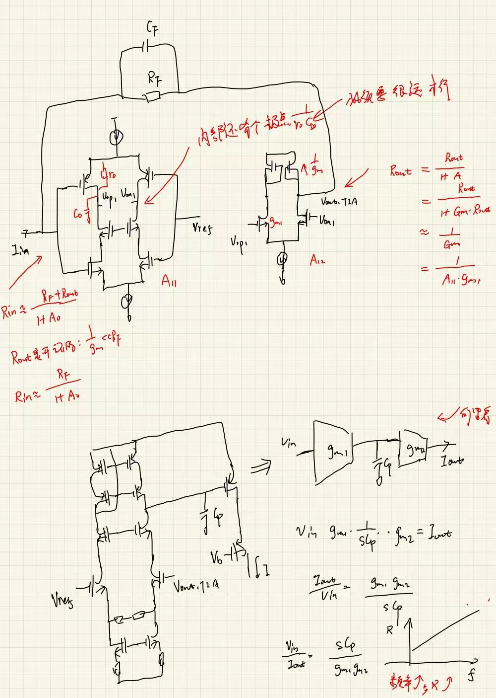

# 论文阅读 2024 — Xiaoxiao Zheng

> ⚠️ 本文件由 Claude 依据 PDF **文字层 + 逐页渲染图**填写。 (本人通过阅读和分析对里面的内容进行验证和学习)，这次 Table I / II / III 和 Fig. 2–19 全部看到了，没有「图未提取」的格子；剩下的空缺都是**论文本身没说**，标为「未说明」。
> 所有带「【我算的】」的数字是我自己推的，不是论文原话，务必自己验一遍。
> 用的是新版模板（多了 Q3b / Q26b / Q26c / A16–A18 / B4 陷阱）。

**论文**：Zheng et al., *A CMOS AFE Array With DC Input Current Cancellation for FMCW LiDAR*
**级别**（精读 / 提取 / 扫）：提取级（TIA 一侧精读）
**开始时间**：2026-09-16　　　**结束时间**：2026-09-19

---

## 一、定位（20 min · 正文一个字都不读）

**Q1. 题目、出处、年份是什么？**

答：
- 题目：A CMOS AFE Array With DC Input Current Cancellation for FMCW LiDAR
- 出处：IEEE Trans. VLSI Systems (TVLSI), Vol. 32, No. 3, pp. 422–431, March 2024，DOI 10.1109/TVLSI.2024.3350870
- 单位：天津大学（Tianjin Key Lab of Imaging and Sensing Microelectronic Technology；通讯作者 Mao Ye / Yiqiang Zhao）。是 [15] Hu 2017（同组 FMCW ROIC，用隔直电容那篇）的后续。

---

**Q2. 摘要最后一句宣称的指标是什么？（原样抄下来，带单位）**

答：
> "The AFE array also achieves a linear dynamic range (DR) of 66 dB and the area of each channel is approximately equal to 0.16 × 1.3 mm²."

摘要主指标（合起来看）：
- 20 通道，0.18 μm CMOS
- 最大跨阻 **107 dB**，直流消除范围 **−150 ~ +250 μA**
- 最高增益下：BW **165 MHz**、输入折合噪声 **29.4 nA_rms**、相邻通道 SCR (signal-to-crosstalk ratio) **−33.9 dB**
- 线性 DR **66 dB**；单通道面积 **0.16 × 1.3 mm²**

---

**Q3. 末页对比表里，它加粗或点名的是哪一列？它跟谁比？**

答：

![[Zheng2024-table3_comparison.png]]

- 它把 **This work 整列加粗**，没有单独点名某一列。逐列看，它**真正第一的只有一列：直流消除范围 −150 ~ +250 μA（双极性、跨度 400 μA）**。其余都是第二或第三：
  - 增益 107 dB：输给 [10] 110 dB、[15] 140 dB
  - 噪声 2.29 pA/√Hz：输给 [27] 0.84、[10] 1.44
  - 摆幅 1700 mV：输给 [10] 1800
  - DR 66 dB：输给 [5] 80、[10] 82、[27] 86、[28] 81
  - 通道数 20：输给 [15] 32
  - FoM 630：输给 [10] 922
- 比的对象：[4] Ngo TCAS-I'13（宽带接收机，640 MHz）、[5] Kashmiri JSSC'20（电流域 AFE，±125 μA 直流伺服）、[10] Cho TCAS-I'14（CF-TIA，110 dB / 1.44 pA）、[15] Hu Sensors'17（同组 FMCW ROIC，隔直电容，1 MHz）、[22] TI LMH32404（4 通道，只能消 source 方向 62 μA）、[27] Zheng Sensors'21（AM 相移，0.84 pA）、[28] Hong Sensors'18（16 通道 VCF）、[29] Joo Sensors'23（DFD-TIA）。
- 文中批评其他的论文中的参数：
	 [5] 只有 ±125 μA 且噪声/功耗差；
	 [22] 只消一个方向的直流、限制 PD 类型；
	 [4]  [10]  [27] [29] 都是单通道；
	 [15] 带宽只有 1 MHz；
	 [28] 噪声和摆幅差；
	 [29] 噪声差。
- 它的组合牌是「FMCW + 双极性直流消除 + 多通道 + 线性输出」四个条件同时满足，表里没有第二家。

---

**Q3b. 它自定义的 FoM 是什么？分子分母里有哪些量、故意漏了哪些量？**

答：
$$\text{FoM}=\frac{\text{Gain}(k\Omega)\cdot f_{-3dB}(\text{MHz})\cdot C_{PD}(\text{pF})}{\text{Power}(\text{mW})\cdot \text{Noise}(\text{pA}/\sqrt{Hz})}$$

- 【我算的】验算：$223.9\times165\times2/(51.48\times2.29)=627\approx630$ ✅（用 107 dB 算的，不是 107.6）。
- 分子里有 $C_{PD}$（对它有利，2 pF 比 [28][29] 的 0.5 pF 大 4 倍）。
- **分母里没有 DR、没有摆幅、没有线性度、没有通道数、没有直流消除范围**——恰恰是它最想卖的那几样都不在 FoM 里，而 FoM 又是它输给 [10] 的地方。所以这个 FoM 不是为它自己量身定做的，是「行业常用 FoM」，它老老实实排第二。
- 【我算的】[10] 按同一公式：$316.2\times140\times2.5/(79\times1.44)=973$，表里写 922，差 5%，可能是 [10] 的 gain 取了别的口径。不影响排序。

---

**Q4. 系统架构是什么？用一句话描述从光电二极管到输出的完整链路。**

答：

![[Zheng2024-fig02_block_diagram.png]]

> 平衡 PD 对（$V_{s1}/V_{s2}$）→ $I_{in1\ldots20}$ → **DCSF-TIA**（单端 shunt-feedback TIA + 两条直流消除环 DC-SFP / DC-STG）→ **后级放大器**（OTA 带 $R_S\|C_S$ 源简并 → 全差分 SF-TIA 带 CMFB，$R_{f0}\|C_{f0}$ 可变）→ **输出缓冲**（深 N 阱 NMOS 源随对 + 5 位电流 DAC）→ $V_{outp/n\,1\ldots20}$ → 片外 ADC → FPGA。

辅助电路：Vbias / Ibias 产生、温度传感器（TMP）、SPI（配置增益档和缓冲电流）。20 通道分两侧各 10 路，PD 接口在芯片中间，每通道独立电源/地。

---

==**Q5. 创新在框图的哪个框里？**==   (就是通过两个环路来消除输入的共模电压的偏移，提供吸电流和拉电流两个环路)

答：**在 DCSF-TIA 那个框里，具体是包着 SF-TIA 的那两条环（DC-SFP、DC-STG）。**

三处（按分量排）：
1. **DCL（主创新）**：一个慢速 $g_m$-C 积分器（OTA $g_{m8}$ → 30 pF MOS 电容 $C_p$ → 电流源 $g_{m3}$）从 $V_{out,TIA}$ 取平均值，往输入节点灌/抽一个等量反向的直流。数学上等价于一个**并联在 $R_F$ 两端的大电感** $L_F=C_p/(g_{m8}g_{m3})$：直流短路、交流不管。两条环分别管「从 VDD 灌」和「往 GND 抽」两个极性，按输入直流极性自动选一条。
2. **后级放大器**：不用传统的 CS + 电阻负载（增益和输出共模被同一个电阻绑死），改成「OTA 转电流 → 全差分 SF-TIA 转回电压」，增益 $=R_{f0}/R_S$，共模由 CMFB 单独定 → 同时拿大增益和 1700 mV 摆幅。$R_S\|C_S$ 顺便做均衡（一个零点一个极点）扩带宽。
3. **核心放大器第一级**：NMOS M1a + PMOS M1b **都当输入管**（$g_m$ 相加，反相器式噪声），再加共源共栅 M3 抬输出共模并抬增益——比纯反相器 PSRR 好。

> 一句话：创新点是**把「去直流」这件事从 PD 前面的电容挪到了 TIA 反馈环里，用一个合成电感替代了集成不了的大电容。**

---

**Q6. 它拿什么测试结果证明自己？（哪几张图、哪个数）**

答：

| 图              | 证明什么             | 关键数                                                                                           |
| -------------- | ---------------- | --------------------------------------------------------------------------------------------- |
| Fig. 13        | 频响 + 串扰          | 107 dB / 165 MHz（板上 $C_d$ = 2 pF）；相邻通道 SCR 最差 **−33.9 dB @ 90 MHz**，低频串扰小（PSRR）、高频又降（片上退耦）    |
| Fig. 14        | 输出噪声             | 示波器直方图 **3.58 mV_rms**（最高增益），示波器本底 643.53 μV_rms → 式 (25) 得 29.4 nA_rms                       |
| **Fig. 15(a)** | **直流消除能力（核心卖点）** | 输入直流 −150 ~ +250 μA 内，输入节点电压变化 **< 10 mV**（钳在 ~1.61 V）；超出范围输入电压开始漂，通道进非饱和区                    |
| Fig. 15(b)     | 低频响应             | 作者说高通截止 **~20 kHz**；【我读图】1 kHz 处仍有 99 dB，−3 dB 点更像 **80–100 kHz**，直流处抑制只有 ~8 dB（见 Q22/Q23）    |
| Fig. 16 / 17   | 增益档 + 线性度        | 五档 107/93/85/80/72 dB，输入 **0.2 → 420 μA = 66 dB**，每档 ±10% 误差内线性，差分摆幅 1700 mV                  |
| Fig. 18        | 谐波               | HD2/HD3 **< −53 dBc**（0–200 MHz），SFDR 最小 **45 dB @ 20 MHz**                                   |
| Fig. 19        | 光学验证             | 1550 nm PIN（φ0.18 mm，0.9 A/W），**只测了 20 MHz 单频点**：差分 615 mV_pp，差分比单端 SFDR 好 11 dB（48 vs 37 dB） |
| Table II       | 五档汇总             | BW 165/200/200/225/220 MHz；噪声 2.29/8.76/11.24/18.8/46.05 pA/√Hz ↔ 29.4/124/159/282/683 nA_rms |
| Fig. 11        | 功耗分解             | 15.6 mA @ 3.3 V = **51.48 mW/ch**：DCSF-TIA 21.1 / 后级 10.58 / 输出缓冲 19.8 mW                     |
| Table III      | 对比 + FoM         | FoM 630，第二                                                                                    |
串扰：

![[Zheng2024-fig13_freq_resp_SCR.png]]

本文提出的两个环路对电流的拉电流和吸电流的能力：(DC input Current Cancellation Loop)

![[Zheng2024-fig15_dc_lf_response.png]]

不同增益的时候的输出的摆幅：

![[Zheng2024-fig16_gain_modes.png]]

不同增益下的带宽、摆幅、噪声

![[Zheng2024-table2_gain_modes.png]]

---

**Q7. Intro 最后两段里，它批评前人什么？**

答：三条，分别对应它自己的三个动作：

1. **[14]  [15]（PD 和 AFE 之间串隔直电容）**：低截止频率需要大电容，**集成不了**；而且 PD 一端浮空接电容，电容充电过程中 **PD 结偏压跟着变 → 响应非线性**。
2. **[16]（IDDC 钳位输入）、[17]（低阻输入级 + HPF）**：线性度好了，但**比串电容复杂得多**。→ 它承认自己也复杂，卖点改成「同时消 sink 和 source 两个方向」。
3. **更前面一段（ToF vs FMCW）**：ToF 要响应 3–5 ns 脉冲，AFE 带宽要求严；激光功率大、人眼安全差；测速要多次发射。→ 这段是在给「为什么做 FMCW 前端」铺路，不是批评具体电路。

> 注意它**没批评** [5] 的直流伺服环（那是最像它的方案），把 [5] 留到 Table III 讨论时才说「只有 ±125 μA、噪声功耗差」。

---

## 二、三问（10 min · 通过标准）

**Q8. 它想赢哪一列？（只能有一个）**

答：==**直流输入电流消除范围（−150 ~ +250 μA，双极性）**。==

这是题目里的那个词（DC Input Current Cancellation），是 Table III 里唯一它排第一的列，也是 [22] 只能做一个方向、[5] 只有 ±125 μA 的对照点。其他列它都是老二老三（Q3）。

---

**Q9. 为了赢那一列，它牺牲了什么？（一定有）**

答：牺牲了**五样**，按代价大小排：

1. **功耗**：51.48 mW/ch，20 通道整片 **≈ 1.03 W**。多通道同行里只比 [22]（92 mW）好，比 [15] 7.8 mW、[28] 29.8 mW 差得多。其中 **输出缓冲占 38%**（19.8 mW，为了驱动片外 50 Ω 负载）——这一项是测试环境的账，不是结构的账；但核心 DCSF-TIA 也要 21.1 mW（两级各 3.2 mA）。
2. **带宽**：最高档只有 165 MHz。它自己在第二节说运动目标的多普勒拍频要「hundreds of megahertz」，165 MHz 是卡着下限的。Table III 里比它窄的只有 [10]/[15]/[27]。
3. **动态范围只有 66 dB，而且是拼的**：【我读 Fig. 16】单档只有 **30–34 dB**（107 dB 档 0.18–8 μA），66 dB 靠 SPI 切五档 $R_F\|C_F$ 拼出来。**没有自动 AGC**，FMCW 回波幅度随目标变，谁来切档、切档要多久，论文没说。
4. **低频响应**：合成电感带来一个高通角（作者 ~20 kHz，我读图 ~80 kHz）和一段从 99 dB 缓慢爬到 107 dB 的斜坡（1 kHz → 1 MHz）。FMCW 拍频正比于距离，**近距离目标落在这段斜坡上，幅度既被衰减又不平**。
5. **面积 + 复杂度**：每通道两条 DCL、每条 30 pF MOS 电容；五套 $R_F/C_F$；后级 $R_{f0}/C_{f0}$ 可变；SPI；温度传感器。0.208 mm²/ch 不含 pad。

---

**Q10. 它的机制是什么？一句话，不带公式，讲给不懂的人听。**

答：
> FMCW 雷达的接收管上永远流着一股很大的「底电流」——那是本振激光自己照出来的，不带任何目标信息，但它比回波信号大几百倍，会把高增益放大器直接顶饱和。引入两个直流电流消除环路，一条负责往里灌电流，另一条负责往外抽，正负两种底电流都能抵消。

> ✅ 通过。附加一句给电路的人：**这个慢环在小信号上等价于一个跟 $R_F$ 并联的大电感，$L_F = C_p/(g_{m8}g_{m3})$，高通角 $p_0 = R_F/(2\pi L_F)$。**

---

## 三、反推（30 min）

> 电路图这次都看到了（Fig. 3 / 4 / 5 / 6 / 7 / 9 + Table I 尺寸），但论文**没给 $R_F$、$C_F$、$A_o$、$\omega_o$ 的任何数值**，所以「我猜」里的数全是从 Table I 尺寸 + 3.2 mA 偏置反推的，标【我算的】。

![[Zheng2024-fig04_DCSF-TIA.png]]

![[Zheng2024-table1_device_sizes.png]]

**Q11. 输入阻抗 $R_{in}$ 大概是多少？主极点被推到哪？**

我猜：
- shunt-shunt 反馈，$R_{in}\approx R_F/(1+A_o)$。$A_o = A_{v11}\cdot A_{v12}$。
- 【我算的】$A_{v12} = \sqrt{\mu_n(W/L)_{7}/\mu_p(W/L)_{9}} = \sqrt{3\times171.4/120}\approx 2.1$（$\mu_n/\mu_p$ 取 3；取 4.4 则 2.5）——第二级只有 **6–8 dB**，它的作用是稳定工作点、抗 PVT，不是拿增益。
- 【我算的】第一级：每支路 1.6 mA，$g_{m1a}\approx30$ mS（384/0.35）+ $g_{m1b}\approx14$ mS（288/0.3）≈ **44 mS**；输出阻抗被 PMOS M1b 的 $r_o$（~2 kΩ）限死，共源共栅只抬 NMOS 侧 → $A_{v11}\approx 44\text{ mS}\times 2\text{ k}\Omega\approx 50\text{–}80$。总 $A_o\approx 100\text{–}200$（**40–46 dB**）。
- 若 TIA 单级 $R_F$ 真是 224 kΩ（107 dB 全在 TIA 里），$R_{in}\approx 224\text{k}/150\approx 1.5\text{ k}\Omega$，输入极点 $1/(2\pi\cdot1.5\text{k}\cdot4\text{p})\approx 27$ MHz——**跟 165 MHz 对不上**。所以 $R_F$ 不可能是 224 kΩ（见 Q24）。
- 若 $R_F\approx 20$ kΩ（后级出 20 dB）：$R_{in}\approx 130\ \Omega$，输入极点 ≈ 300 MHz，主极点由式 (8) 的 $1/(2\pi R_F(C_F + C_d/(A_o+1)))$ 定，与 165 MHz 相容。

作者：没给 $R_{in}$ 的数。只给了式 (8)：两个极点，一个在输入节点 $1/(R_F(C_F+C_d/(A_o+1)))$——**$C_d$ 被 $(A_o+1)$ 除掉了**，这就是「主极点被推走」的方式；另一个 $(1+A_o\omega_oR_FC_F)/(R_F(C_d+C_F))$ 在放大器侧。加了 DCL 之后多一个低频极点 $p_0$ 和一个原点零点 $z_0$，高频那两个极点不动（Fig. 6b）。作者的结论是「提高 $A_o$ 是扩带宽的正道」。

差在：
- 方向对上了（输入节点主极点 + $A_o$ 推走），**但作者的式 (8) 是「两极点远离」的近似，真实是二阶系统（式 18–21），带宽 ≈ $\omega_n=\sqrt{(A_o+1)\omega_o/(R_F C_{d,tot})}$，是输入 RC 极点和放大器 GBW 的几何平均。**
- 🚩 【我算的】$C_{d,tot}$ 不止 2 pF：M1a/M1b 栅电容 $\approx 0.77+0.50 = 1.3$ pF，DCL 输入管 M1「与 M1a/M1b 类似」再加 0.5–0.8 pF，**片内自己就贡献 ~2 pF，总 $C_d\approx 4$ pF**。论文只说「2-pF parasitic capacitance」，指的是板上贴的那个 PD 等效电容。
- → 进疑问池：$R_F$ 到底多大、$A_o$ 多大，论文全程回避。

---

**Q12. 直流跨阻 $Z_T$ 由哪个器件决定？**

我猜：TIA 单级 $Z_T\approx R_F$（式 9）；整链 $Z_T = R_F\times(R_{f0}/R_S)\times A_{buffer}$。五档由「多套 $R_F\|C_F$ 并联切换」+ 后级「$R_{f0}/C_{f0}$ 可变」共同实现。加了 DCL 后，**$z_0$ 到 $p_0$ 之间的低频跨阻低于 $R_F$，随频率上升逐渐回到 $R_F$**。 (整体表现为一个带通的形式)

作者：式 (9) $A_{SF\text{-}TIA}\approx R_F$；Table II 五档 107/93/85/80/72 dB；式 (25) 用了 **107.6 dB**（$V_{n,out}$ 折算时）；正文和表都写 107。后级增益 $R_{f0}/R_S$「线性、对工艺不敏感」。

差在：
- 「$Z_T\approx R_F$」是 TIA 单级的说法，**但 107 dB 那个数是整链的**（Q24 三条证据）。作者没给 $R_F$ 和 $R_{f0}/R_S$ 各自多少，所以「TIA 单级的跨阻带宽积」这篇是算不出来的。
- 107 vs 107.6 dB：0.6 dB 的差别对 $I_{n,in}$ 影响 7%（29.4 → 31.5 nA），小事，但说明「107」是四舍五入的宣传口径。

---

**Q13. 噪声主贡献是哪个器件？为什么是它？**

我猜：
- **低频**：$R_F$ 热噪声 $4kT/R_F$。
- **高频**：输入管 M1a/M1b 沟道噪声被 $C_{d,tot}$ 抬起来（经典的 $|1+sR_FC_d|^2$ 项），随频率线性上升，在带宽边缘占主导。
- **DCL**：OTA 输入对 M8 的噪声经 $G_m$ 折到输入，∝ $1/f^2$，只在 $p_0$ 附近起作用；另外**M3 那个电流源直接往输入节点灌电流，它的沟道噪声 $4kT\gamma g_{m3}$ 应该也直接进来**。

作者：式 (24) 三项——

$$\overline{I^2_{n,in}}\approx\frac{4kT}{R_F}+4kT\gamma\left(\frac{1}{g_{m1a}+g_{m1b}}\left|\frac{1+sR_F(C_d+C_{in,dc})}{1+sR_FC_F}\right|^2+\frac{1}{g_{m8}}\left|\frac{1}{R_F}+\frac{g_{m3}g_{m8}}{sC_p}\right|^2\right)$$

==结论：噪底由 $R_F$ 决定；输入管 $g_m$ 越大越好但会增 $C_d$ 和功耗，所以用最短沟长拿大 $W/L$；DCL 输入管 M1 要小（减 $C_{in,dc}$）；$C_p$ 越大越好，面积允许下取 30 pF。==

差在：
1. 前两项对上了。【我算的】按 $g_m\approx40$ mS、$\gamma=1$：$v_{n,a}\approx0.64$ nV/√Hz；$C_{d,tot}=4$ pF 时带内均方平均 ≈ **1.5 pA/√Hz**；$R_F=20$ kΩ 时 $4kT/R_F$ 项 0.91 pA/√Hz；合成 ≈ **1.8 pA/√Hz** vs 宣称 2.29——差 20%，量级对，**高频那项是主贡献，$R_F$ 项次之**。若 $R_F$ 真是 224 kΩ，$R_F$ 项只有 0.27，合成 1.55，差更多。

2. → **2.29 pA/√Hz 只在「DCL 空转（无直流输入）」时成立**（Q26b）。真实 FMCW 工况下噪底至少翻倍到三倍，而且是被消除的那股直流自己带来的，跟电路设计无关。**论文对此一个字没提。**

![[Zheng2024-fig09_noise_model.png]]

---

**Q14. peaking / Q 值靠什么压下去？代价是什么？**

我猜：靠反馈电容 $C_F$。每档 $R_F$ 配一个 $C_F$（「多套 $R_F$ 和 $C_F$ 并联」），把闭环二阶系统 Q 压到 ≤ 0.707。代价是 $C_F$ 给带宽封顶 $1/(2\pi R_FC_F)$。另外后级 $R_S\|C_S$ 的零点-极点对是**人为加 peaking 来扩带宽**——代价是高频噪声和串扰被一起抬起来（Fig. 13 里 SCR 最差恰好在 90 MHz 附近）。

作者：式 (21) $Q=\sqrt{(C_d+C_{in,dc}+C_F)/(A_o\omega_oR_FC_F^2)}$，要求 $Q<0.707$ ⇒ $A_o\omega_o\ge 2(C_d+C_{in,dc}+C_F)/(R_FC_F^2)$。均衡：零点 $1/(2\pi R_SC_S)$，极点 $(1+g_{m1}R_S)/(2\pi R_SC_S)$，零点在前 → 中间一段抬升。**没给 $C_F$ 值、没给相位裕度、没给每档的 Q。**

差在：
- 方向一致。作者的式 (21) 把 Q 写成 $C_F$ 的函数很清楚：**$C_F$ 越大 Q 越小但带宽越低，这就是每档要配不同 $C_F$ 的原因。**
- 它没说的：**均衡的零极点对是开环的，位置随 $g_{m1}$（OTA 输入管）漂**，而 $R_S$ 大到 $g_{m1}R_S\gg1$ 时极点 ≈ $g_{m1}/(2\pi C_S)$，跟偏置强相关。Fig. 13 频响很平，说明后仿+实测都调好了，但它没给 PVT 下的带宽散布。
- 🚩 Fig. 13 里 SCR 最差点在 90 MHz、之后又变好，作者归因于「片上退耦电容」。**另一种解释是均衡段把 90 MHz 附近的串扰路径一起抬了**——两个解释不冲突，但作者只说了一个。

---

**Q15. 哪个器件去掉会坏事？作者为什么加它？**

答：**M2——DCL 里那个 30 pF 的 MOS 电容 $C_p$。**

作者的理由：$L_F=C_p/(g_{m8}g_{m3})$，$p_0\approx R_F/(2\pi L_F)$，「要 $p_0$ 低就要 $L_F$ 大，所以 $C_p$ 要大、$g_{m8}$、$g_{m3}$ 要小；但 $g_{m3}$ 又正比于能消除的最大直流，不能太小；所以主要靠 $C_p$ 和用源简并压 $g_{m8}$」。

去掉的后果：没有 $C_p$，$G_m = g_{m8}g_{m3}$ 变成宽带跨导，DCL 从「合成电感」变成「跟 $R_F$ 并联的电阻 $1/G_m$」，**所有频率的信号一起被抵消**，TIA 增益全频段塌掉。**$C_p$ 是「只消直流、不消信号」这个功能的全部物理基础。**

【我算的】按作者的 20 kHz 和 $C_p$ = 30 pF：$R_Fg_{m8}g_{m3}=2\pi\cdot20\text{k}\cdot30\text{p}=3.8\times10^{-6}$。$R_F$ = 20 kΩ、$g_{m3}$ ≈ 0.3 mS（近零直流时亚阈值）→ $g_{m8}\approx0.6\ \mu$S → OTA 偏置只有 **几十 nA** 量级，或者简并电阻 MΩ 级。**这个环慢到什么程度：时间常数 $L_F/R_F\approx8\ \mu$s。**

其他「去掉就坏事」的候选（次要）：
- **M1b（PMOS 输入管）**：去掉后 $g_m$ 少三分之一、噪声电压涨 ~20%，且第一级变成普通 CS。作者加它是「不多花电流白拿 $g_m$」。
- **$R_S$（后级源简并）**：去掉则后级增益 $=g_{m1}R_{f0}$，随工艺漂、线性度崩，HD2/HD3 < −53 dBc 拿不到；FMCW 里谐波会被当成假拍频。
- **输出缓冲的深 N 阱**：去掉则源随器有体效应，摆幅和线性度掉。

![[Zheng2024-fig05_dc-SFP.png]]

![[Zheng2024-fig06_equiv_bode.png]]

---

**Q16. 手抄核心电路图（不要截图），在图上标三处**

① **输入节点 $I_{in,ac}$**：$C_{d,tot}$ = 板上 2 pF + M1a/M1b 栅 ~1.3 pF【我算的】+ DCL 输入管 M1 ~0.5 pF【我算的】≈ 4 pF；$R_{in}\approx R_F/(1+A_o)$，论文**未给数**；直流被 DCL 钳在 ~1.61 V，−150 ~ +250 μA 内变化 < 10 mV ← **这是它想赢的那一列**

② **反馈支路 $R_F\|C_F$**：五套可切（107/93/85/80/72 dB），$Z_T\approx R_F$（但整链 107 dB ≠ $R_F$，Q24）；$Q=\sqrt{C_{d,tot}/(A_o\omega_oR_FC_F^2)}<0.707$；**$R_F$、$C_F$ 数值全程未给**

③ **DCL（DC-SFP 那条）**：$V_{out,TIA}$ → 套筒式 OTA（M5–M14，$g_{m8}$ 用源简并压到 μS 级）→ $C_p$ = **30 pF**（M2 MOS 电容）→ M3（PMOS，从 VDD 往输入灌 $I_{in,dc\_p}$，最大 250 μA）；等效 $L_F=C_p/(g_{m8}g_{m3})$，$p_0=R_F/(2\pi L_F)\approx$ 20 kHz（作者）；DC-STG 是镜像的一条，NMOS 往 GND 抽，最大 150 μA

核心放大器尺寸（Table I）：第一级 M1a/M2a NMOS 384/0.35、M1b/M2b PMOS 288/0.3、M3/M4 共源共栅 80/0.35，3.2 mA；第二级 M7/M8 60/0.35 差分对、M9/M10 72/0.6 二极管负载，3.2 mA；$A_{v12}\approx2$【我算的】。

---

## 四、复现一个数字（10 min）

**Q17. 我复现的是哪个数？**   ==(复现的时候再来看)==

答：复现了**四个**，前两个是它的口径，后两个是判断力用的：

- **主复现 A（B4 噪声自洽）**：Table II 那一行 **2.29 pA/√Hz** 是怎么从 29.4 nA_rms 来的。
- **复现 B（式 25）**：**29.4 nA_rms** 本身——那个「×2」是什么口径。
- **复现 C（B5 灵敏度）**：MDS **0.2 μA** 相对噪声是几个 σ。
- **复现 D（功耗 / DR / FoM 三个加法）**：51.48 mW、66 dB、630。

---

**Q18. 用了它给的哪些参数？**

答：全部来自论文原文，无外部假设：
- 最高增益档：$Z_T$ = 107 dB（Table II / Fig. 13）；式 (25) 里用的是 **107.6 dB**
- $f_{-3dB}$ = 165 MHz；其他四档 200 / 200 / 225 / 220 MHz
- 输出噪声 3.58 mV_rms，示波器本底 643.53 μV_rms（Fig. 14）
- 五档 nA_rms：29.4 / 124 / 159 / 282 / 683；五档 pA/√Hz：2.29 / 8.76 / 11.24 / 18.8 / 46.05
- 15.6 mA @ 3.3 V；Fig. 11 分解 21.1 / 10.58 / 19.8 mW；核心放大器两级各 3.2 mA
- 输入电流范围 0.2 → 420 μA；$C_{PD}$ = 2 pF
- MDS = 0.2 μA（结论段「minimum detectable current of 0.2 μA」）

---

**Q19. 我算出来多少？它宣称多少？**

### 复现 A —— 2.29 pA/√Hz 的来历（B4）

$$B_n^{\text{隐含}}=\left(\frac{I_{n,rms}}{i_{n,in}}\right)^2=\left(\frac{29.4\text{ nA}}{2.29\text{ pA}/\sqrt{Hz}}\right)^2=(12838)^2=\mathbf{164.8\text{ MHz}}=f_{-3dB}$$

五档全部验证：124/√200M = **8.77** ✓，159/√200M = **11.24** ✓，282/√225M = **18.80** ✓，683/√220M = **46.05** ✓（四位有效数字全对上）。

我算：**密度列 = nA_rms ÷ √f₋₃dB，砖墙 $B_n=f_{-3dB}$**
它称：Table II 标题「Noise (pA/√Hz)」，Table III 直接拿 2.29 跟别人的密度比

→ 若按二阶 Butterworth $B_n=1.11f_{-3dB}$：**2.17 pA/√Hz**；按一阶 $\pi/2$：**1.83 pA/√Hz**。

### 复现 B —— 式 (25) 的「×2」

$$I_{n,in}=\frac{2\sqrt{3.58^2-0.64353^2}\text{ mV}}{10^{107.6/20}}=\frac{2\times3.5217\text{ mV}}{239.9\text{ k}\Omega}=\mathbf{29.36\text{ nA}_{rms}}$$ ✅

- 「×2」的含义：示波器测的是**单端**输出（OutP 一路），107.6 dB 是**差分**跨阻，作者假设两路噪声完全反相 → 差分噪声 = 2× 单端。
- 若两路噪声不相关（应取 √2）：**20.8 nA_rms**；若用表里的 107 dB：**31.5 nA_rms**。
- 第一级是单端 TIA，其噪声经后级变差分后确实是完全反相的，**×2 对 TIA 主导的噪声是对的，对后级差分对自身的噪声偏保守**。合理，但没交代。

### 复现 C —— MDS 是几个 σ（B5）

$$\frac{0.2\ \mu\text{A}}{29.4\text{ nA}_{rms}}=\mathbf{6.8}\quad(16.7\text{ dB})$$

若 0.2 μA 是正弦幅度（FMCW 拍频是正弦）：rms 比 = **4.8**（13.6 dB）。
它称：**没有判据**。0.2 μA 就是 Fig. 16 / 17(a) 里 107 dB 档 ±10% 线性度扫描的**最低测试点**（我读图是 0.18 μA），不是从噪声推的。

### 复现 D —— 三个加法

| 项 | 我算 | 它称 |
|---|---|---|
| 功耗 | 15.6 mA × 3.3 V = **51.48 mW**；21.1 + 10.58 + 19.8 = **51.48** ✓；核心放大器 6.4 mA × 3.3 = **21.12 mW** ≈ DCSF-TIA 的 21.1 → **DCL 自身功耗 < 0.1 mW**（跟 Q15 里「nA 级偏置」自洽） | 51.48 mW |
| DR | 20·log(420/0.2) = **66.4 dB**；单档【读图】33 / 34 / 34 / 29.5 / 31.6 dB | 66 dB |
| FoM | 223.9 × 165 × 2 / (51.48 × 2.29) = **627** | 630 |

---

**Q20. 结论是哪一种？下一步做什么？**

- [x] **对上** → 已验证：**这篇的 pA/√Hz 列是换算值（$B_n=f_{-3dB}$），nA_rms 是「单端实测 ×2 再除以 107.6 dB」，MDS 0.2 μA 是线性度扫描的起点（≈ 6.8σ）而不是噪声判据。三个数都是「硬」的，但口径都要标。**
- [ ] 对不上，我错
- [ ] 对不上，它错

说明：
- 这篇的数字**内部自洽得很好**（五档密度四位有效数字全对、功耗三项加法精确、FoM 对上），说明作者是认真填表的人。**问题不在算错，在没说**：$R_F$ 多大、噪声在多大直流下测的、20 kHz 是哪个点。
- **下一步（建议做第 1 个）：**
  1. 把它的 Table III 那 9 列抄进总表时，**把噪声列全部按 $B_n=1.11f_{-3dB}$ 重算一遍再比**（别人的密度是不是也这么换算的不知道，至少本篇是）。成本 10 分钟。
  2. 用 Fig. 15(b) 的曲线反推 DCL 的直流环路增益（99 → 107 dB 只差 8 dB → 环路增益 ≈ 2.5），再对照 Fig. 15(a) 的 ±10 mV 钳位——**两者对不上**（8 dB 的环路增益钳不住 250 μA），说明 $g_{m3}$ 随直流电流强烈非线性，小信号 AC 响应是在零直流下测的。这是 Q23-1 那个问题的证据链，值得单独记一页。

---

## 五、归档（20 min）

**Q21. 一句话贡献是什么？**

答：**把 FMCW 接收前端「去本振直流」(产生的直流电流)这件事从 PD 前面集成不了的隔直电容，挪进 TIA 的反馈环里——用一个慢速 $g_m$-C 积分器合成出一个跟 $R_F$ 并联的大电感，直流短路、信号不管，两条镜像的环分别管灌和抽，于是 −150 ~ +250 μA 双极性直流被消掉、输入节点被钳住、PD 偏压不变；再配一个「OTA + 全差分 SF-TIA」后级把增益和输出共模解耦，拿到 1700 mV 线性摆幅。20 通道、0.18 μm、107 dB / 165 MHz / 29.4 nA_rms。**

---

**Q22. 它没解决什么？（1–2 条）**

答：
1. **真实工况下的噪声没有表征。** 2.29 pA/√Hz 是电学测试、（推测）零直流输入下的数。一旦 DCL 真的在消 100–250 μA，被消除电流的散粒噪声（5.7–9 pA/√Hz【我算的】），**这不是它做得不好，是所有「直流消除 / 背景光消除」方案的共同物理代价，但它没量化。**
2. 直流消除环的低频效果随直流电流变化，近距离目标的幅度会被低估，但测距和测速本身不受影响
3. **没有自动 AGC**，五档靠 SPI；**光学验证只有 20 MHz 一个点**，没有真正的 FMCW 测距演示；**通道间失配一个数都没有**（Fig. 17 标题写「20-channel」但只画一条曲线）。

---

**Q23. 我不懂的是什么？（列出来，先攒不查）**

答：**先攒着不查。**

*电路一侧（跟你的 TIA 主线直接相关，优先级最高）*

1. ==❓ **DCL 是不是「直流相关」的？** $g_{m3}$ 随 $I_{dc}$ 变 100 倍，$p_0$ 就变 100 倍。这意味着高通角、环路稳定性、甚至 Q 值（式 20 里有 $1/L_F$）都随目标亮度变。这是所有「用 MOS 电流源消直流」方案的通病，还是可以用某种结构（比如电阻简并的 M3、或对数域）线性化？← **这条最值钱，直接关系到你做 dToF 背景光消除时怎么选结构。**==   
2. ❓ **$R_F$ 到底多大？** 从 165 MHz + 4 pF 反推，$R_F$ 不可能是 224 kΩ（需要 153 GHz 的 GBW【我算的】），大概率是几十 kΩ，后级出 20 dB 以上。那 Table III 里跟别人的「Gain」比就是整链比单级。别人呢？
3. ❓ 第一级「NMOS + PMOS 都做输入管」——这跟反相器 TIA 的区别只在多了尾电流源和共源共栅。==**它说 PSRR 更好==❌️，代价是 headroom 少一个 $V_{ds,sat}$**。3.3 V 工艺无所谓，1.8 V 就得掂量。好像并没好，只是改变了共模的抑制。
4. ❓ 两条 DCL「按输入直流极性自动激活一条」——**怎么自动的？** 
	我认为是输出的共模电压和基准比较，如果高于基准了那么就会输出一个电流，这两条链一定是全都一直开着的，因为这两条链会放大输出的信号，这两个信号经过放大之后在输入端相互抵消，达到就是打到了一个动态平和，但是呢共模信号就不会达到动态的平衡。共模信号只会像一个方向偏移，比如说基准的上方或者基准的下方。
5. ❓ 输出缓冲 19.8 mW 占 38%，是为了驱 50 Ω 测试。**真实系统里后面是 ADC，不需要这么大电流**，真实功耗应该按 ~32 mW/ch 算。抄总表时 A10 要不要减掉？

*噪声口径一侧*

6. ❓ 式 (25) 的「×2」到底是作者的差分折算，还是它测的时候本来就是单端且增益也是单端？如果 107.6 dB 本身就是单端增益，×2 就多算了一倍，$I_{n,in}$ 应为 14.7 nA。**Fig. 12(b) 的 S 参数接的是 Port2/Port3 差分**，倾向于 107.6 是差分——但没明说。
		==我认为==是整个链的增益是107.6dB，然后噪声只要的贡献是第一级的单输入单输出，然后在通过单端转为双端，噪声也是分为了两部分，这样测到的结果要乘2才能得效回到输入端。

*系统一侧*

7. ❓ 平衡 PD 剩 5–10% 直流（几十到 100 μA），==那 250 μA 的消除上限对应什么本振功率？==它没算这笔账。
8. ❓ ==光学测试用 10 mW 直流光经衰减器 + 调制器，**测试时 PD 的直流光电流是多少？**== 如果不为零，Fig. 19 的 SFDR 48 dB 就是「DCL 工作中」的真实线性度——这反而是全文最有价值的一个数，但它没标。

---

## 六、口径核对（不确定就写「未说明」）

**Q24. $Z_T$ 是 TIA 单级还是含后级的整链？**

答：**整链（DCSF-TIA × 后级 × 输出缓冲，差分输出）。** 论文没明说，三条证据：
1. Table II 标题写「DCSF-TIA」，但同一张表里有 **1700 mV 差分摆幅**——单端 TIA 输出不可能是差分摆幅。
2. 式 (25) 用「示波器测输出噪声 ÷ 107.6 dB」得输入折合，输出噪声显然是缓冲之后测的。
3. 【我算的】若 TIA 单级 $R_F$ = 224 kΩ，$C_{d,tot}\ge2$ pF，要做到 165 MHz 需要核心放大器 GBW ≥ 77–153 GHz，0.18 μm 做不到。$R_F$ ≈ 20 kΩ 时只需 ~14 GHz，合理。
	使用的公式是：

$$
GBW = f_{-3dB}^{2} \times 2 \pi \cdot R_F C_d
$$

---

**Q25. 噪声给的是密度还是积分值？积分带宽是多少？带内平不平坦？**

答：**两个都给了，但密度是从积分值换算的（Q19 复现 A）。**
- **积分值**：29.4 nA_rms（最高增益档）——实测，示波器直方图，扣本底，单端 ×2，除以 107.6 dB。积分带宽 = 示波器全带宽（DSO9404A，4 GHz）内 AFE 自己滚降后的等效带宽，作者没说。
- **密度**：2.29 pA/√Hz = 29.4 nA / √165 MHz，**砖墙 $B_n=f_{-3dB}$，不是实测密度**。五档全部如此。
- **带内平坦度**：没给噪声谱。Fig. 13 增益曲线平，但输入折合电流噪声按式 (24) 在高频 ∝ f 上升，**带内必然不平坦**（这是所有 SF-TIA 的物理，不是本篇的问题）。
- **测噪声时的直流输入：未说明**（Q26b）。

---

**Q26. MDS 的判据是什么？**

答：**未说明。** 结论段写「minimum detectable current of 0.2 μA」，来源是 Fig. 16/17(a) 的线性度扫描起点（±10% 误差内的最低点）。
- ==【我算的】0.2 μA / 29.4 nA_rms = **6.8**（幅度比）==；若 0.2 μA 是正弦幅度则 rms 比 4.8。
- 不是 SNR 判据、不是 BER、不是 $P_D@P_{FA}$。FMCW 的实际检测是在 FFT 之后（有处理增益 ∝ 点数），电路层的 MDS 跟系统层的 MDS 中间还隔一个 FFT 长度，论文没碰。

---

**Q26b. 噪声是在什么直流 / 背景条件下测的？**  ==这是一个重要的问题文中没有提到也没解决。==

答：**未说明。** Fig. 12(a) 电学测试台：$R_e$ 转压为流 + 50 Ω 端接 + 板上 $C_d$；噪声测试时输入大概率是端接到地、零直流。→ DCL 两条环都在亚阈值空转，==M3(反馈环路中的电流输出管) 的噪声和散粒噪声都不在 29.4 nA 里（Q13 差在-2/3）。**这是本篇最该被追问的一个口径。**==而且这里M3管子的跨导也是变化的，根据噪声的公式管子的电流越大那么跨导越大，产生的噪声电流也就越大。所以当有直流偏移发生的时候管子的跨导增大，这样等效输入噪声电流也就增加了。

---

**Q26c. 带宽和噪声是电学测的还是光学测的？$C_d$ 是什么？**

答：
- **带宽、噪声、直流消除、线性度、谐波：全部电学**（Fig. 12），$C_d$ 是**板上贴的 2 pF 电容**，不是 PD，不含键合线电感。
- **光学：只有 Fig. 19，一个频点（20 MHz）**，1550 nm PIN（φ0.18 mm、0.9 A/W）+ 调制器，看了瞬态和 FFT，**没扫频、没测噪声、没测距**。
- 所以 165 MHz 是「2 pF 理想电容」下的电学带宽；换真 PD + 键合线，2021 那篇的经验是会出 peaking。

---

**Q27. 时间盒到点了吗？没读完的是哪部分，为什么停？**

---

## 七、总表行

### A 组 —— 从论文抄

| 列   | 字段                  | 值                                                                                                 | 注意                                                      |
| --- | ------------------- | ------------------------------------------------------------------------------------------------- | ------------------------------------------------------- |
| A1  | 年份 / 出处             | **2024 · IEEE TVLSI Vol.32 No.3 pp.422–431**                                                      | 天津大学 Mao Ye / Yiqiang Zhao 组，[15] Hu 2017 的后续           |
| A2  | 工艺 / 电源             | **0.18 μm CMOS / 3.3 V**                                                                          |                                                         |
| A3  | 应用场景                | **FMCW LiDAR（相干探测）**，1550 nm PIN；拍频 MHz–百 MHz                                                     | 不是脉冲 dToF，噪声判据不能直接套 dToF 那套                             |
| A4  | TIA 拓扑              | **shunt-shunt FB（单端）+ 双极性直流消除环（gm-C 合成电感）= DCSF-TIA**；核心两级：CS（N+P 双输入 + 共源共栅）→ 差分 CS 二极管负载        | 后级 OTA + 全差分 SF-TIA；输出源随缓冲                              |
| A5  | 跨阻增益 $Z_T$          | **107 dB（223.9 kΩ）最高档**；五档 107/93/85/80/72                                                        | 🚩 **整链（Q24）**，式 (25) 用的 107.6；TIA 单级 $R_F$ 未给          |
| A6  | 带宽 BW (−3dB)        | **165 MHz @107 dB**；200/200/225/220 其他档                                                           | 电学，板上 2 pF；低端高通 ~20 kHz（==作者这个不太对==）/ ~80 kHz（我读图）      |
| A7  | 输入参考噪声              | **29.4 nA_rms（实测）/ 2.29 pA/√Hz（换算，$B_n=f_{-3dB}$）** @107 dB；其他档 8.76/11.24/18.8/46.05             | 🚩 密度是换算值；按 1.11× 应为 2.17；**零直流下测（推测），真实工况会翻倍以上（Q26b）** |
| A8  | $C_{PD}$ / $C_{in}$ | **2 pF（板上电容）**；片内输入管 + DCL 输入管 ≈ 2 pF【我算的】                                                        | 论文只说 2 pF，$C_{d,tot}$ ≈ 4 pF 是我估的                       |
| A9  | 动态范围                | **66 dB 线性（0.2–420 μA）**，±10% 误差，五档 SPI 切换，**无自动 AGC**；单档 30–34 dB【读图】                            | 差分摆幅 1700 mV                                            |
| A10 | 功耗（单通道）             | **51.48 mW/ch**（15.6 mA @ 3.3 V）：TIA 21.1 / 后级 10.58 / 缓冲 19.8                                    | 缓冲占 38%，为驱 50 Ω；DCL 自身 < 0.1 mW【我算的】                    |
| A11 | 面积（单通道）             | **0.16 × 1.3 mm = 0.208 mm²/ch**（不含 pad）；整片 3.5 × 3 mm 含 pad                                      |                                                         |
| A12 | 通道数                 | **20**；SCR 最差 **−33.9 dB @ 90 MHz**（相邻）；每通道独立电源/地 + 保护环                                           | 通道间失配**未给**                                             |
| A13 | MDS 判据              | **未说明**；0.2 μA = 线性度扫描起点 ≈ **6.8σ**【我算的】                                                          | 🚩 不是噪声判据                                               |
| A14 | 一句话创新               | 反馈环里用 gm-C 合成电感消双极性直流，PD 偏压钳住；OTA+差分 SF-TIA 后级解耦增益与共模 ← Q10                                       |                                                         |
| A15 | 代价                  | 功耗 51 mW/ch；BW 165 MHz 卡下限；DR 靠换档拼、无 AGC；低频斜坡 + 高通角随直流漂；两条环各 30 pF ← Q9                           |                                                         |
| A16 | 低频截止 / 直流处理         | **直流伺服环（合成电感）**；高通 ~20 kHz（作者）；**直流处仅压 ~8 dB【读图】**；$p_0\propto g_{m3}\propto I_{dc}$ → **随直流电流变** | ==🚩 这一列是本篇的灵魂，也是最该追问的==                                |
| A17 | 线性度 / 输出摆幅          | HD2/HD3 **< −53 dBc**（0–200 MHz）；SFDR ≥ **45 dB**（电学）/ 48 dB（光学 20 MHz）；**1700 mV 差分**            |                                                         |
| A18 | 测试条件                | 带宽/噪声/DR/谐波 **全电学**（$R_e$ + 50 Ω + 板上 2 pF）；光学只有 20 MHz 单点；**噪声测试时直流输入未说明**                       |                                                         |

**补充（本文特有）**

| 项 | 值 |
|---|---|
| 直流消除范围 | **−150 ~ +250 μA**，输入电压变化 < 10 mV，钳在 ~1.61 V |
| $C_p$（DCL 积分电容） | 30 pF（MOS 电容 M2），每条环一个 |
| 核心放大器偏置 | 两级各 3.2 mA；Table I 尺寸见 Q16 |
| 输出缓冲 | 深 N 阱 NMOS 源随对 + 5 位电流 DAC（1I…16I） |
| FoM（式 26） | 630（第二，[10] 922 第一） |
| 光学测试 | 1550 nm 种子源 + 调制器 + PIN φ0.18 mm 0.9 A/W，20 MHz，差分 615 mV_pp |

### B 组 —— 自己算

> 【全部为我算的，未经你复核】

| 列   | 派生量   | 算法                                  | 值                                                            | 它告诉你什么                                                                                                  |
| --- | ----- | ----------------------------------- | ------------------------------------------------------------ | ------------------------------------------------------------------------------------------------------- |
| B1  | 跨阻带宽积 | $Z_T\times BW$                      | **223.9 kΩ × 165 MHz = 3.69×10¹³ Ω·Hz**                      | 🚩 **整链值**。跟 Ma 2024 HG 档 3.9×10¹³（单级后仿）数量级一样，但口径不同；跟 2021 那篇（整链 86 dBΩ × 281 MHz = 5.6×10¹²）可比，高 6.6 倍 |
| B2  | 带容量归一 | $Z_T\times BW\times C_{in}$         | **× 2 pF = 73.9**；若按 $C_{d,tot}$ = 4 pF 则 148                | 2 pF 是板上电容，「用小 PD 作弊」的成分不大；片内自己就贡献 2 pF 是它没说的                                                           |
| B3  | 功率效率  | $Z_T\times BW/P$                    | **7.2×10¹¹ Ω·Hz/mW**（整链 51.48 mW）；只算 TIA 21.1 mW 则 1.75×10¹² | 缓冲 19.8 mW 是测试的账，比较时建议用 ~32 mW（TIA + 后级）→ 1.17×10¹²                                                     |
| B4  | 噪声自洽  | $I_{n,rms}$ vs $i_{n,in}\sqrt{B_n}$ | **循环 ✓**：$B_n^{隐含}$ = 164.8 MHz = $f_{-3dB}$                 | 密度是换算值，验不出平坦度；重算：2.17（1.11×）/ 1.83（π/2）                                                                 |
| B5  | 灵敏度反推 | 由 A7 + A13 反推 MDS                   | **0.2 μA / 29.4 nA = 6.8σ**（16.7 dB）                         | 若要 dToF 那种 $d\approx10$（单样本 $P_{FA}$ 很低）→ MDS 应为 0.29 μA；它的 0.2 是线性度起点，比噪声判据松一点                         |

**B4 展开——$R_F$ 噪底反推**（它没给 $R_F$，用噪声反推下限）

| 检验 | 计算 | 结果 |
|---|---|---|
| $R_F$ 下限 | $4kT/R_F\le(2.29\text{ pA})^2$ → $R_F\ge4kT/5.24\times10^{-24}$ | **$R_F\ge3.2$ kΩ**（无矛盾，只说明 $R_F$ 不是主噪声源） |
| 若 $R_F$ = 20 kΩ | $\sqrt{4kT/R_F}$ | 0.91 pA/√Hz，占总噪声功率 16% |
| 若 $R_F$ = 224 kΩ | 同上 | 0.27 pA/√Hz，占 1.4% |
| 放大器高频项（$C_{d,tot}$ = 4 pF，$g_m$ = 40 mS，γ = 1） | $v_{n,a}\cdot2\pi f C_d$，带内均方平均 | 带边 2.7，均 **1.5 pA/√Hz** → 主贡献 |
| 合成（$R_F$ = 20 kΩ） | $\sqrt{1.5^2+0.91^2}$ | **1.8 pA/√Hz** vs 宣称 2.29，差 20%（γ 取 1.2 或 $C_d$ 取 5 pF 即可对上） |

> **结论：噪声模型自洽，主贡献是输入管沟道噪声经 $C_{d,tot}$ 抬起的高频项，$R_F$ 项次之。但这全部是「DCL 空转」下的数。**

---

## 八、给你的三条即时结论

1. **这篇对你的 TIA 主线真正有价值的只有一件事：「直流消除环 = 跟 $R_F$ 并联的合成电感」这个模型**（式 13、17、Fig. 6）。dToF 的背景光消除（TI LMH32404 的 ambient light cancellation 就是同一个东西）用的是完全相同的结构，代价也完全相同：**高通角随被消除的电流变、消除电流源自身的噪声 + 散粒噪声进来、直流处只能压有限的 dB。** 你以后做背景光消除时，先算这三笔账。← Q13 / Q22 / Q23-1

2. **它的 2.29 pA/√Hz 和 107 dB 不要直接抄进对比表。** 密度是 nA_rms/√f₋₃dB 换算的（B4 循环），增益是整链的（Q24），噪声是零直流下的（Q26b）。**三个星号。** 跟别人比噪声之前，先对别人也做一次 B4——[10] 的 1.44 和 [27] 的 0.84 可能同样是换算值。

3. **这篇有一个可以直接变成你选题种子的洞**：DCL 的 $p_0\propto g_{m3}\propto I_{dc}$，Fig. 15(b) 的 8 dB 直流抑制和 Fig. 15(a) 的 ±10 mV 钳位在小信号模型下互相矛盾，只能用「大信号下 $g_{m3}$ 变 100 倍」解释。**「直流消除环的高通角、Q 值、噪声随被消除电流的变化怎么量化、怎么线性化」——论文完全回避，而这恰恰是 FMCW / 背景光消除前端能不能做「幅度可信」的关键。** 这个口子不小。

---

>论文可以直接批评的点

>[!summary] ==总结论文中引入新结构后出现的问题==
>1. 引入了消除的环路的时候，高通截频率是有等效出来的电感确定的，但是这里等效的电感值是和电路中的两个管子的的等效跨导有关的，而管子的跨导是和电流相关的，电流是随着失调电流在变化的。变化的范围可以达到100倍以上，那么电路中的高通截止频率越会变化100倍。
>2. 同样是引入的电路引入的问题，电流变化100倍，这也会导致噪声的变化，文中并没有说在直流电流失调的时候不如说 $250\mu A$ 的时候等效的输入噪声是多少，因为引入环路的输出的电路的管子直接作用到输入点。
