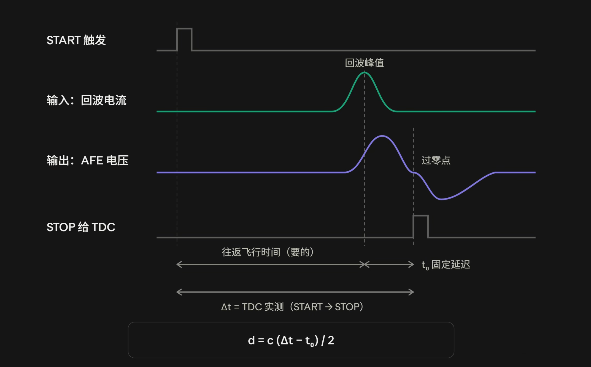

1.  为什么激光脉冲信号的tof检测开始的时候比较准确
	因为斜率最大，还是下一个问题的意思

2. 为什么幅值小的信号误差就大
	主要还是一阶的低通的传递函数给出的结果：
	$\Delta t = \tau \cdot \ln{\frac{1}{1-\frac{V_{th}}{V_{peak}}}} \approx \tau \cdot \frac{V_{th}}{V_{peak}}$ 其中 $V_{peak} \gg V_{th}$ 所以误差就很小  

3. 为什么选择信号的输出峰峰值要是等效输出噪声峰峰值的5倍
	就是因为探测概率和虚假报警的关系： [[虚假报警和探测概率.md#^adec30]]

4. 串扰的定义：(比值越大越好)
	方法一：2018年的那个博士论文中的定义 [[论文阅读2018.md]]
	
$$
R = 20 \log {\frac{V_{pp,s}-V_{pp,n}}{V_{pp,c}-V_{pp,n}}} = 20 \log {\frac{304mV-20mV}{22.8mV-20mV}} = 40.1dB
$$
方法二： [[论文阅读2024-Xiaoxiao Zheng.md]] 中的定义

$$
SCR = 20 \log{\frac{Z_{T,受害通道}}{Z_{T,被激励通道}}} 
$$

其中：

$$
Z_{T,受害通道} = \frac{V_{out,受害通道}}{I_{in,被激励通道}}
$$

5. 写论文
	摘要：先说自己做了什么采用什么结构，创新点，介绍自己的东西的指标哪些参数得到了提升，以及功耗面积这些。
	intruduct：先介绍背景，在介绍现有工作，批评现有工作，自己针对他们的问题提出了什么结构。本文提出了什么结构、解决了什么问题。本文安排

6. crossing-zero测距
	
	如上图：
	就是用信号的飞行时间减去电路引入的所有的误差得到的时间，就可以计算出完整的飞行时间。然后crossing-zero的点是会随着波形或者jitter变化的，这个漂移称为是行走误差。
	但是我认为这个东西出厂的时候是是需要进行一次校准的。然后就是PVT和一些其他的因素来导致的行走误差了。

你说，本来dtof就会有行走误差，那么如果我写一个小的东西进行学习呢？就是小的偏上的容易实现的，那不就是可以随时对心走误差进行补偿了？不知道这样的话准不准，或者说需要的数字电路复杂不复杂，面积如何，和模拟的相比怎么样。只要出现了信号很快，就认定补偿量的大小。

去关注我这些论文中的作者，看看有没有更新的新的这个方向的论文，包括国外的一些人。设置为及时推送。